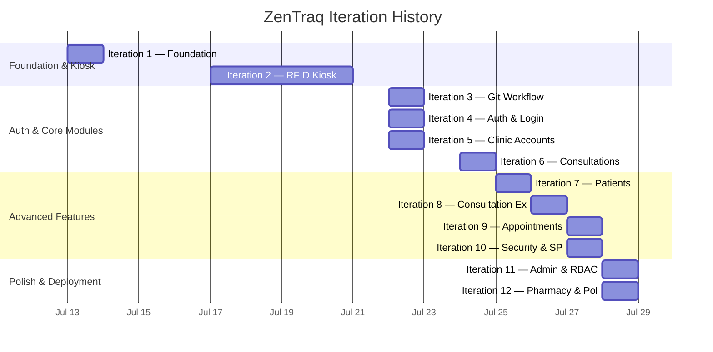

# ZenTraq — Product Backlog

> A comprehensive record of all features implemented across every iteration, from project inception to the latest release.
>
> **Project Start:** July 13, 2026 &nbsp;|&nbsp; **Last Updated:** July 29, 2026

---

## Legend

| Symbol | Meaning |
|--------|---------|
| ✅ | Fully implemented |
| ⚠️ | Partially implemented / Needs improvement |
| 🔲 | Placeholder only (page exists, no logic) |
| 🚀 | Shipped with real-time / Supabase integration |

---

## Iteration Overview

---

## Iteration 1 — Project Foundation

**Date:** July 13, 2026

| # | Feature | Status | Notes |
|---|---------|--------|-------|
| 1.1 | Next.js 16 project scaffolding (App Router) | ✅ | TypeScript, Tailwind CSS 4, pnpm |
| 1.2 | Supabase project initialization | ✅ | Local dev with Docker, `supabase/config.toml` |
| 1.3 | Agent design system document (`agent.md`) | ✅ | UI philosophy, color system, typography, sidebar structure |
| 1.4 | Initial dashboard layout (sidebar + main content) | ✅ | Responsive shell, collapsible sidebar |
| 1.5 | Supabase Edge Function placeholder (RFID) | ✅ | Later removed/simplified |

---

## Iteration 2 — RFID Integration & Kiosk

**Date:** July 17–20, 2026

| # | Feature | Status | Notes |
|---|---------|--------|-------|
| 2.1 | RFID Kiosk mode (`/rfid-kiosk`) | ✅🚀 | Full-screen standalone page, opens in new tab |
| 2.2 | RFID scan input (hardware reader → hidden input) | ✅ | Auto-focus, keyboard capture, Enter to submit |
| 2.3 | Patient profile lookup by RFID UID | ✅🚀 | Queries `student_accounts` via Supabase |
| 2.4 | Kiosk states: IDLE → DISPLAY → UNREGISTERED | ✅ | Type animation on idle, profile card on scan |
| 2.5 | Kiosk auto-reset after display timeout | ✅ | Returns to idle after showing profile |
| 2.6 | Kiosk UI simplification | ✅ | Minimal, distraction-free interface |

---

## Iteration 3 — Git Workflow & Team Onboarding

**Date:** July 22, 2026

| # | Feature | Status | Notes |
|---|---------|--------|-------|
| 3.1 | Git branching guide (`git.test.md`) | ✅ | Branching format documentation for team |
| 3.2 | Multi-contributor workflow (PR #1–#11) | ✅ | `rei/development`, `padre`, `samontanez` branches |
| 3.3 | Test markdown files for branch practice | ✅ | Team practice commits |

---

## Iteration 4 — Authentication & Login

**Date:** July 22, 2026

| # | Feature | Status | Notes |
|---|---------|--------|-------|
| 4.1 | Login page (`/login`) | ✅ | Email + password form with branded logo |
| 4.2 | Supabase Auth integration (signInWithPassword) | ✅🚀 | Server action in `login/actions.ts` |
| 4.3 | Password visibility toggle | ✅ | Eye/EyeOff icon |
| 4.4 | Login loading state with NProgress bar | ✅ | Top progress bar via `nprogress` |
| 4.5 | Login error handling & toast notifications | ✅ | Sonner toast on failure |
| 4.6 | Success animation on login | ✅ | CheckCircle2 icon before redirect |
| 4.7 | Role-based redirect after login | ✅ | Admin → `/admin/rfid-registration`, Staff → `/` |

---

## Iteration 5 — Clinic Account Management

**Date:** July 22, 2026

| # | Feature | Status | Notes |
|---|---------|--------|-------|
| 5.1 | Clinic Accounts listing page (`/admin/clinic-accounts`) | ✅🚀 | Data table with search, pagination |
| 5.2 | Create Clinic Account (`/admin/clinic-accounts/create`) | ✅🚀 | Server action creates Supabase Auth user + `clinic_accounts` row |
| 5.3 | Role assignment (admin / nurse / doctor) | ✅ | Role selector in creation form |
| 5.4 | Remove clinic account | ✅🚀 | Server action with confirmation |
| 5.5 | `user_role` enum in database | ✅ | PostgreSQL enum: admin, nurse, doctor, patient |
| 5.6 | `clinic_accounts` table (renamed from `profiles`) | ✅ | Migration: `20250729000001_rename_profiles_to_clinic_accounts.sql` |

---

## Iteration 6 — Consultation System

**Date:** July 24, 2026

| # | Feature | Status | Notes |
|---|---------|--------|-------|
| 6.1 | Consultations page (`/consultations`) | ✅🚀 | Full CRUD with real-time updates |
| 6.2 | Consultation statuses: waiting → in_consultation → completed/dismissed | ✅ | Status badges with color coding |
| 6.3 | Walk-in consultation creation dialog | ✅ | Patient name + complaint input |
| 6.4 | Consultation Wizard (multi-step completion) | ✅ | 3 steps: Complaint → Report → Review |
| 6.5 | Complaint Selector component | ✅🚀 | Searchable, paginated, add-new-complaint from `complaints` table |
| 6.6 | Disposition statuses (return_to_class, return_to_activity, sent_home) | ✅ | Applied on consultation completion |
| 6.7 | Completion report (diagnosis, treatment, recommendations) | ✅ | Written during wizard, saved to visit log |
| 6.8 | `consultations` table | ✅ | With RLS policies |
| 6.9 | `complaints` table | ✅ | Predefined + user-added complaints |
| 6.10 | Consultation origin tracking (consultation vs emergency) | ✅ | `origin` column added |

---

## Iteration 7 — Patients & Medical Records

**Date:** July 25, 2026

| # | Feature | Status | Notes |
|---|---------|--------|-------|
| 7.1 | Patients listing page (`/patients`) | ✅🚀 | Search, pagination, data table |
| 7.2 | Medical Records page (`/patients/medical-records`) | ✅🚀 | Patient medical history view |
| 7.3 | Patient data from `student_accounts` | ✅ | RFID-linked profiles |

---

## Iteration 8 — Consultation Module Expansion

**Date:** July 26, 2026

| # | Feature | Status | Notes |
|---|---------|--------|-------|
| 8.1 | Visit Logs page (`/consultations/visit-logs`) | ✅🚀 | Historical record of completed consultations |
| 8.2 | Emergency Cases page (`/consultations/emergency`) | ✅🚀 | Filtered view of emergency-origin cases |
| 8.3 | `visit_logs` table | ✅ | Linked to `consultations`, stores diagnosis/treatment/recommendations |
| 8.4 | Visit log status tracking | ✅ | Multiple status values including disposition |
| 8.5 | Deduplication migration for consultations | ✅ | Migration to clean duplicate records |
| 8.6 | Dashboard performance fix (excessive API requests) | ✅ | Debounced realtime subscriptions, optimized polling |
| 8.7 | Dashboard data fetching optimization | ✅ | 30s polling fallback + 500ms realtime debounce |

---

## Iteration 9 — Appointments Module

**Date:** July 27, 2026

| # | Feature | Status | Notes |
|---|---------|--------|-------|
| 9.1 | Appointments Calendar (`/appointments/calendar`) | ✅ | Monthly calendar view with appointment markers |
| 9.2 | Appointment Queue (`/appointments/queue`) | ✅🚀 | Real-time queue management (33KB page) |
| 9.3 | Cleared Appointments (`/appointments/cleared`) | ✅🚀 | History of processed appointments (24KB page) |
| 9.4 | `student_appointments` table | ✅ | With status: pending, confirmed, completed, cancelled |
| 9.5 | MonthCalendar component | ✅ | Reusable calendar with markers |

---

## Iteration 10 — Session Security & Student Portal

**Date:** July 27, 2026

| # | Feature | Status | Notes |
|---|---------|--------|-------|
| 10.1 | Session security hook (`useSessionSecurity`) | ✅ | 3-minute inactivity timeout, auto-logout |
| 10.2 | Session token validation | ✅🚀 | Checks `current_session_token` in both clinic & student tables |
| 10.3 | Single-session enforcement | ✅ | New login invalidates previous session token |
| 10.4 | Auth state change listener | ✅ | Auto-redirect on SIGNED_OUT |
| 10.5 | Student Dashboard (`/student`) | ✅🚀 | Welcome card, recent announcements |
| 10.6 | Student Announcements page (`/student/announcements`) | ✅🚀 | View clinic announcements with images |
| 10.7 | Student Book Appointment (`/student/appointments`) | ✅🚀 | Self-service appointment booking |
| 10.8 | Student Settings (`/student/settings`) | ✅ | Profile management |
| 10.9 | Student navigation (separate sidebar) | ✅ | Restricted nav: Dashboard, Announcements, Book Appointment, Settings |
| 10.10 | `session_security` migration | ✅ | `current_session_token` column |
| 10.11 | `session_token_students` migration | ✅ | Token column for `student_accounts` |

---

## Iteration 11 — Admin Panel & Access Control Overhaul

**Date:** July 28, 2026

| # | Feature | Status | Notes |
|---|---------|--------|-------|
| 11.1 | Role-based access control (RBAC) system | ✅ | `roles.ts`: admin, nurse, doctor, student type guards |
| 11.2 | Navigation filtering by role | ✅ | `filterNavigationForRole()` hides restricted items |
| 11.3 | Separate navigation configs (admin, staff, student) | ✅ | 3 distinct nav structures in `navigation.ts` |
| 11.4 | Admin-only sidebar with admin modules | ✅ | RFID, Accounts, Announcements, Services, Reports |
| 11.5 | RFID Registration wizard (`/admin/rfid-registration`) | ✅🚀 | Multi-step: Scan → Verify → Edit → Success (65KB, 1449 lines) |
| 11.6 | Student account creation via RFID registration | ✅🚀 | Server action creates Auth user + `student_accounts` entry |
| 11.7 | Password strength validation | ✅ | `PasswordStrengthInput` component + `password.ts` validation |
| 11.8 | Clinic photo capture (webcam) | ✅ | Camera integration during RFID registration |
| 11.9 | Student Accounts management (`/admin/student-accounts`) | ✅🚀 | Full data table, 29KB page |
| 11.10 | Clinic Announcements CRUD (`/admin/clinic-announcements`) | ✅🚀 | Create, edit, delete with image upload |
| 11.11 | Announcement image upload to Supabase Storage | ✅🚀 | `announcement-images` bucket, drag & drop |
| 11.12 | User role detection (`getUserRole`) | ✅ | Multi-fallback: admin client → standard client → student check → metadata |
| 11.13 | Dashboard Shell with user profile dropdown | ✅ | Avatar, email, role badge, logout |
| 11.14 | Notification Dropdown | ✅🚀 | Real-time notifications for appointments, consultations, emergencies |
| 11.15 | Global search (Cmd/Ctrl+K) | ✅ | Keyboard shortcut to focus search |

---

## Iteration 12 — Pharmacy Module & Final UI Polish

**Date:** July 28, 2026

| # | Feature | Status | Notes |
|---|---------|--------|-------|
| 12.1 | Medicines catalog (`/pharmacy/medicines`) | ✅ | Medicine listing with search and filters (35KB page) |
| 12.2 | Medicine Dispensing (`/pharmacy/dispensing`) | ✅ | Dispensing workflow (30KB page) |
| 12.3 | Inventory Management (`/pharmacy/inventory`) | ✅ | Stock tracking and alerts (22KB page) |
| 12.4 | Dashboard UI overhaul | ✅ | KPI stat cards, consultation trends chart, calendar, AI insights |
| 12.5 | Top header layout update | ✅ | Refined page title, search bar, notifications, profile |
| 12.6 | Auth & login bug fixes | ✅ | Session handling edge cases |
| 12.7 | Deployment fixes | ✅ | Build and environment configuration |

---

## Placeholder Pages (Scaffolded, Not Yet Implemented)

These pages exist in the navigation and have route files, but currently render the generic `PlaceholderPage` component with no functional logic.

| # | Page | Route | Priority |
|---|------|-------|----------|
| P.1 | Analytics | `/reports/analytics` | High |
| P.2 | Compliance | `/reports/compliance` | Medium |
| P.3 | Roles Management | `/admin/roles` | Medium |
| P.4 | Audit Logs | `/admin/audit-logs` | High |
| P.5 | System Settings | `/admin/settings` | Medium |
| P.6 | Health Programs | `/admin/services/programs` | Low |
| P.7 | Health Clearance | `/admin/services/clearance` | Low |
| P.8 | Faculty Accounts | `/admin/faculty-accounts` | Medium |
| P.9 | Create Faculty Accounts | `/admin/faculty-accounts/create` | Medium |

---

## Database Schema Summary

| Table | Status | Description |
|-------|--------|-------------|
| `clinic_accounts` | ✅ | Clinic staff users (admin, nurse, doctor) with session tokens |
| `student_accounts` | ✅ | Student/patient profiles with RFID, demographics, photo |
| `consultations` | ✅ | Active consultation queue with status workflow |
| `visit_logs` | ✅ | Completed consultation records (diagnosis, treatment, disposition) |
| `complaints` | ✅ | Predefined + custom complaint catalog |
| `announcements` | ✅ | Clinic announcements with image support |
| `student_appointments` | ✅ | Student-booked appointments with status lifecycle |

---

## Reusable Components Built

| Component | File | Description |
|-----------|------|-------------|
| `AppSidebar` | `components/layout/app-sidebar.tsx` | Role-aware collapsible sidebar |
| `DashboardShell` | `components/layout/dashboard-shell.tsx` | Main layout wrapper with header, search, profile dropdown |
| `NotificationDropdown` | `components/layout/notification-dropdown.tsx` | Real-time notification bell with unread count |
| `ConsultationWizard` | `components/consultation-wizard.tsx` | 3-step dialog for completing consultations |
| `ComplaintSelector` | `components/complaint-selector.tsx` | Searchable, paginated complaint picker |
| `MonthCalendar` | `components/month-calendar.tsx` | Calendar view with event markers |
| `StatCard` | `components/stat-card.tsx` | Dashboard KPI card |
| `StatusBadge` | `components/status-badge.tsx` | Color-coded status indicator |
| `Pagination` | `components/pagination.tsx` | Reusable table pagination |
| `PageHeader` | `components/page-header.tsx` | Consistent page title + description |
| `SectionHeader` | `components/section-header.tsx` | Section title within pages |
| `PasswordStrengthInput` | `components/password-strength-input.tsx` | Password input with strength meter |
| `EmptyState` | `components/empty-state.tsx` | Empty data placeholder |
| `PlaceholderPage` | `components/placeholder-page.tsx` | Temporary page stub |

**Shadcn UI Components:** Avatar, Badge, Button, Card, Dialog, DropdownMenu, Input, Label, Sonner (toast), Table

---

## Tech Stack

| Layer | Technology |
|-------|------------|
| Framework | Next.js 16 (App Router) |
| Language | TypeScript |
| Database & Auth | Supabase (PostgreSQL + Auth + Storage + Realtime) |
| Styling | Tailwind CSS 4 |
| UI Library | Shadcn UI + Lucide React icons |
| Charts | Recharts |
| Animations | react-type-animation |
| Progress | nprogress |
| Toasts | Sonner |
| Package Manager | pnpm |

---

## Migration History

| File | Date | Description |
|------|------|-------------|
| `002_user_roles.sql` | — | Initial user_role enum |
| `20250722100000_check_ins_and_staff_roles.sql` | Jul 22 | Check-ins table and staff role support |
| `20250724000000_consultations_rls_and_columns.sql` | Jul 24 | Consultation table RLS + additional columns |
| `20250726000000_add_origin_to_consultations.sql` | Jul 26 | Origin column (consultation vs emergency) |
| `20250726000001_deduplicate_consultations.sql` | Jul 26 | Remove duplicate consultation records |
| `20250726000002_create_visit_logs.sql` | Jul 26 | Visit logs table creation |
| `20250726000003_deduplicate_consultations_and_migrate.sql` | Jul 26 | Data migration cleanup |
| `20250726000004_fix_duplicates_and_clean_visit_logs.sql` | Jul 26 | Final deduplication pass |
| `20250726000005_add_status_to_visit_logs.sql` | Jul 26 | Status column for visit logs |
| `20250726000006_update_consultation_statuses.sql` | Jul 26 | Status enum updates |
| `20250726000007_create_complaints_table.sql` | Jul 26 | Complaints catalog table |
| `20250726000007_rename_chief_complaint.sql` | Jul 26 | Column rename |
| `20250728000000_student_accounts_and_roles.sql` | Jul 28 | Student accounts, announcements, appointments tables + RLS |
| `20250729000000_session_security.sql` | Jul 29 | Session token column for clinic_accounts |
| `20250729000001_rename_profiles_to_clinic_accounts.sql` | Jul 29 | Rename profiles → clinic_accounts |
| `20250729000002_session_token_students.sql` | Jul 29 | Session token column for student_accounts |
