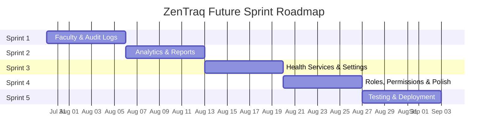

# ZenTraq — Product Backlog

> A comprehensive record of all features implemented across every iteration, from project inception to the latest release.
>
> **Project Start:** July 13, 2026 &nbsp;|&nbsp; **Last Updated:** July 29, 2026

---

## Legend

| Symbol | Meaning |
|--------|---------|
| ✅ | Fully implemented |
| ⚠️ | Partially implemented / Needs improvement |
| 🔲 | Placeholder only (page exists, no logic) |
| 🚀 | Shipped with real-time / Supabase integration |

---

## Complete Roadmap Overview

```mermaid
gantt
    title ZenTraq Complete Project Roadmap
    dateFormat  YYYY-MM-DD
    axisFormat  %b %d

    section Foundation & Kiosk
    Iteration 1 — Foundation     :done, i1, 2026-07-13, 1d
    Iteration 2 — RFID Kiosk     :done, i2, 2026-07-17, 4d

    section Auth & Core Modules
    Iteration 3 — Git Workflow   :done, i3, 2026-07-22, 1d
    Iteration 4 — Auth & Login   :done, i4, 2026-07-22, 1d
    Iteration 5 — Clinic Accounts:done, i5, 2026-07-22, 1d
    Iteration 6 — Consultations  :done, i6, 2026-07-24, 1d

    section Advanced Features
    Iteration 7 — Patients       :done, i7, 2026-07-25, 1d
    Iteration 8 — Consultation Ex:done, i8, 2026-07-26, 1d
    Iteration 9 — Appointments   :done, i9, 2026-07-27, 1d
    Iteration 10 — Security & SP :done, i10, 2026-07-27, 1d

    section Polish & Deployment
    Iteration 11 — Admin & RBAC  :done, i11, 2026-07-28, 1d
    Iteration 12 — Pharmacy & Pol:done, i12, 2026-07-28, 1d

    section Future Sprints
    Sprint 1: Faculty & Audit    :active, s1, 2026-07-30, 7d
    Sprint 2: Analytics & Reports:s2, after s1, 7d
    Sprint 3: Services & Settings:s3, after s2, 7d
    Sprint 4: Roles & Polish     :s4, after s3, 7d
    Sprint 5: Testing & QA       :s5, after s4, 7d
```

---

## Iteration 1 — Project Foundation

**Date:** July 13, 2026

| # | Feature | Status | Notes |
|---|---------|--------|-------|
| 1.1 | Next.js 16 project scaffolding (App Router) | ✅ | TypeScript, Tailwind CSS 4, pnpm |
| 1.2 | Supabase project initialization | ✅ | Local dev with Docker, `supabase/config.toml` |
| 1.3 | Agent design system document (`agent.md`) | ✅ | UI philosophy, color system, typography, sidebar structure |
| 1.4 | Initial dashboard layout (sidebar + main content) | ✅ | Responsive shell, collapsible sidebar |
| 1.5 | Supabase Edge Function placeholder (RFID) | ✅ | Later removed/simplified |

---

## Iteration 2 — RFID Integration & Kiosk

**Date:** July 17–20, 2026

| # | Feature | Status | Notes |
|---|---------|--------|-------|
| 2.1 | RFID Kiosk mode (`/rfid-kiosk`) | ✅🚀 | Full-screen standalone page, opens in new tab |
| 2.2 | RFID scan input (hardware reader → hidden input) | ✅ | Auto-focus, keyboard capture, Enter to submit |
| 2.3 | Patient profile lookup by RFID UID | ✅🚀 | Queries `student_accounts` via Supabase |
| 2.4 | Kiosk states: IDLE → DISPLAY → UNREGISTERED | ✅ | Type animation on idle, profile card on scan |
| 2.5 | Kiosk auto-reset after display timeout | ✅ | Returns to idle after showing profile |
| 2.6 | Kiosk UI simplification | ✅ | Minimal, distraction-free interface |

---

## Iteration 3 — Git Workflow & Team Onboarding

**Date:** July 22, 2026

| # | Feature | Status | Notes |
|---|---------|--------|-------|
| 3.1 | Git branching guide (`git.test.md`) | ✅ | Branching format documentation for team |
| 3.2 | Multi-contributor workflow (PR #1–#11) | ✅ | `rei/development`, `padre`, `samontanez` branches |
| 3.3 | Test markdown files for branch practice | ✅ | Team practice commits |

---

## Iteration 4 — Authentication & Login

**Date:** July 22, 2026

| # | Feature | Status | Notes |
|---|---------|--------|-------|
| 4.1 | Login page (`/login`) | ✅ | Email + password form with branded logo |
| 4.2 | Supabase Auth integration (signInWithPassword) | ✅🚀 | Server action in `login/actions.ts` |
| 4.3 | Password visibility toggle | ✅ | Eye/EyeOff icon |
| 4.4 | Login loading state with NProgress bar | ✅ | Top progress bar via `nprogress` |
| 4.5 | Login error handling & toast notifications | ✅ | Sonner toast on failure |
| 4.6 | Success animation on login | ✅ | CheckCircle2 icon before redirect |
| 4.7 | Role-based redirect after login | ✅ | Admin → `/admin/rfid-registration`, Staff → `/` |

---

## Iteration 5 — Clinic Account Management

**Date:** July 22, 2026

| # | Feature | Status | Notes |
|---|---------|--------|-------|
| 5.1 | Clinic Accounts listing page (`/admin/clinic-accounts`) | ✅🚀 | Data table with search, pagination |
| 5.2 | Create Clinic Account (`/admin/clinic-accounts/create`) | ✅🚀 | Server action creates Supabase Auth user + `clinic_accounts` row |
| 5.3 | Role assignment (admin / nurse / doctor) | ✅ | Role selector in creation form |
| 5.4 | Remove clinic account | ✅🚀 | Server action with confirmation |
| 5.5 | `user_role` enum in database | ✅ | PostgreSQL enum: admin, nurse, doctor, patient |
| 5.6 | `clinic_accounts` table (renamed from `profiles`) | ✅ | Migration: `20250729000001_rename_profiles_to_clinic_accounts.sql` |

---

## Iteration 6 — Consultation System

**Date:** July 24, 2026

| # | Feature | Status | Notes |
|---|---------|--------|-------|
| 6.1 | Consultations page (`/consultations`) | ✅🚀 | Full CRUD with real-time updates |
| 6.2 | Consultation statuses: waiting → in_consultation → completed/dismissed | ✅ | Status badges with color coding |
| 6.3 | Walk-in consultation creation dialog | ✅ | Patient name + complaint input |
| 6.4 | Consultation Wizard (multi-step completion) | ✅ | 3 steps: Complaint → Report → Review |
| 6.5 | Complaint Selector component | ✅🚀 | Searchable, paginated, add-new-complaint from `complaints` table |
| 6.6 | Disposition statuses (return_to_class, return_to_activity, sent_home) | ✅ | Applied on consultation completion |
| 6.7 | Completion report (diagnosis, treatment, recommendations) | ✅ | Written during wizard, saved to visit log |
| 6.8 | `consultations` table | ✅ | With RLS policies |
| 6.9 | `complaints` table | ✅ | Predefined + user-added complaints |
| 6.10 | Consultation origin tracking (consultation vs emergency) | ✅ | `origin` column added |

---

## Iteration 7 — Patients & Medical Records

**Date:** July 25, 2026

| # | Feature | Status | Notes |
|---|---------|--------|-------|
| 7.1 | Patients listing page (`/patients`) | ✅🚀 | Search, pagination, data table |
| 7.2 | Medical Records page (`/patients/medical-records`) | ✅🚀 | Patient medical history view |
| 7.3 | Patient data from `student_accounts` | ✅ | RFID-linked profiles |

---

## Iteration 8 — Consultation Module Expansion

**Date:** July 26, 2026

| # | Feature | Status | Notes |
|---|---------|--------|-------|
| 8.1 | Visit Logs page (`/consultations/visit-logs`) | ✅🚀 | Historical record of completed consultations |
| 8.2 | Emergency Cases page (`/consultations/emergency`) | ✅🚀 | Filtered view of emergency-origin cases |
| 8.3 | `visit_logs` table | ✅ | Linked to `consultations`, stores diagnosis/treatment/recommendations |
| 8.4 | Visit log status tracking | ✅ | Multiple status values including disposition |
| 8.5 | Deduplication migration for consultations | ✅ | Migration to clean duplicate records |
| 8.6 | Dashboard performance fix (excessive API requests) | ✅ | Debounced realtime subscriptions, optimized polling |
| 8.7 | Dashboard data fetching optimization | ✅ | 30s polling fallback + 500ms realtime debounce |

---

## Iteration 9 — Appointments Module

**Date:** July 27, 2026

| # | Feature | Status | Notes |
|---|---------|--------|-------|
| 9.1 | Appointments Calendar (`/appointments/calendar`) | ✅ | Monthly calendar view with appointment markers |
| 9.2 | Appointment Queue (`/appointments/queue`) | ✅🚀 | Real-time queue management (33KB page) |
| 9.3 | Cleared Appointments (`/appointments/cleared`) | ✅🚀 | History of processed appointments (24KB page) |
| 9.4 | `student_appointments` table | ✅ | With status: pending, confirmed, completed, cancelled |
| 9.5 | MonthCalendar component | ✅ | Reusable calendar with markers |

---

## Iteration 10 — Session Security & Student Portal

**Date:** July 27, 2026

| # | Feature | Status | Notes |
|---|---------|--------|-------|
| 10.1 | Session security hook (`useSessionSecurity`) | ✅ | 3-minute inactivity timeout, auto-logout |
| 10.2 | Session token validation | ✅🚀 | Checks `current_session_token` in both clinic & student tables |
| 10.3 | Single-session enforcement | ✅ | New login invalidates previous session token |
| 10.4 | Auth state change listener | ✅ | Auto-redirect on SIGNED_OUT |
| 10.5 | Student Dashboard (`/student`) | ✅🚀 | Welcome card, recent announcements |
| 10.6 | Student Announcements page (`/student/announcements`) | ✅🚀 | View clinic announcements with images |
| 10.7 | Student Book Appointment (`/student/appointments`) | ✅🚀 | Self-service appointment booking |
| 10.8 | Student Settings (`/student/settings`) | ✅ | Profile management |
| 10.9 | Student navigation (separate sidebar) | ✅ | Restricted nav: Dashboard, Announcements, Book Appointment, Settings |
| 10.10 | `session_security` migration | ✅ | `current_session_token` column |
| 10.11 | `session_token_students` migration | ✅ | Token column for `student_accounts` |

---

## Iteration 11 — Admin Panel & Access Control Overhaul

**Date:** July 28, 2026

| # | Feature | Status | Notes |
|---|---------|--------|-------|
| 11.1 | Role-based access control (RBAC) system | ✅ | `roles.ts`: admin, nurse, doctor, student type guards |
| 11.2 | Navigation filtering by role | ✅ | `filterNavigationForRole()` hides restricted items |
| 11.3 | Separate navigation configs (admin, staff, student) | ✅ | 3 distinct nav structures in `navigation.ts` |
| 11.4 | Admin-only sidebar with admin modules | ✅ | RFID, Accounts, Announcements, Services, Reports |
| 11.5 | RFID Registration wizard (`/admin/rfid-registration`) | ✅🚀 | Multi-step: Scan → Verify → Edit → Success (65KB, 1449 lines) |
| 11.6 | Student account creation via RFID registration | ✅🚀 | Server action creates Auth user + `student_accounts` entry |
| 11.7 | Password strength validation | ✅ | `PasswordStrengthInput` component + `password.ts` validation |
| 11.8 | Clinic photo capture (webcam) | ✅ | Camera integration during RFID registration |
| 11.9 | Student Accounts management (`/admin/student-accounts`) | ✅🚀 | Full data table, 29KB page |
| 11.10 | Clinic Announcements CRUD (`/admin/clinic-announcements`) | ✅🚀 | Create, edit, delete with image upload |
| 11.11 | Announcement image upload to Supabase Storage | ✅🚀 | `announcement-images` bucket, drag & drop |
| 11.12 | User role detection (`getUserRole`) | ✅ | Multi-fallback: admin client → standard client → student check → metadata |
| 11.13 | Dashboard Shell with user profile dropdown | ✅ | Avatar, email, role badge, logout |
| 11.14 | Notification Dropdown | ✅🚀 | Real-time notifications for appointments, consultations, emergencies |
| 11.15 | Global search (Cmd/Ctrl+K) | ✅ | Keyboard shortcut to focus search |

---

## Iteration 12 — Pharmacy Module & Final UI Polish

**Date:** July 28, 2026

| # | Feature | Status | Notes |
|---|---------|--------|-------|
| 12.1 | Medicines catalog (`/pharmacy/medicines`) | ✅ | Medicine listing with search and filters (35KB page) |
| 12.2 | Medicine Dispensing (`/pharmacy/dispensing`) | ✅ | Dispensing workflow (30KB page) |
| 12.3 | Inventory Management (`/pharmacy/inventory`) | ✅ | Stock tracking and alerts (22KB page) |
| 12.4 | Dashboard UI overhaul | ✅ | KPI stat cards, consultation trends chart, calendar, AI insights |
| 12.5 | Top header layout update | ✅ | Refined page title, search bar, notifications, profile |
| 12.6 | Auth & login bug fixes | ✅ | Session handling edge cases |
| 12.7 | Deployment fixes | ✅ | Build and environment configuration |

---

## Placeholder Pages (Scaffolded, Not Yet Implemented)

These pages exist in the navigation and have route files, but currently render the generic `PlaceholderPage` component with no functional logic.

| # | Page | Route | Priority |
|---|------|-------|----------|
| P.1 | Analytics | `/reports/analytics` | High |
| P.2 | Compliance | `/reports/compliance` | Medium |
| P.3 | Roles Management | `/admin/useraccess/roles` | Medium |
| P.4 | System Settings | `/admin/settings` | Medium |
| P.5 | Health Programs | `/admin/healthprograms/list` | Low |
| P.6 | Health Clearance | `/admin/services/clearance` | Low |
| P.7 | Faculty Accounts | `/admin/faculty-accounts` | Medium |
| P.8 | Create Faculty Accounts | `/admin/faculty-accounts/create` | Medium |

---

## Database Schema Summary

| Table | Status | Description |
|-------|--------|-------------|
| `clinic_accounts` | ✅ | Clinic staff users (admin, nurse, doctor) with session tokens |
| `student_accounts` | ✅ | Student/patient profiles with RFID, demographics, photo |
| `consultations` | ✅ | Active consultation queue with status workflow |
| `visit_logs` | ✅ | Completed consultation records (diagnosis, treatment, disposition) |
| `complaints` | ✅ | Predefined + custom complaint catalog |
| `announcements` | ✅ | Clinic announcements with image support |
| `student_appointments` | ✅ | Student-booked appointments with status lifecycle |

---

## Reusable Components Built

| Component | File | Description |
|-----------|------|-------------|
| `AppSidebar` | `components/layout/app-sidebar.tsx` | Role-aware collapsible sidebar |
| `DashboardShell` | `components/layout/dashboard-shell.tsx` | Main layout wrapper with header, search, profile dropdown |
| `NotificationDropdown` | `components/layout/notification-dropdown.tsx` | Real-time notification bell with unread count |
| `ConsultationWizard` | `components/consultation-wizard.tsx` | 3-step dialog for completing consultations |
| `ComplaintSelector` | `components/complaint-selector.tsx` | Searchable, paginated complaint picker |
| `MonthCalendar` | `components/month-calendar.tsx` | Calendar view with event markers |
| `StatCard` | `components/stat-card.tsx` | Dashboard KPI card |
| `StatusBadge` | `components/status-badge.tsx` | Color-coded status indicator |
| `Pagination` | `components/pagination.tsx` | Reusable table pagination |
| `PageHeader` | `components/page-header.tsx` | Consistent page title + description |
| `SectionHeader` | `components/section-header.tsx` | Section title within pages |
| `PasswordStrengthInput` | `components/password-strength-input.tsx` | Password input with strength meter |
| `EmptyState` | `components/empty-state.tsx` | Empty data placeholder |
| `PlaceholderPage` | `components/placeholder-page.tsx` | Temporary page stub |

**Shadcn UI Components:** Avatar, Badge, Button, Card, Dialog, DropdownMenu, Input, Label, Sonner (toast), Table

---

## Tech Stack

| Layer | Technology |
|-------|------------|
| Framework | Next.js 16 (App Router) |
| Language | TypeScript |
| Database & Auth | Supabase (PostgreSQL + Auth + Storage + Realtime) |
| Styling | Tailwind CSS 4 |
| UI Library | Shadcn UI + Lucide React icons |
| Charts | Recharts |
| Animations | react-type-animation |
| Progress | nprogress |
| Toasts | Sonner |
| Package Manager | pnpm |

---

## Migration History

| File | Date | Description |
|------|------|-------------|
| `002_user_roles.sql` | — | Initial user_role enum |
| `20250722100000_check_ins_and_staff_roles.sql` | Jul 22 | Check-ins table and staff role support |
| `20250724000000_consultations_rls_and_columns.sql` | Jul 24 | Consultation table RLS + additional columns |
| `20250726000000_add_origin_to_consultations.sql` | Jul 26 | Origin column (consultation vs emergency) |
| `20250726000001_deduplicate_consultations.sql` | Jul 26 | Remove duplicate consultation records |
| `20250726000002_create_visit_logs.sql` | Jul 26 | Visit logs table creation |
| `20250726000003_deduplicate_consultations_and_migrate.sql` | Jul 26 | Data migration cleanup |
| `20250726000004_fix_duplicates_and_clean_visit_logs.sql` | Jul 26 | Final deduplication pass |
| `20250726000005_add_status_to_visit_logs.sql` | Jul 26 | Status column for visit logs |
| `20250726000006_update_consultation_statuses.sql` | Jul 26 | Status enum updates |
| `20250726000007_create_complaints_table.sql` | Jul 26 | Complaints catalog table |
| `20250726000007_rename_chief_complaint.sql` | Jul 26 | Column rename |
| `20250728000000_student_accounts_and_roles.sql` | Jul 28 | Student accounts, announcements, appointments tables + RLS |
| `20250729000000_session_security.sql` | Jul 29 | Session token column for clinic_accounts |
| `20250729000001_rename_profiles_to_clinic_accounts.sql` | Jul 29 | Rename profiles → clinic_accounts |
| `20250729000002_session_token_students.sql` | Jul 29 | Session token column for student_accounts |

---

# Future Sprint Plan

> Sprint planning for remaining backlog items and system improvements.
>
> **Sprint Duration:** 1 week per sprint &nbsp;|&nbsp; **Start Date:** July 30, 2026

---

## Sprint Overview



---

## Sprint 1 — Faculty Accounts & Audit Logs

**Date:** Jul 30 – Aug 5, 2026 &nbsp;|&nbsp; **Priority:** 🔴 High

> **Goal:** Complete the two highest-priority placeholder pages in Administration — faculty account management and the audit logging system.

### User Stories

| ID | Story | Acceptance Criteria | Points |
|----|-------|---------------------|--------|
| S1-01 | As an **admin**, I want to manage faculty accounts so I can register faculty/staff in the clinic system | Faculty accounts list page with search, filter by department, and pagination | 5 |
| S1-02 | As an **admin**, I want to create a new faculty account with profile details | Creation form with fields: name, email, employee number, department, position, RFID UID; creates Supabase Auth user + `student_accounts` row with faculty flag | 5 |
| S1-03 | As an **admin**, I want to edit and deactivate faculty accounts | Inline edit, archive/deactivate toggle, confirmation dialog | 3 |
| S1-04 | As an **admin**, I want to view a chronological audit log of all system actions | Audit logs page with filterable table: timestamp, user, action, target, details | 8 |
| S1-05 | As a **system**, I want to automatically log critical actions to the audit trail | Server-side logging for: login/logout, account creation/deletion, RFID registration, consultation status changes, appointment updates | 8 |
| S1-06 | As an **admin**, I want to export audit logs for compliance | CSV/JSON export button with date range filter | 3 |

**Total Points:** 32

### Technical Tasks

- [ ] Create `audit_logs` table migration (columns: id, user_id, action, target_type, target_id, details jsonb, ip_address, created_at)
- [ ] Create RLS policies for `audit_logs` (admin-only read, system-level insert)
- [ ] Build `/admin/faculty-accounts` page — data table with search, department filter, status filter, pagination
- [ ] Build `/admin/faculty-accounts/create` page — multi-field creation form with server action
- [ ] Build faculty account edit dialog
- [x] Use `/admin/reports/audit_trail` as the single filterable audit interface
- [ ] Create `logAuditEvent()` server utility function
- [ ] Integrate audit logging into existing server actions (login, account CRUD, RFID registration)
- [ ] Add audit log export endpoint (CSV)

### Definition of Done

- [ ] Faculty accounts can be listed, created, edited, and deactivated
- [ ] Audit logs capture all critical system actions
- [ ] Audit logs page displays entries with proper filtering
- [ ] All new pages follow existing design system (monochromatic, Shadcn UI)
- [ ] RLS policies protect audit data

---

## Sprint 2 — Analytics & Compliance Reports

**Date:** Aug 6 – Aug 12, 2026 &nbsp;|&nbsp; **Priority:** 🔴 High

> **Goal:** Build out the Reports module with real analytics dashboards and compliance monitoring.

### User Stories

| ID | Story | Acceptance Criteria | Points |
|----|-------|---------------------|--------|
| S2-01 | As a **nurse/doctor**, I want to see clinic performance analytics with charts | Analytics dashboard with: daily/weekly/monthly patient volume, top complaints, average consultation duration, peak hours heatmap | 8 |
| S2-02 | As an **admin**, I want to view consultation trends over time | Line/bar chart showing consultations per day/week/month with origin breakdown (walk-in vs emergency) | 5 |
| S2-03 | As an **admin**, I want to see medicine dispensing statistics | Chart showing top dispensed medicines, stock consumption rate, low-stock trend alerts | 5 |
| S2-04 | As an **admin**, I want a compliance dashboard that tracks regulatory metrics | Compliance page with: health clearance completion rate, required documentation checklist, overdue items | 8 |
| S2-05 | As an **admin**, I want to generate and download periodic reports | PDF/CSV report generation for consultation summaries, patient demographics, medicine usage | 5 |
| S2-06 | As an **admin**, I want date range filtering on all reports | Global date range picker (today, this week, this month, custom range) applied to all charts/tables | 3 |

**Total Points:** 34

### Technical Tasks

- [ ] Build `/reports/analytics` page with Recharts dashboard
- [ ] Create server-side data aggregation queries (consultations by date, complaints frequency, peak hours)
- [ ] Build patient volume chart (bar chart, daily/weekly/monthly toggle)
- [ ] Build top complaints chart (horizontal bar chart)
- [ ] Build consultation origin breakdown (pie/donut chart)
- [ ] Build `/reports/compliance` page with compliance metrics
- [ ] Create health clearance completion tracking query
- [ ] Add date range picker component (reusable)
- [ ] Add CSV export for analytics data
- [ ] Create summary statistics cards (total patients, avg wait time, clearance rate)

### Definition of Done

- [ ] Analytics page shows real data from Supabase with interactive charts
- [ ] Compliance page displays meaningful regulatory metrics
- [ ] Date range filtering works across all report views
- [ ] Reports can be exported as CSV
- [ ] Charts use restrained color palette per design system (gray, black, emerald, blue)

---

## Sprint 3 — Health Services & System Settings

**Date:** Aug 13 – Aug 19, 2026 &nbsp;|&nbsp; **Priority:** 🟡 Medium

> **Goal:** Implement the Health Services module (programs and clearance) and the system settings page.

### User Stories

| ID | Story | Acceptance Criteria | Points |
|----|-------|---------------------|--------|
| S3-01 | As an **admin**, I want to manage health programs offered by the clinic | Health programs CRUD: name, description, schedule, target audience, status (active/inactive) | 5 |
| S3-02 | As a **nurse**, I want to enroll students in health programs | Enrollment tracking: student selection, program assignment, completion status | 5 |
| S3-03 | As an **admin**, I want to manage health clearance requirements and approvals | Clearance request list, approval workflow (pending → approved → denied), document upload | 8 |
| S3-04 | As a **student**, I want to request health clearance through the student portal | Student-facing clearance request form linked to `/student` portal | 3 |
| S3-05 | As an **admin**, I want to configure system-wide settings | Settings page with: clinic information (name, address, hours), notification preferences, session timeout duration, appointment slot configuration | 5 |
| S3-06 | As an **admin**, I want to manage the list of available appointment time slots | Time slot editor: add/remove/disable time slots for each day of the week | 3 |

**Total Points:** 29

### Technical Tasks

- [ ] Create `health_programs` table migration (id, name, description, schedule, target_audience, status, created_at)
- [ ] Create `program_enrollments` table migration (id, student_id, program_id, status, enrolled_at, completed_at)
- [ ] Create `health_clearances` table migration (id, student_id, type, status, requested_at, approved_at, approved_by, documents)
- [ ] Create `clinic_settings` table migration (key-value store for system config)
- [ ] Build `/admin/healthprograms/list` page — program list with CRUD, enrollment tracking
- [ ] Build `/admin/services/clearance` page — clearance request queue with approval workflow
- [ ] Build `/admin/settings` page — tabbed settings interface (General, Notifications, Appointments, Security)
- [ ] Add health clearance request to student portal
- [ ] Create time slot management UI in settings

### Definition of Done

- [ ] Health programs can be created, edited, and have students enrolled
- [ ] Health clearance requests flow through approval workflow
- [ ] Settings page saves and applies configuration changes
- [ ] Time slot configuration affects student appointment booking
- [ ] All new tables have proper RLS policies

---

## Sprint 4 — Roles & Permissions + System Polish

**Date:** Aug 20 – Aug 26, 2026 &nbsp;|&nbsp; **Priority:** 🟡 Medium

> **Goal:** Build a proper roles & permissions management UI and polish existing features based on testing feedback.

### User Stories

| ID | Story | Acceptance Criteria | Points |
|----|-------|---------------------|--------|
| S4-01 | As an **admin**, I want to manage user roles and their permissions | Roles page: view all roles, see which permissions each role has, create custom roles | 5 |
| S4-02 | As an **admin**, I want to assign granular permissions to roles | Permission matrix: module-level access control (e.g., consultations: view/create/edit/delete) | 8 |
| S4-03 | As an **admin**, I want to see which users are assigned to each role | Role detail view showing all users in that role with ability to reassign | 3 |
| S4-04 | As a **nurse/doctor**, I want a global search that finds patients, consultations, and medicines | Command palette (Cmd+K) with real search across multiple tables, grouped results | 8 |
| S4-05 | As a **user**, I want smooth page transitions and loading states | Skeleton loaders for all data tables, optimistic updates where applicable | 5 |
| S4-06 | As a **user**, I want the app to work well on tablet screens | Responsive layout audit and fixes for iPad/tablet viewport (768–1024px) | 3 |

**Total Points:** 32

### Technical Tasks

- [ ] Create `roles` and `permissions` tables migration
- [ ] Build `/admin/useraccess/roles` page — role list with expandable permission matrix
- [ ] Build role creation/edit dialog with permission checkboxes
- [ ] Integrate permission checks into existing navigation filtering
- [ ] Build command palette component (Cmd+K search across patients, consultations, medicines)
- [ ] Add skeleton loading states to all data table pages
- [ ] Responsive audit: sidebar behavior, table layouts, form layouts on tablets
- [ ] Add optimistic UI updates for consultation status changes
- [ ] Performance audit: lazy-load heavy pages, reduce bundle size

### Definition of Done

- [ ] Roles page displays all roles with their permissions
- [ ] Custom roles can be created and assigned to users
- [ ] Global search returns results from patients, consultations, and medicines
- [ ] All pages have proper loading skeletons (no empty flashes)
- [ ] App is usable on tablet screens without horizontal overflow

---

## Sprint 5 — Testing, QA & Deployment Readiness

**Date:** Aug 27 – Sep 2, 2026 &nbsp;|&nbsp; **Priority:** 🔴 High

> **Goal:** Comprehensive testing, bug fixes, and production deployment preparation.

### User Stories

| ID | Story | Acceptance Criteria | Points |
|----|-------|---------------------|--------|
| S5-01 | As a **developer**, I want end-to-end test coverage for critical workflows | E2E tests for: login flow, consultation lifecycle, RFID kiosk scan, appointment booking | 8 |
| S5-02 | As a **developer**, I want all pages to handle error states gracefully | Error boundaries, network failure handling, empty state displays for all data views | 5 |
| S5-03 | As an **admin**, I want the system to work reliably on the production Supabase instance | Production Supabase project configured with all migrations, RLS policies verified, storage buckets created | 5 |
| S5-04 | As a **user**, I want the app to load fast on first visit | Lighthouse performance score ≥ 80, optimized images, code splitting | 5 |
| S5-05 | As a **developer**, I want proper environment configuration for staging and production | Environment-specific configs, CI/CD pipeline, Vercel deployment settings | 3 |
| S5-06 | As a **user**, I want consistent data seeding for demo/testing | Seed script with realistic sample data: patients, consultations, medicines, appointments | 3 |

**Total Points:** 29

### Technical Tasks

- [ ] Write Playwright E2E tests for login, consultation, RFID, and appointment flows
- [ ] Add React error boundaries to all route layouts
- [ ] Audit and fix all network error handling (show retry, not crash)
- [ ] Verify all empty states display correctly when no data exists
- [ ] Configure production Supabase project (apply all migrations)
- [ ] Verify RLS policies work correctly in production
- [ ] Create Supabase Storage buckets in production (announcement-images, clinic-photos)
- [ ] Lighthouse performance audit and optimization
- [ ] Optimize images with `next/image` and proper sizing
- [ ] Update `seed.sql` with comprehensive demo data
- [ ] Set up Vercel environment variables for production
- [ ] Create deployment checklist document

### Definition of Done

- [ ] All critical user flows have passing E2E tests
- [ ] No unhandled errors or blank screens on any page
- [ ] Production Supabase instance mirrors local schema exactly
- [ ] Lighthouse performance score ≥ 80 on key pages
- [ ] Application can be deployed to Vercel with zero manual steps

---

## Sprint Velocity Summary

| Sprint | Focus | Points | Start | End |
|--------|-------|--------|-------|-----|
| Sprint 1 | Faculty Accounts & Audit Logs | 32 | Jul 30 | Aug 5 |
| Sprint 2 | Analytics & Compliance Reports | 34 | Aug 6 | Aug 12 |
| Sprint 3 | Health Services & Settings | 29 | Aug 13 | Aug 19 |
| Sprint 4 | Roles & Permissions + Polish | 32 | Aug 20 | Aug 26 |
| Sprint 5 | Testing & Deployment | 29 | Aug 27 | Sep 2 |
| **Total** | | **156** | **Jul 30** | **Sep 2** |

---

## Risk Register

| Risk | Impact | Likelihood | Mitigation |
|------|--------|------------|------------|
| Audit logging adds latency to existing actions | Medium | Medium | Use async logging (fire-and-forget), batch inserts |
| Report queries slow on large datasets | High | Low | Add database indexes, use materialized views for aggregations |
| Permission system breaks existing access control | High | Medium | Feature-flag new permission checks, maintain backward compatibility |
| Scope creep from user feedback during sprints | Medium | High | Maintain strict sprint scope, defer additions to backlog |
| Production Supabase migration conflicts | High | Low | Test migrations on staging first, maintain migration order discipline |

---

## Backlog (Future Sprints — Unprioritized)

Items that surfaced during planning but are deferred beyond Sprint 5:

| ID | Feature | Notes |
|----|---------|-------|
| BL-01 | Dark mode support | Design tokens exist in `agent.md`, not yet implemented |
| BL-02 | AI-powered triage suggestions | AI insights section on dashboard is mock data |
| BL-03 | Bulk student import (CSV) | Mass registration for start of semester |
| BL-04 | Prescription management module | Currently part of consultation notes, needs dedicated workflow |
| BL-05 | Laboratory results tracking | Referenced in `agent.md` RFID workflow, not yet built |
| BL-06 | SMS/Email appointment reminders | Notification system exists but no external messaging |
| BL-07 | Multi-language support (i18n) | English only currently |
| BL-08 | Offline mode / PWA | For kiosk resilience when network is unstable |
| BL-09 | Student medical history timeline | Visual timeline of all clinic visits for a student |
| BL-10 | Enrollment system API integration | External identity sync as described in `agent.md` |
