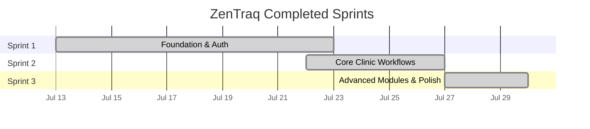

# ZenTraq — Completed Sprints

> A retrospective sprint overview of the implemented features from project inception to the latest release.
>
> **Project Start:** July 13, 2026 &nbsp;|&nbsp; **Last Updated:** July 29, 2026

---

## Historical Sprint Overview

---

## Sprint 1 — Foundation & Auth
**Date:** July 13 – July 22, 2026

**Iterations Included:**
- Iteration 1 — Project Foundation
- Iteration 2 — RFID Integration & Kiosk
- Iteration 3 — Git Workflow & Team Onboarding
- Iteration 4 — Authentication & Login

**Key Deliverables:**
- Next.js scaffolding and Supabase initialization
- Agent design system document and UI philosophy
- RFID kiosk mode with standalone interface
- Git branching guide and team onboarding
- Login page with Supabase Auth integration

---

## Sprint 2 — Core Clinic Workflows
**Date:** July 22 – July 26, 2026

**Iterations Included:**
- Iteration 5 — Clinic Account Management
- Iteration 6 — Consultation System
- Iteration 7 — Patients & Medical Records
- Iteration 8 — Consultation Module Expansion

**Key Deliverables:**
- Clinic accounts listing and creation
- Full consultation CRUD with status workflows
- Consultation wizard with complaint selector
- Patients listing and medical records viewer
- Visit logs and emergency cases tracking

---

## Sprint 3 — Advanced Modules & Polish
**Date:** July 27 – July 29, 2026

**Iterations Included:**
- Iteration 9 — Appointments Module
- Iteration 10 — Session Security & Student Portal
- Iteration 11 — Admin Panel & Access Control Overhaul
- Iteration 12 — Pharmacy Module & Final UI Polish

**Key Deliverables:**
- Appointments calendar and real-time queue
- Session security and single-session enforcement
- Student portal with announcements and appointment booking
- Admin panel, RFID registration wizard, and RBAC
- Medicines catalog, dispensing, and inventory management
