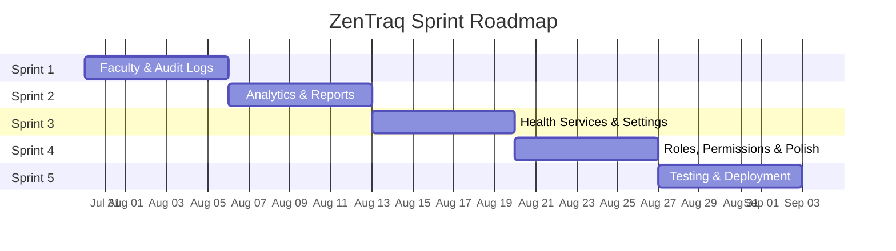

# ZenTraq — Sprint Plan

> Sprint planning for remaining backlog items and system improvements.
>
> **Sprint Duration:** 1 week per sprint &nbsp;|&nbsp; **Start Date:** July 30, 2026

---

## Sprint Overview

---

## Sprint 1 — Faculty Accounts & Audit Logs

**Date:** Jul 30 – Aug 5, 2026 &nbsp;|&nbsp; **Priority:** 🔴 High

> **Goal:** Complete the two highest-priority placeholder pages in Administration — faculty account management and the audit logging system.

### User Stories

| ID | Story | Acceptance Criteria | Points |
|----|-------|---------------------|--------|
| S1-01 | As an **admin**, I want to manage faculty accounts so I can register faculty/staff in the clinic system | Faculty accounts list page with search, filter by department, and pagination | 5 |
| S1-02 | As an **admin**, I want to create a new faculty account with profile details | Creation form with fields: name, email, employee number, department, position, RFID UID; creates Supabase Auth user + `student_accounts` row with faculty flag | 5 |
| S1-03 | As an **admin**, I want to edit and deactivate faculty accounts | Inline edit, archive/deactivate toggle, confirmation dialog | 3 |
| S1-04 | As an **admin**, I want to view a chronological audit log of all system actions | Audit logs page with filterable table: timestamp, user, action, target, details | 8 |
| S1-05 | As a **system**, I want to automatically log critical actions to the audit trail | Server-side logging for: login/logout, account creation/deletion, RFID registration, consultation status changes, appointment updates | 8 |
| S1-06 | As an **admin**, I want to export audit logs for compliance | CSV/JSON export button with date range filter | 3 |

**Total Points:** 32

### Technical Tasks

- [ ] Create `audit_logs` table migration (columns: id, user_id, action, target_type, target_id, details jsonb, ip_address, created_at)
- [ ] Create RLS policies for `audit_logs` (admin-only read, system-level insert)
- [ ] Build `/admin/faculty-accounts` page — data table with search, department filter, status filter, pagination
- [ ] Build `/admin/faculty-accounts/create` page — multi-field creation form with server action
- [ ] Build faculty account edit dialog
- [x] Use `/admin/reports/audit_trail` as the single filterable audit interface
- [ ] Create `logAuditEvent()` server utility function
- [ ] Integrate audit logging into existing server actions (login, account CRUD, RFID registration)
- [ ] Add audit log export endpoint (CSV)

### Definition of Done

- [ ] Faculty accounts can be listed, created, edited, and deactivated
- [ ] Audit logs capture all critical system actions
- [x] Audit Trail displays entries with proper filtering
- [ ] All new pages follow existing design system (monochromatic, Shadcn UI)
- [ ] RLS policies protect audit data

---

## Sprint 2 — Analytics & Compliance Reports

**Date:** Aug 6 – Aug 12, 2026 &nbsp;|&nbsp; **Priority:** 🔴 High

> **Goal:** Build out the Reports module with real analytics dashboards and compliance monitoring.

### User Stories

| ID | Story | Acceptance Criteria | Points |
|----|-------|---------------------|--------|
| S2-01 | As a **nurse/doctor**, I want to see clinic performance analytics with charts | Analytics dashboard with: daily/weekly/monthly patient volume, top complaints, average consultation duration, peak hours heatmap | 8 |
| S2-02 | As an **admin**, I want to view consultation trends over time | Line/bar chart showing consultations per day/week/month with origin breakdown (walk-in vs emergency) | 5 |
| S2-03 | As an **admin**, I want to see medicine dispensing statistics | Chart showing top dispensed medicines, stock consumption rate, low-stock trend alerts | 5 |
| S2-04 | As an **admin**, I want a compliance dashboard that tracks regulatory metrics | Compliance page with: health clearance completion rate, required documentation checklist, overdue items | 8 |
| S2-05 | As an **admin**, I want to generate and download periodic reports | PDF/CSV report generation for consultation summaries, patient demographics, medicine usage | 5 |
| S2-06 | As an **admin**, I want date range filtering on all reports | Global date range picker (today, this week, this month, custom range) applied to all charts/tables | 3 |

**Total Points:** 34

### Technical Tasks

- [ ] Build `/reports/analytics` page with Recharts dashboard
- [ ] Create server-side data aggregation queries (consultations by date, complaints frequency, peak hours)
- [ ] Build patient volume chart (bar chart, daily/weekly/monthly toggle)
- [ ] Build top complaints chart (horizontal bar chart)
- [ ] Build consultation origin breakdown (pie/donut chart)
- [ ] Build `/reports/compliance` page with compliance metrics
- [ ] Create health clearance completion tracking query
- [ ] Add date range picker component (reusable)
- [ ] Add CSV export for analytics data
- [ ] Create summary statistics cards (total patients, avg wait time, clearance rate)

### Definition of Done

- [ ] Analytics page shows real data from Supabase with interactive charts
- [ ] Compliance page displays meaningful regulatory metrics
- [ ] Date range filtering works across all report views
- [ ] Reports can be exported as CSV
- [ ] Charts use restrained color palette per design system (gray, black, emerald, blue)

---

## Sprint 3 — Health Services & System Settings

**Date:** Aug 13 – Aug 19, 2026 &nbsp;|&nbsp; **Priority:** 🟡 Medium

> **Goal:** Implement the Health Services module (programs and clearance) and the system settings page.

### User Stories

| ID | Story | Acceptance Criteria | Points |
|----|-------|---------------------|--------|
| S3-01 | As an **admin**, I want to manage health programs offered by the clinic | Health programs CRUD: name, description, schedule, target audience, status (active/inactive) | 5 |
| S3-02 | As a **nurse**, I want to enroll students in health programs | Enrollment tracking: student selection, program assignment, completion status | 5 |
| S3-03 | As an **admin**, I want to manage health clearance requirements and approvals | Clearance request list, approval workflow (pending → approved → denied), document upload | 8 |
| S3-04 | As a **student**, I want to request health clearance through the student portal | Student-facing clearance request form linked to `/student` portal | 3 |
| S3-05 | As an **admin**, I want to configure system-wide settings | Settings page with: clinic information (name, address, hours), notification preferences, session timeout duration, appointment slot configuration | 5 |
| S3-06 | As an **admin**, I want to manage the list of available appointment time slots | Time slot editor: add/remove/disable time slots for each day of the week | 3 |

**Total Points:** 29

### Technical Tasks

- [ ] Create `health_programs` table migration (id, name, description, schedule, target_audience, status, created_at)
- [ ] Create `program_enrollments` table migration (id, student_id, program_id, status, enrolled_at, completed_at)
- [ ] Create `health_clearances` table migration (id, student_id, type, status, requested_at, approved_at, approved_by, documents)
- [ ] Create `clinic_settings` table migration (key-value store for system config)
- [ ] Build `/admin/healthprograms/list` page — program list with CRUD, enrollment tracking
- [ ] Build `/admin/services/clearance` page — clearance request queue with approval workflow
- [ ] Build `/admin/settings` page — tabbed settings interface (General, Notifications, Appointments, Security)
- [ ] Add health clearance request to student portal
- [ ] Create time slot management UI in settings

### Definition of Done

- [ ] Health programs can be created, edited, and have students enrolled
- [ ] Health clearance requests flow through approval workflow
- [ ] Settings page saves and applies configuration changes
- [ ] Time slot configuration affects student appointment booking
- [ ] All new tables have proper RLS policies

---

## Sprint 4 — Roles & Permissions + System Polish

**Date:** Aug 20 – Aug 26, 2026 &nbsp;|&nbsp; **Priority:** 🟡 Medium

> **Goal:** Build a proper roles & permissions management UI and polish existing features based on testing feedback.

### User Stories

| ID | Story | Acceptance Criteria | Points |
|----|-------|---------------------|--------|
| S4-01 | As an **admin**, I want to manage user roles and their permissions | Roles page: view all roles, see which permissions each role has, create custom roles | 5 |
| S4-02 | As an **admin**, I want to assign granular permissions to roles | Permission matrix: module-level access control (e.g., consultations: view/create/edit/delete) | 8 |
| S4-03 | As an **admin**, I want to see which users are assigned to each role | Role detail view showing all users in that role with ability to reassign | 3 |
| S4-04 | As a **nurse/doctor**, I want a global search that finds patients, consultations, and medicines | Command palette (Cmd+K) with real search across multiple tables, grouped results | 8 |
| S4-05 | As a **user**, I want smooth page transitions and loading states | Skeleton loaders for all data tables, optimistic updates where applicable | 5 |
| S4-06 | As a **user**, I want the app to work well on tablet screens | Responsive layout audit and fixes for iPad/tablet viewport (768–1024px) | 3 |

**Total Points:** 32

### Technical Tasks

- [ ] Create `roles` and `permissions` tables migration
- [ ] Build `/admin/useraccess/roles` page — role list with expandable permission matrix
- [ ] Build role creation/edit dialog with permission checkboxes
- [ ] Integrate permission checks into existing navigation filtering
- [ ] Build command palette component (Cmd+K search across patients, consultations, medicines)
- [ ] Add skeleton loading states to all data table pages
- [ ] Responsive audit: sidebar behavior, table layouts, form layouts on tablets
- [ ] Add optimistic UI updates for consultation status changes
- [ ] Performance audit: lazy-load heavy pages, reduce bundle size

### Definition of Done

- [ ] Roles page displays all roles with their permissions
- [ ] Custom roles can be created and assigned to users
- [ ] Global search returns results from patients, consultations, and medicines
- [ ] All pages have proper loading skeletons (no empty flashes)
- [ ] App is usable on tablet screens without horizontal overflow

---

## Sprint 5 — Testing, QA & Deployment Readiness

**Date:** Aug 27 – Sep 2, 2026 &nbsp;|&nbsp; **Priority:** 🔴 High

> **Goal:** Comprehensive testing, bug fixes, and production deployment preparation.

### User Stories

| ID | Story | Acceptance Criteria | Points |
|----|-------|---------------------|--------|
| S5-01 | As a **developer**, I want end-to-end test coverage for critical workflows | E2E tests for: login flow, consultation lifecycle, RFID kiosk scan, appointment booking | 8 |
| S5-02 | As a **developer**, I want all pages to handle error states gracefully | Error boundaries, network failure handling, empty state displays for all data views | 5 |
| S5-03 | As an **admin**, I want the system to work reliably on the production Supabase instance | Production Supabase project configured with all migrations, RLS policies verified, storage buckets created | 5 |
| S5-04 | As a **user**, I want the app to load fast on first visit | Lighthouse performance score ≥ 80, optimized images, code splitting | 5 |
| S5-05 | As a **developer**, I want proper environment configuration for staging and production | Environment-specific configs, CI/CD pipeline, Vercel deployment settings | 3 |
| S5-06 | As a **user**, I want consistent data seeding for demo/testing | Seed script with realistic sample data: patients, consultations, medicines, appointments | 3 |

**Total Points:** 29

### Technical Tasks

- [ ] Write Playwright E2E tests for login, consultation, RFID, and appointment flows
- [ ] Add React error boundaries to all route layouts
- [ ] Audit and fix all network error handling (show retry, not crash)
- [ ] Verify all empty states display correctly when no data exists
- [ ] Configure production Supabase project (apply all migrations)
- [ ] Verify RLS policies work correctly in production
- [ ] Create Supabase Storage buckets in production (announcement-images, clinic-photos)
- [ ] Lighthouse performance audit and optimization
- [ ] Optimize images with `next/image` and proper sizing
- [ ] Update `seed.sql` with comprehensive demo data
- [ ] Set up Vercel environment variables for production
- [ ] Create deployment checklist document

### Definition of Done

- [ ] All critical user flows have passing E2E tests
- [ ] No unhandled errors or blank screens on any page
- [ ] Production Supabase instance mirrors local schema exactly
- [ ] Lighthouse performance score ≥ 80 on key pages
- [ ] Application can be deployed to Vercel with zero manual steps

---

## Sprint Velocity Summary

| Sprint | Focus | Points | Start | End |
|--------|-------|--------|-------|-----|
| Sprint 1 | Faculty Accounts & Audit Logs | 32 | Jul 30 | Aug 5 |
| Sprint 2 | Analytics & Compliance Reports | 34 | Aug 6 | Aug 12 |
| Sprint 3 | Health Services & Settings | 29 | Aug 13 | Aug 19 |
| Sprint 4 | Roles & Permissions + Polish | 32 | Aug 20 | Aug 26 |
| Sprint 5 | Testing & Deployment | 29 | Aug 27 | Sep 2 |
| **Total** | | **156** | **Jul 30** | **Sep 2** |

---

## Risk Register

| Risk | Impact | Likelihood | Mitigation |
|------|--------|------------|------------|
| Audit logging adds latency to existing actions | Medium | Medium | Use async logging (fire-and-forget), batch inserts |
| Report queries slow on large datasets | High | Low | Add database indexes, use materialized views for aggregations |
| Permission system breaks existing access control | High | Medium | Feature-flag new permission checks, maintain backward compatibility |
| Scope creep from user feedback during sprints | Medium | High | Maintain strict sprint scope, defer additions to backlog |
| Production Supabase migration conflicts | High | Low | Test migrations on staging first, maintain migration order discipline |

---

## Backlog (Future Sprints — Unprioritized)

Items that surfaced during planning but are deferred beyond Sprint 5:

| ID | Feature | Notes |
|----|---------|-------|
| BL-01 | Dark mode support | Design tokens exist in `agent.md`, not yet implemented |
| BL-02 | AI-powered triage suggestions | AI insights section on dashboard is mock data |
| BL-03 | Bulk student import (CSV) | Mass registration for start of semester |
| BL-04 | Prescription management module | Currently part of consultation notes, needs dedicated workflow |
| BL-05 | Laboratory results tracking | Referenced in `agent.md` RFID workflow, not yet built |
| BL-06 | SMS/Email appointment reminders | Notification system exists but no external messaging |
| BL-07 | Multi-language support (i18n) | English only currently |
| BL-08 | Offline mode / PWA | For kiosk resilience when network is unstable |
| BL-09 | Student medical history timeline | Visual timeline of all clinic visits for a student |
| BL-10 | Enrollment system API integration | External identity sync as described in `agent.md` |
