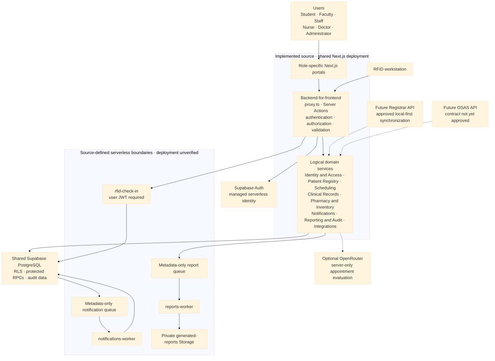

# Focused Serverless Service Boundaries

**Status:** Source implemented; linked deployment verification is blocked by
unreconciled migration history

**Last reviewed:** 2026-08-13

Zentraq uses a serverless service-oriented microservices architecture. Focused
Supabase Edge Functions provide notification, report, and RFID service
boundaries without replacing the Next.js backend-for-frontend, Supabase Auth,
PostgreSQL transactions, RLS, or role-aware Server Actions.

## Capstone-ready manuscript sections

### 2.4.1 Microservices Architecture

The BCP Clinic Management System, implemented in this repository as Zentraq,
uses a **serverless service-oriented microservices architecture**. The
architecture applies microservice principles by separating major
responsibilities into domain-owned services and by moving selected asynchronous
or security-sensitive workloads into Supabase Edge Functions. Notification,
report, and RFID functions have focused serverless execution boundaries. Other
logical services currently share one Next.js release and one Supabase data
platform, so the document does not claim that every service is independently
deployed or scaled.

The supported users are Student, Faculty, Staff, Nurse, Doctor, and
Administrator. Role-specific Next.js portals form the presentation layer.
Browser code handles interaction and display, while the Next.js
backend-for-frontend performs authentication, authorization, validation,
ownership checks, and response minimization before privileged clinical work is
allowed. The browser does not receive service-role credentials or directly
execute privileged clinical database operations.

#### Types of microservices used in Zentraq

| Microservice pattern | Current Zentraq implementation | Current limitation |
| --- | --- | --- |
| API gateway or proxy | Next.js `proxy.ts` and Server Actions form the browser-facing backend-for-frontend. They route requests to authorized domain actions, Supabase Auth, protected RPCs, Storage, and Edge Functions. | This is not a separately deployed API gateway or project-owned load balancer. It shares the Next.js release and failure boundary. |
| Event-driven service | Metadata-only PGMQ notification and report queues are consumed by `notifications-worker` and `reports-worker`; source-defined Cron jobs invoke the workers. | The source exists, but deployment, secrets, schedules, retries, and dead-letter behavior remain unverified in the linked project. |
| Domain-specific service | Identity and Access, Patient Registry, Scheduling, Clinical Records, Pharmacy and Inventory, Notifications, Reporting and Audit, and Integrations have explicit responsibility boundaries. | Most domains communicate through internal TypeScript functions, Server Actions, and shared PostgreSQL transactions rather than independent network APIs. |
| Data-intensive service | Aggregate report RPCs prepare role-scoped data, and `reports-worker` produces administrative workbooks in private Storage. | Report generation is source-implemented, but deployed execution, artifact access, expiry, and workbook output require end-to-end verification. |

#### Logical service responsibilities

| Logical service | Implemented responsibility and ownership boundary |
| --- | --- |
| Identity and Access | Uses Supabase Auth for identities and sessions, then resolves active application roles for all six user types. It does not own clinical information. |
| Patient Registry | Owns demographics, institutional identifiers, contact information, emergency contacts, patient type, and RFID association. |
| Scheduling | Manages appointments, clinician availability, schedule blocks, conflict checks, booking, rescheduling, cancellation, and check-in state. |
| Clinical Records | Manages consultations, visit reasons, triage, vital signs, diagnoses, treatments, prescriptions, follow-ups, and protected medical documents. |
| Pharmacy and Inventory | Manages medicine definitions, stock levels, batches, dispensing, expiry monitoring, and restocking workflows. |
| Notifications | Manages announcements, reminders, private notifications, read state, and the source-defined asynchronous notification queue. |
| Reporting and Audit | Produces role-scoped aggregates, administrative workbooks, and implemented audit events without becoming an unrestricted secondary store of protected health information. |
| Integrations | Handles RFID check-in and optional server-side OpenRouter appointment evaluation. Registrar and OSAS synchronization remain future integrations. |

#### Current architecture and staged boundaries



#### Implementation status

| Status | Included capabilities | Meaning |
| --- | --- | --- |
| Implemented modular services | Role portals, domain-first Server Actions, Supabase Auth integration, patient registry, scheduling, clinical records, inventory, notifications, reporting, audit events, and RFID workflows | Production-oriented source is present, but each deployment-dependent control still requires target-environment verification. |
| Source-implemented serverless boundaries | `notifications-worker`, `reports-worker`, `rfid-check-in`, protected RPCs, PGMQ queues, worker Cron migration, and the private generated-report workflow | Functions, SQL, and configuration are version-controlled; this does not prove that they are deployed or correctly configured. |
| Deployment-unverified infrastructure | Remote migration state, Edge Function deployment, worker secrets, Cron execution, queue grants and retries, Storage policies, RLS behavior, signed URLs, and six-role isolation | These items must remain open until verified against an authorized non-production or target Supabase project. |
| Future capabilities | Registrar and OSAS synchronization, external email or SMS delivery, centralized observability, and possible extraction of additional independently deployed services | These require approved contracts, privacy and security reviews, operational ownership, and implementation evidence. |

### 3.2.1 Why Microservices? Justify the Choice over Monolithic Architecture

Zentraq uses microservice principles instead of an undifferentiated application
architecture because explicit domain ownership makes the system easier to
understand, test, secure, and maintain. Focused serverless boundaries also keep
scheduled notification delivery, report generation, and authenticated RFID
check-in outside general-purpose browser code. The shared PostgreSQL platform
preserves transactional consistency for clinical workflows that update several
related records together.

The current architecture provides the following benefits:

- **Maintainability:** changes can be organized and reviewed within a clear
  domain instead of being mixed into role-specific or catch-all modules.
- **Security:** every browser request crosses a server-controlled boundary, and
  worker credentials, protected RPCs, RLS policies, and private Storage remain
  outside client bundles.
- **Transactional consistency:** related patient, consultation, inventory, and
  audit updates can use PostgreSQL transactions rather than distributed
  compensating transactions.
- **Asynchronous processing:** queued notifications and aggregate workbooks can
  be retried and processed outside the original user request once the deployed
  queue and worker configuration is verified.
- **Future integration readiness:** explicit integration boundaries provide a
  controlled location for approved Registrar and OSAS APIs without giving
  external systems unrestricted access to clinical tables.

Independent scaling, independent releases, technology diversity, and service
failure isolation are **future capabilities**, not current properties. Achieving
them would require separate service APIs, deployments, credentials, data
ownership rules, monitoring, idempotent communication, and recovery procedures.
Adopting that distributed-system complexity before there is measured scale or
reliability need would increase operational and security risk. The staged
architecture is therefore appropriate for the current capstone scope while
preserving a controlled path toward independently deployed services.

## Domain-first Server Actions

```text
actions/
  access/          accounts/       appointments/    auth/
  clinical/
    clearances/    incidents/      prescriptions/   records/    visits/
  communications/ dashboard/      health-programs/ inventory/
  profiles/        reports/        rfid/            settings/
```

Authorization is enforced inside each action; role names are not ownership
folders. Client-invoked exports use `<verb><Noun>Action`, except the unchanged
`login` and `logout` interface. The intentionally unwired faculty-account and
faculty/staff-document modules are retained under their domains for a later
review rather than copied into role folders.

## Detailed current service flows

### Notifications

1. A protected domain transaction creates an allowlisted, metadata-only job.
2. `notifications-worker` claims a bounded batch using the private queue.
3. The completion RPC creates a generic notification in `notifications` and
   archives the queue message.
4. The authenticated notification inbox reads only the current user's rows.

The worker is not a general job runner. Queue messages contain opaque IDs and
must not contain names, diagnoses, medication, notes, or other health data.

### Reports

1. An Admin requests an aggregate workbook through a Server Action.
2. The action validates the date range and enqueues an idempotent report job.
3. `reports-worker` reads aggregate RPC results and produces the workbook.
4. The workbook is stored in the private `generated-reports` bucket.
5. A Server Action rechecks ownership and expiry before issuing a five-minute
   signed download URL.

Doctor and Nurse report pages remain read-only aggregate dashboards. Workbook
generation and downloads remain Admin-only.

### RFID check-in

1. The scanner submits `{ eventId, rfidUid }` to a Server Action.
2. The action authenticates an active Admin, Doctor, or Nurse clinic account,
   validates same-origin input, and applies rate limiting.
3. The action invokes `rfid-check-in` with the user's JWT.
4. The Edge Function calls `check_in_rfid_v1` through the caller's RLS-scoped
   client.
5. The RPC returns an existing active visit or atomically creates the visit,
   consultation, and queue entry.

The public error contract uses sanitized codes: `INVALID_REQUEST`,
`PATIENT_NOT_FOUND`, and `CHECK_IN_FAILED`. An unknown card performs no patient
insert in the current phase.

## Retired platform pilot

The metadata-only `service-jobs-worker` and its Admin smoke-test UI have been
retired. Historical service-job migrations remain present for auditability. The guarded
`20260813005838_retire_service_jobs_worker.sql` migration removes only:

- the smoke-test service RPCs;
- the `zentraq_service_jobs` PGMQ queue;
- `private.service_jobs`; and
- `private.service_job_transitions`.

It does not query, update, or delete patient, consultation, notification,
report, appointment, medicine, or clinical-record data.

## Source and migration state

Supabase functions, migrations, templates, and configuration are now intended
to be version-controlled. Local linked-project state and secrets remain
ignored.

The report, RFID, and worker-Cron templates were promoted into CLI-created
migrations:

- `20260813010024_report_service.sql`
- `20260813010107_rfid_check_in_service.sql`
- `20260813010246_notification_report_worker_cron.sql`

On 2026-08-13, `supabase migration list --project-ref` reported only migration
`001` in remote history, while the repository contains later local migrations.
Therefore no `db push`, cleanup migration, or function deployment was performed
as part of this source change. The migration histories must be reconciled by an
authorized project owner before any push. `migration repair` must not be used to
mark unverified schema changes as applied.

## Security invariants

- Server Actions are reachable POST entry points and recheck authentication,
  authorization, resource ownership, input shape, and request origin.
- User-editable Auth metadata is never used for authorization.
- Worker secrets use the `apikey` header and remain outside browser bundles,
  responses, logs, and migrations.
- User-facing RFID calls use a user JWT and keep platform JWT verification on.
- Service-role RPCs revoke default execution and grant only the minimum role.
- Queue payloads and logs contain opaque identifiers and sanitized codes only.
- Generated reports remain private and use short-lived signed URLs.
- Existing RLS policies are not relaxed to make a worker succeed.

## Ordered implementation roadmap

The next work is deployment reconciliation and verification, not the immediate
extraction of more services. The implementation order is:

1. **Reconcile migration history.** Compare local and remote histories without
   modifying production, capture missing app-facing database definitions, and
   run the complete migration sequence against a disposable or staging project.
2. **Deploy and configure the focused boundaries.** After review, deploy the
   notification, report, RFID, and worker-Cron migrations; configure the three
   Edge Functions, named worker secrets, PGMQ queues, Cron schedules, and the
   private `generated-reports` bucket.
3. **Verify security and runtime behavior.** Test authentication, RLS, grants,
   worker credential rejection, queue idempotency and retries, concurrent RFID
   requests, signed-URL ownership and expiry, and positive and negative access
   paths for all six roles.
4. **Add observability and operational recovery.** Establish protected logs,
   metrics, alerts, dead-letter review, retry and replay procedures, artifact
   cleanup, incident response, and documented rollback or disable controls.
5. **Implement approved external integrations.** Add Registrar or OSAS only
   after the authoritative endpoint, service authentication, field mapping,
   consent and privacy rules, reconciliation behavior, and operational owner are
   approved. Registrar patient creation remains local-first and insert-only.
6. **Evaluate further service extraction.** Create independently deployed
   services only when measured load, release cadence, ownership, or reliability
   requirements justify separate APIs, data contracts, credentials, pipelines,
   monitoring, and failure handling.

## Future Registrar integration

Registrar synchronization is intentionally not implemented until the endpoint,
service authentication, patient-type mapping, and response contract are
approved. The required behavior is local-first and insert-only:

1. Search the local Student, Faculty, and Staff records by RFID.
2. Call Registrar only when no local patient exists.
3. Validate and minimize the Registrar response.
4. Insert a new local patient with an immutable external-source identifier in
   an idempotent transaction.
5. On a uniqueness conflict, re-read the local patient instead of updating it.
6. Continue the normal transactional check-in.

Existing local patient rows must never be overwritten automatically by a
Registrar response. Reconciliation requires a separate reviewed workflow.

## Identity and login boundary

No custom login Edge Function is planned. Supabase Auth is already the managed
serverless Identity Service, while the login Server Action remains Zentraq's
browser-facing boundary. A future Registrar-backed registration service may
verify and provision accounts, but login continues through Supabase Auth and
must not store or proxy Registrar passwords.

## Required deployment verification

After migration history is reconciled:

1. Run a linked dry-run and review every pending migration.
2. Run database security and performance advisors.
3. Test worker authentication with missing, publishable, user, and named secret
   credentials.
4. Test notification idempotency, retry, and dead-letter behavior.
5. Open a generated workbook in desktop Excel and verify private download and
   expiry behavior.
6. Test RFID with Student, Faculty, Staff, duplicate, concurrent, unknown,
   self-check-in, and unauthorized-role cases.
7. Compare patient-table checksums or row snapshots before and after RFID tests
   to confirm that existing patient rows are unchanged.
