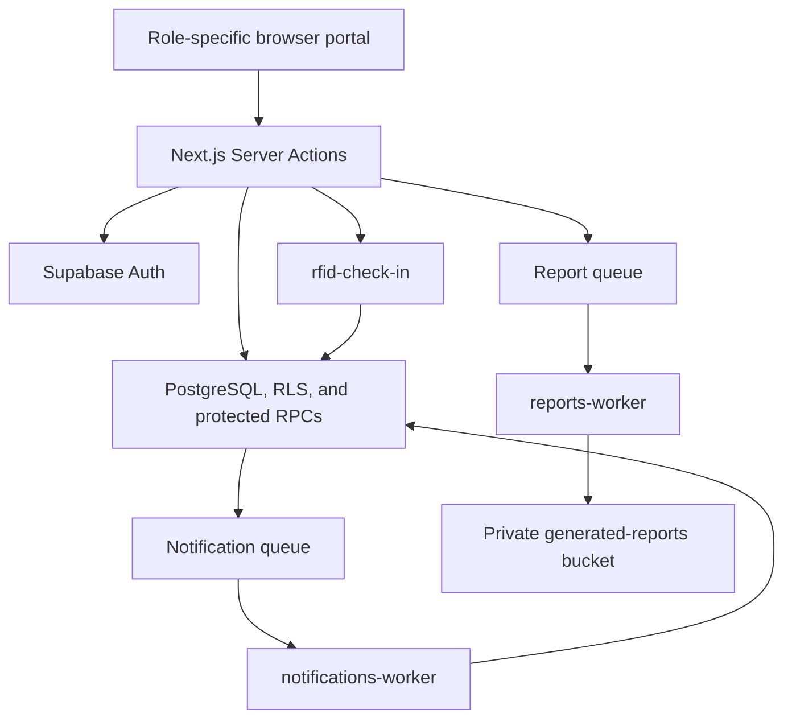

# Focused Serverless Service Boundaries

**Status:** Source implemented; linked deployment verification is blocked by
unreconciled migration history

**Last reviewed:** 2026-08-13

Zentraq remains a service-oriented modular monolith. Supabase Edge Functions
are used only where a focused serverless boundary adds value; they do not
replace the Next.js backend-for-frontend, Supabase Auth, PostgreSQL
transactions, RLS, or role-aware Server Actions.

## Domain-first Server Actions

```text
actions/
  access/          accounts/       appointments/    auth/
  clinical/
    clearances/    incidents/      prescriptions/   records/    visits/
  communications/ dashboard/      health-programs/ inventory/
  profiles/        reports/        rfid/            settings/
```

Authorization is enforced inside each action; role names are not ownership
folders. Client-invoked exports use `<verb><Noun>Action`, except the unchanged
`login` and `logout` interface. The intentionally unwired faculty-account and
faculty/staff-document modules are retained under their domains for a later
review rather than copied into role folders.

## Current service flows



### Notifications

1. A protected domain transaction creates an allowlisted, metadata-only job.
2. `notifications-worker` claims a bounded batch using the private queue.
3. The completion RPC creates a generic notification in `notifications` and
   archives the queue message.
4. The authenticated notification inbox reads only the current user's rows.

The worker is not a general job runner. Queue messages contain opaque IDs and
must not contain names, diagnoses, medication, notes, or other health data.

### Reports

1. An Admin requests an aggregate workbook through a Server Action.
2. The action validates the date range and enqueues an idempotent report job.
3. `reports-worker` reads aggregate RPC results and produces the workbook.
4. The workbook is stored in the private `generated-reports` bucket.
5. A Server Action rechecks ownership and expiry before issuing a five-minute
   signed download URL.

Doctor and Nurse report pages remain read-only aggregate dashboards. Workbook
generation and downloads remain Admin-only.

### RFID check-in

1. The scanner submits `{ eventId, rfidUid }` to a Server Action.
2. The action authenticates an active Admin, Doctor, or Nurse clinic account,
   validates same-origin input, and applies rate limiting.
3. The action invokes `rfid-check-in` with the user's JWT.
4. The Edge Function calls `check_in_rfid_v1` through the caller's RLS-scoped
   client.
5. The RPC returns an existing active visit or atomically creates the visit,
   consultation, and queue entry.

The public error contract uses sanitized codes: `INVALID_REQUEST`,
`PATIENT_NOT_FOUND`, and `CHECK_IN_FAILED`. An unknown card performs no patient
insert in the current phase.

## Retired platform pilot

The metadata-only `service-jobs-worker` and its Admin smoke-test UI have been
retired. Historical service-job migrations remain present for auditability. The guarded
`20260813005838_retire_service_jobs_worker.sql` migration removes only:

- the smoke-test service RPCs;
- the `zentraq_service_jobs` PGMQ queue;
- `private.service_jobs`; and
- `private.service_job_transitions`.

It does not query, update, or delete patient, consultation, notification,
report, appointment, medicine, or clinical-record data.

## Source and migration state

Supabase functions, migrations, templates, and configuration are now intended
to be version-controlled. Local linked-project state and secrets remain
ignored.

The report, RFID, and worker-Cron templates were promoted into CLI-created
migrations:

- `20260813010024_report_service.sql`
- `20260813010107_rfid_check_in_service.sql`
- `20260813010246_notification_report_worker_cron.sql`

On 2026-08-13, `supabase migration list --project-ref` reported only migration
`001` in remote history, while the repository contains later local migrations.
Therefore no `db push`, cleanup migration, or function deployment was performed
as part of this source change. The migration histories must be reconciled by an
authorized project owner before any push. `migration repair` must not be used to
mark unverified schema changes as applied.

## Security invariants

- Server Actions are reachable POST entry points and recheck authentication,
  authorization, resource ownership, input shape, and request origin.
- User-editable Auth metadata is never used for authorization.
- Worker secrets use the `apikey` header and remain outside browser bundles,
  responses, logs, and migrations.
- User-facing RFID calls use a user JWT and keep platform JWT verification on.
- Service-role RPCs revoke default execution and grant only the minimum role.
- Queue payloads and logs contain opaque identifiers and sanitized codes only.
- Generated reports remain private and use short-lived signed URLs.
- Existing RLS policies are not relaxed to make a worker succeed.

## Future Registrar integration

Registrar synchronization is intentionally not implemented until the endpoint,
service authentication, patient-type mapping, and response contract are
approved. The required behavior is local-first and insert-only:

1. Search the local Student, Faculty, and Staff records by RFID.
2. Call Registrar only when no local patient exists.
3. Validate and minimize the Registrar response.
4. Insert a new local patient with an immutable external-source identifier in
   an idempotent transaction.
5. On a uniqueness conflict, re-read the local patient instead of updating it.
6. Continue the normal transactional check-in.

Existing local patient rows must never be overwritten automatically by a
Registrar response. Reconciliation requires a separate reviewed workflow.

## Identity and login boundary

No custom login Edge Function is planned. Supabase Auth is already the managed
serverless Identity Service, while the login Server Action remains Zentraq's
browser-facing boundary. A future Registrar-backed registration service may
verify and provision accounts, but login continues through Supabase Auth and
must not store or proxy Registrar passwords.

## Required deployment verification

After migration history is reconciled:

1. Run a linked dry-run and review every pending migration.
2. Run database security and performance advisors.
3. Test worker authentication with missing, publishable, user, and named secret
   credentials.
4. Test notification idempotency, retry, and dead-letter behavior.
5. Open a generated workbook in desktop Excel and verify private download and
   expiry behavior.
6. Test RFID with Student, Faculty, Staff, duplicate, concurrent, unknown,
   self-check-in, and unauthorized-role cases.
7. Compare patient-table checksums or row snapshots before and after RFID tests
   to confirm that existing patient rows are unchanged.
