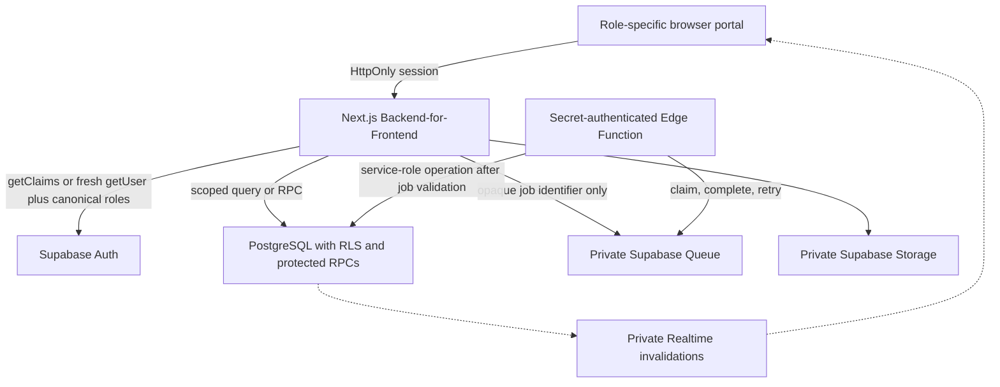

# Serverless Microservices Migration Plan

**Status:** Production service source defined; rollout flags default to disabled

**Last reviewed:** 2026-08-11

**Migration owner:** Zentraq engineering and the authorized Supabase project owner

This implementation moves Zentraq from a service-oriented modular monolith
toward serverless services without weakening authentication, authorization,
clinical assignment, audit, or data-minimization controls. Notifications are
the first active production migration. Reports, RFID check-in, profile-photo
Storage, and worker Cron remain reviewed migration templates until the prior
phase passes its production security gate.

No database migration or function deployment was executed while preparing
this implementation. All production flags remain disabled by default.

## 1. Recommended target



Next.js remains the only browser-facing Backend-for-Frontend during the
migration. Supabase Auth remains the identity authority, and PostgreSQL RLS and
protected RPCs remain database enforcement boundaries. Edge Functions are
internal workers, not alternative browser APIs.

## 2. Security and privacy invariants

The following controls are non-negotiable in every phase:

1. Page and proxy identity checks use `auth.getClaims()`. Workflows requiring a
   fresh Auth record use `auth.getUser()`. Authorization is always resolved
   against the canonical `user_roles -> roles` assignment on the server.
2. Route middleware, Server Action authorization, database RLS, and protected
   RPC grants remain simultaneous controls. None replaces another.
3. Doctor, nurse, and administrator clinical work remains scoped by active
   `clinic_accounts.id`, patient ownership, or an explicit assignment.
4. The service-role key and named service secrets never enter browser bundles,
   public environment variables, queue messages, logs, or API responses.
5. User-editable Auth metadata is never used for authorization.
6. Queues contain only a version, job UUID, and job type. Names, email
   addresses, institutional numbers, diagnoses, medications, notes, documents,
   and other PHI are prohibited in queue messages.
7. A worker fetches required records by opaque identifier after authenticating
   as an internal service. It returns only aggregate counts or generic status.
8. Logs contain event names, sanitized error codes, and correlation IDs. They
   must not contain request bodies, queue messages, database rows, JWTs, keys,
   signed URLs, or free-form clinical text.
9. Jobs are idempotent, bounded, retryable, and dead-lettered after a fixed
   attempt limit. A retry must not duplicate a clinical or administrative
   mutation.
10. Existing RLS policies are not relaxed to accommodate a service. Privileged
    database functions have an empty `search_path`, revoke default execution,
    and grant execution only to `service_role`.
11. Sensitive tables and queues remain outside the browser Data API. New public
    objects receive explicit grants rather than relying on automatic exposure.
12. Storage objects remain private. Authorization is checked before creating a
    short-lived signed URL.

## 3. Service ownership roadmap

| Service boundary | First extraction | Data ownership rule | Security gate |
| --- | --- | --- | --- |
| Platform jobs | Phase 0 smoke-test worker | Private service metadata only | Named secret, service-role-only RPCs, no PHI |
| Notifications | Phase 1 | Notification delivery state and generic templates | User-specific RLS; queue contains only delivery job ID |
| Reports | Phase 1 | Aggregate report requests and generated artifacts | Admin-only request; minimized aggregate inputs; private Storage output |
| RFID and check-in | Phase 2 | RFID event intake and check-in orchestration | Signed workstation identity; replay protection; existing claim ownership |
| Scheduling | Phase 2 | Appointments, availability, reminders, and conflicts | Role and assignment checks; idempotent booking keys |
| Inventory | Phase 3 | Stock, batches, dispensing, and expiry | Transactional stock mutation; actor and prescription validation |
| Clinical records | Last | Consultations, triage, diagnoses, prescriptions, and follow-ups | Live RLS/grant audit, transactional design, clinical governance approval |
| Identity and access | Remains centralized | Supabase Auth, application sessions, canonical roles | Session revocation, server-only Admin API, no independent identity copies |

Clinical records are extracted last because splitting them prematurely creates
distributed-transaction and broken-access-control risks. A service boundary is
not considered extracted until it has enforceable ownership, authenticated
contracts, monitoring, retry behavior, and role-by-role security tests.

## 4. Phase plan

### Phase 0: private platform pilot

Included in this change:

- A durable `zentraq_service_jobs` PGMQ queue
- Private `service_jobs` and append-only transition tables
- Service-role-only enqueue, claim, completion, and failure RPCs
- A single allowed `platform.smoke_test` job type
- A `service-jobs-worker` Edge Function protected by the named
  `automations` secret key
- Bounded batches, a visibility timeout, idempotency keys, sanitized error
  codes, retry limits, and dead-letter state

This phase proves infrastructure only. It does not redirect application
traffic or store PHI.

Exit criteria:

- The migration dry-run lists only reviewed pending migrations.
- Database advisors report no new security or performance errors.
- Anonymous and authenticated roles cannot access the private job tables,
  queue tables, or service RPCs. Existing authenticated access to approved
  private RLS helper functions remains unchanged.
- The named service key can invoke the worker; a user JWT and publishable key
  cannot.
- A repeated idempotency key produces one job.
- Failed jobs retry and reach `dead_letter` at the configured limit.
- Logs contain no payload or user health information.

### Phase 1: notifications and aggregate reports

- `zentraq_notification_jobs` accepts only opaque job identifiers and allowlisted
  in-app templates. Notification reads and read-state changes use the caller's
  RLS-scoped client.
- `zentraq_report_jobs` generates Admin-owned aggregate workbooks in the private
  `generated-reports` bucket. Signed downloads last five minutes and artifacts
  expire after 24 hours.
- `notifications-worker` and `reports-worker` require the named `automations`
  secret. Cron reads the project URL and worker key from Vault.
- Doctor and Nurse retain aggregate read-only charts; only Admin may create or
  download workbook artifacts.

### Phase 2: RFID and scheduling

- `rfid-check-in` uses authenticated user JWTs and a replay-resistant event ID;
  the check-in mutation remains synchronous and transactional.
- The protected RPC supports Student, Faculty, and Staff and requires an active
  Admin, Doctor, or Nurse clinic account.
- Preserve the current unclaimed/claimed queue and clinician ownership rules.
- Require idempotency keys for appointment creation and rescheduling.
- Keep conflict checks and writes in one database transaction or protected RPC.

### Phase 3: inventory

- Move stock commands behind an inventory service contract.
- Keep prescription authorization and stock decrement atomic.
- Audit actor, medicine, quantity, and result using identifiers rather than
  duplicating clinical notes.

### Phase 4: clinical records

Proceed only after a live RLS, grants, view, function-owner, and Storage audit.
Define failure recovery for every consultation transition before moving it out
of the modular monolith.

## 5. Pilot database objects

The migration is:

`supabase/migrations/20260811065559_serverless_service_foundation.sql`

It deliberately uses the private `pgmq` and `private` schemas. The queue is not
added to the configured Data API schemas. The public RPC names are visible in
the API schema, but `PUBLIC`, `anon`, and `authenticated` have no execute grant;
only `service_role` can call them.

The allowed queue message is equivalent to:

```json
{
  "version": 1,
  "job_id": "opaque-uuid",
  "job_type": "platform.smoke_test"
}
```

Free-form payloads are intentionally unsupported. Future service payloads must
be stored in private, domain-owned tables and referenced by UUID.

## 6. Worker authentication

`service-jobs-worker` uses handler-level
`auth: "secret:automations"`. Its Supabase configuration sets
`verify_jwt = false` because modern Supabase secret API keys belong in the
`apikey` header and are not JWTs. Disabling platform JWT verification does not
make the function public: the handler rejects callers that do not present the
named secret key.

Create a dedicated secret API key named `automations` in the Supabase Dashboard
under **Settings -> API Keys**. Add its value to Supabase Vault as
`zentraq_automations_secret`, and add the project origin such as
`https://PROJECT_REF.supabase.co` as `zentraq_project_url`. Do not reuse the
browser publishable key, place the worker key in a public environment variable,
or include either value in a migration.

## 7. Manual deployment procedure

Run these commands yourself from `D:\Documents\Coding\zentraq`. They were not
executed while preparing this code.

First authenticate and link the correct project if it is not already linked:

```powershell
pnpm dlx supabase@latest login
pnpm dlx supabase@latest link --project-ref YOUR_PROJECT_REF
```

Inspect every pending migration without applying anything:

```powershell
pnpm dlx supabase@latest db push --linked --dry-run
```

Important: `db push` applies every pending local migration, not only the newest
file. Stop if the dry-run lists an unexpected migration or if local and remote
history differ.

After reviewing the dry-run, apply the notification phase only:

```powershell
pnpm dlx supabase@latest db push --linked
```

At this point, the dry-run must list only the already-approved foundation (if
it is not yet remote) and `20260811100000_notification_service.sql`. The later
domains are intentionally stored under `supabase/migration-templates`, because
the official CLI applies every pending file in `supabase/migrations` and has no
single-version `db push` flag.

Deploy the notification worker after its schema succeeds and both Vault entries
exist:

```powershell
pnpm dlx supabase@latest functions deploy notifications-worker
```

Complete the notification role, retry, idempotency, and denial tests. Then
stage only the report migration and repeat the dry-run/push/deploy sequence:

```powershell
Copy-Item `
  -LiteralPath .\supabase\migration-templates\20260811110000_report_service.sql `
  -Destination .\supabase\migrations\20260811110000_report_service.sql
pnpm dlx supabase@latest db push --linked --dry-run
pnpm dlx supabase@latest db push --linked
pnpm dlx supabase@latest functions deploy reports-worker
```

After both workers have passed their security tests, stage Cron. This ordering
prevents Cron from calling a function that has not been deployed:

```powershell
Copy-Item `
  -LiteralPath .\supabase\migration-templates\20260811115000_service_worker_cron.sql `
  -Destination .\supabase\migrations\20260811115000_service_worker_cron.sql
pnpm dlx supabase@latest db push --linked --dry-run
pnpm dlx supabase@latest db push --linked
```

Only after report canary testing succeeds, stage and deploy RFID check-in:

```powershell
Copy-Item `
  -LiteralPath .\supabase\migration-templates\20260811120000_rfid_check_in_service.sql `
  -Destination .\supabase\migrations\20260811120000_rfid_check_in_service.sql
pnpm dlx supabase@latest db push --linked --dry-run
pnpm dlx supabase@latest db push --linked
pnpm dlx supabase@latest functions deploy rfid-check-in
```

After the RFID workstation canary succeeds, stage private profile-photo
Storage for the still-centralized registration workflow:

```powershell
Copy-Item `
  -LiteralPath .\supabase\migration-templates\20260811130000_profile_photo_storage.sql `
  -Destination .\supabase\migrations\20260811130000_profile_photo_storage.sql
pnpm dlx supabase@latest db push --linked --dry-run
pnpm dlx supabase@latest db push --linked
```

Do not copy two templates before a push. Do not use `migration repair` to make
an unapplied domain appear applied.

Do not use `--no-verify-jwt` as a substitute for the checked-in function
configuration. The handler-level named-secret check must remain enabled.

The Next.js rollout flags are server-only and default to disabled:

```text
ZENTRAQ_SERVERLESS_NOTIFICATIONS_ENABLED=false
ZENTRAQ_SERVERLESS_NOTIFICATIONS_CANARY_IDS=
ZENTRAQ_SERVERLESS_REPORTS_ENABLED=false
ZENTRAQ_SERVERLESS_REPORTS_CANARY_IDS=
ZENTRAQ_SERVERLESS_RFID_ENABLED=false
ZENTRAQ_SERVERLESS_RFID_CANARY_IDS=
```

Set one feature to `true` only after its function and database tests pass. When
the matching canary list is empty, every eligible user is enabled; otherwise
only the comma-separated Auth user IDs are enabled.

## 8. Post-deployment verification

Perform these checks before any production domain uses the queue:

- Compare local and remote migration history.
- Run Supabase database security and performance advisors.
- Confirm the private job tables and PGMQ queue are not accessible to `anon` or
  `authenticated`; approved private RLS helpers must continue to work.
- Attempt each service RPC as `anon`, `authenticated`, and `service_role`.
- Invoke the worker without a key, with a publishable key, with a user JWT, and
  with the named `automations` key.
- Confirm only the named key succeeds.
- Confirm an authenticated user JWT succeeds for `rfid-check-in`, while a
  publishable key and the worker secret do not.
- Enqueue repeated notification/report idempotency keys and verify one active
  job exists.
- Force failures and verify the visibility timeout, retry count, and
  dead-letter transition.
- Confirm report objects are private, signed URLs expire, and expired objects
  are removed after 24 hours.
- Open a generated workbook in desktop Excel and confirm it needs no repair and
  includes the aggregate trend image.
- Check in active Student, Faculty, and Staff cards, including duplicate,
  concurrent, replayed, inactive, and self-check-in cases.
- Review function and Postgres logs for PHI, tokens, keys, and SQL details.
- Confirm all existing student, faculty, staff, nurse, doctor, and admin route
  and cross-role tests still pass.

## 9. Rollback and failure handling

All production flags default to disabled. Turning off one flag restores that
module's original application path without deleting queued work. Do not drop a
queue, private table, or bucket while jobs are processing. Archive or reconcile
jobs, disable function invocations, and use a reviewed forward migration for
structural rollback.

Never use `supabase db reset --linked` for rollback. It is destructive to the
remote project.

## 10. Current limitations

- Live database state, RLS policies, grants, function owners, and migration
  history remain deployment-unverified.
- Cron is not staged until both workers and both required Vault entries exist.
  Leave feature flags disabled until the functions are deployed and tested.
- Scheduling, inventory, and clinical records remain in the modular monolith.
- Legal compliance still requires operational controls, retention policies,
  incident response, workforce training, contracts, and a privacy impact
  assessment outside the source code.

## References

- [Supabase Edge Functions](https://supabase.com/docs/guides/functions)
- [Securing Edge Functions](https://supabase.com/docs/guides/functions/auth)
- [Supabase Queues](https://supabase.com/docs/guides/queues)
- [Consuming queue messages with Edge Functions](https://supabase.com/docs/guides/queues/consuming-messages-with-edge-functions)
- [Supabase Cron](https://supabase.com/docs/guides/cron)
- [Supabase database migrations](https://supabase.com/docs/guides/deployment/database-migrations)
