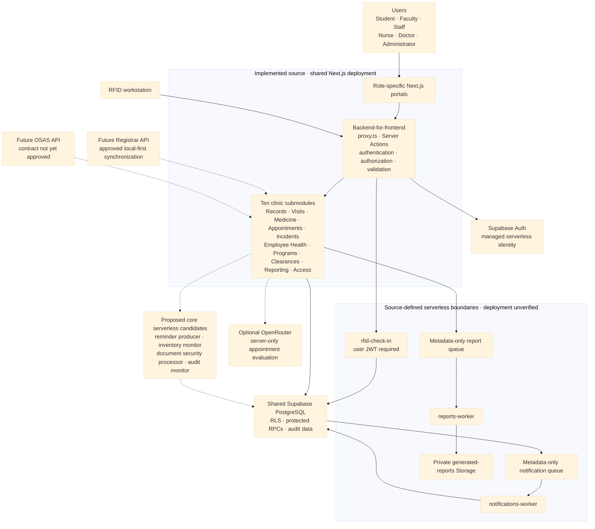

# Focused Serverless Service Boundaries

**Status:** Source implemented; linked deployment verification is blocked by
unreconciled migration history

**Last reviewed:** 2026-08-14

Zentraq uses a serverless service-oriented modular architecture with focused
microservice boundaries. Its ten original clinic submodules define product
ownership, while Supabase Edge Functions provide notification, report, and
RFID technical service boundaries without replacing the Next.js
backend-for-frontend, Supabase Auth, PostgreSQL transactions, RLS, or
role-aware Server Actions.

## Capstone-ready manuscript sections

### 2.4.1 Microservices Architecture

The BCP Clinic Management System, implemented in this repository as Zentraq,
uses a **serverless service-oriented modular architecture with focused
microservice boundaries**. The ten original clinic submodules separate product
responsibilities, while selected asynchronous or security-sensitive workloads
run in Supabase Edge Functions. Notification, report, and RFID functions have
focused serverless execution boundaries. The submodules otherwise share one
Next.js release and one Supabase data platform, so this document does not claim
that each submodule is an independently deployed or scaled service.

The supported users are Student, Faculty, Staff, Nurse, Doctor, and
Administrator. Role-specific Next.js portals form the presentation layer.
Browser code handles interaction and display, while the Next.js
backend-for-frontend performs authentication, authorization, validation,
ownership checks, and response minimization before privileged clinical work is
allowed. The browser does not receive service-role credentials or directly
execute privileged clinical database operations.

#### Types of microservices used in Zentraq

| Microservice pattern | Current Zentraq implementation | Current limitation |
| --- | --- | --- |
| API gateway or proxy | Next.js `proxy.ts` and Server Actions form the browser-facing backend-for-frontend. They route requests to authorized domain actions, Supabase Auth, protected RPCs, Storage, and Edge Functions. | This is not a separately deployed API gateway or project-owned load balancer. It shares the Next.js release and failure boundary. |
| Event-driven service | Metadata-only PGMQ notification and report queues are consumed by `notifications-worker` and `reports-worker`; source-defined Cron jobs invoke the workers. | The source exists, but deployment, secrets, schedules, retries, and dead-letter behavior remain unverified in the linked project. |
| Submodule-oriented boundary | The ten original clinic submodules have explicit product responsibility boundaries. | Most submodules communicate through internal TypeScript functions, Server Actions, and shared PostgreSQL transactions rather than independent network APIs. |
| Data-intensive service | Aggregate report RPCs prepare role-scoped data, and `reports-worker` produces administrative workbooks in private Storage. | Report generation is source-implemented, but deployed execution, artifact access, expiry, and workbook output require end-to-end verification. |

#### Original submodule responsibilities

| Module | Original submodule | Implemented responsibility and ownership boundary |
| --- | --- | --- |
| 1 | Student Medical Records Management | Student identity, demographic and health records, protected documents, own-record access, and RFID association |
| 2 | Clinic Visit & Consultation Logging | Check-in, queue, consultation state, triage, handoff, clinical outcomes, follow-up, and history |
| 3 | Medicine Inventory & Dispensing | Medicine definitions, zero-stock visibility, batches, stock receipt, dispensing, expiry, and movement logs |
| 4 | Appointment Scheduling System | Availability, schedule blocks, conflicts, booking, review, reminders, transitions, history, and optional advisory evaluation |
| 5 | Incident & Emergency Case Management | Incident intake, classification, response, emergency contacts, referrals, follow-up, closure, and history |
| 6 | Faculty & Staff Health Services | Employee identity and health records, protected documents, My Health, histories, examinations, sick leave, and compliance |
| 7 | School Health Program Monitoring | Program proposals, approvals, participants, schedules, screenings, immunizations, monitoring, and reports |
| 8 | Health Clearance and Certification | Requests, requirements, supporting evidence, evaluation, certificates, history, and patient access |
| 9 | Reporting and Compliance | Role-scoped aggregates, private administrative workbooks, audit evidence, monitoring, and compliance documentation |
| 10 | User Access & Confidentiality Control | Authentication, sessions, roles, authorization, RLS, grants, Storage, Realtime, secrets, privacy, and security assurance |

The previous technical-domain labels map into this product structure: Patient
Registry maps to Modules 1 and 6; Clinical Records to Modules 1, 2, 6, and 8;
Scheduling to Module 4; Pharmacy and Inventory to Module 3; Identity and Access
to Module 10; and Reporting and Audit to Modules 9 and 10. RFID supports
Modules 1, 2, and 6. Notifications provide cross-cutting support to Modules 4,
5, 7, 8, and 9 rather than forming an additional product module.

#### Current architecture and staged boundaries



#### Implementation status

| Status | Included capabilities | Meaning |
| --- | --- | --- |
| Implemented clinic submodules | The ten original submodules, six role portals, domain-first Server Actions, Supabase Auth integration, notifications, audit events, and RFID workflows | Production-oriented source is present, but each deployment-dependent control still requires target-environment verification. |
| Source-implemented serverless boundaries | `notifications-worker`, `reports-worker`, `rfid-check-in`, protected RPCs, PGMQ queues, worker Cron migration, and the private generated-report workflow | Functions, SQL, and configuration are version-controlled; this does not prove that they are deployed or correctly configured. |
| Deployment-unverified infrastructure | Remote migration state, Edge Function deployment, worker secrets, Cron execution, queue grants and retries, Storage policies, RLS behavior, signed URLs, and six-role isolation | These items must remain open until verified against an authorized non-production or target Supabase project. |
| Future capabilities | Registrar and OSAS synchronization, external email or SMS delivery, centralized observability, and possible extraction of additional independently deployed services | These require approved contracts, privacy and security reviews, operational ownership, and implementation evidence. |

#### Submodule-aligned serverless opportunities

The following entries are **proposed serverless candidates** unless explicitly
marked as source-implemented. A submodule workflow is a good candidate when it is
bounded, stateless or idempotent, scheduled or event-driven, safe to retry, and
does not require an interactive clinical decision across several database
records.

| Module | Original submodule | Serverless boundary | Trigger and security model | Recommendation |
| --- | --- | --- | --- | --- |
| 1 | Student Medical Records Management | A future `clinical-document-processor` could validate private uploads; a future institutional adapter could perform an approved local-first lookup. | Use opaque record/object IDs, a private queue or Storage event, minimum grants, and conflict-safe insert-only RPCs. | Verify Storage first. Never overwrite an existing student automatically or create clinical facts from OCR or AI output. |
| 2 | Clinic Visit & Consultation Logging | `rfid-check-in` is source-implemented; a future producer could enqueue generic follow-up reminders. | The RFID path requires a user JWT and RLS-scoped client. Scheduled reminders require a named secret and metadata-only payloads. | Deploy and verify RFID first. Keep queue claim, triage, handoff, diagnosis, treatment, prescriptions, and finalization transactional. |
| 3 | Medicine Inventory & Dispensing | An `inventory-attention-worker` could detect low, zero, near-expiry, and expired stock and enqueue generic attention notifications. | Use Cron, an idempotent scan window, a named secret, and protected aggregate or claim RPCs without patient or prescription content. | High-value next candidate. The worker must not order, receive, adjust, dispense, or otherwise change stock. |
| 4 | Appointment Scheduling System | An `appointment-reminders-worker` could claim due reminders; a separate governed function could isolate optional OpenRouter evaluation. | Use Cron and a named secret for reminders. Require a user JWT, server authorization, timeouts, validated output, and sanitized logs for on-demand AI. | Keep booking, conflicts, approval, rescheduling, cancellation, and check-in transactional. External AI remains policy-dependent. |
| 5 | Incident & Emergency Case Management | A reminder producer could enqueue generic overdue follow-up notices. | Queue only opaque incident and recipient identifiers; use a named worker secret and least-privilege completion RPC. | Do not move classification, response, referral, follow-up notes, or closure to an autonomous worker. |
| 6 | Faculty & Staff Health Services | Private-document processing and a future Registrar or HR adapter can support approved employee-record workflows. | Minimize external responses, use immutable source IDs, and insert through conflict-safe RPCs after local lookup fails. | Keep local-first and insert-only behavior. Mismatches require reviewed reconciliation rather than automatic update. |
| 7 | School Health Program Monitoring | Scheduled program reminders or aggregate refresh jobs can be queued without clinical narrative. | Use opaque program/session IDs, named secrets, bounded batches, and idempotent completion. | Keep proposals, approval, participant changes, screenings, and immunization records in authorized transactions. |
| 8 | Health Clearance and Certification | A document processor and expiry-reminder producer could handle private artifacts and generic due notices. | Use private Storage events or queues, object ownership checks, minimum grants, quarantine, and sanitized logs. | Keep clinical evaluation, approval, certificate issuance, and signed-URL authorization synchronous. |
| 9 | Reporting and Compliance | `reports-worker` and `notifications-worker` are source-implemented. A future `audit-monitor` could process an outbox and sanitized security metrics. | Use named secrets, append-only audit inputs, private generated-report Storage, bounded batches, and outputs without clinical content. | Deploy and verify reports and notifications first; protect artifact ownership, expiry, immutable audit writes, and monitoring access. |
| 10 | User Access & Confidentiality Control | Supabase Auth is the managed identity service; future sanitized security monitoring may run asynchronously. | User-facing operations require normal Auth sessions and server-side authorization. Internal monitoring requires named secrets and minimum database grants. | Keep login, active-role checks, revocation, recovery, and account writes in Auth plus protected Server Actions or RPCs; never proxy Registrar passwords. |

`notifications-worker` is cross-cutting infrastructure rather than an eleventh
submodule. `reports-worker` belongs primarily to Module 9. `rfid-check-in`
supports Modules 1, 2, and 6. OpenRouter appointment evaluation belongs to
Module 4, while future Registrar or OSAS integration supports Modules 1 and 6.

#### Core operations that should remain transactional

Serverless Edge Functions may orchestrate these operations, but the state change
itself should remain in an authorized Server Action or atomic PostgreSQL RPC:

- patient correction, merge, and external-record reconciliation;
- appointment booking, conflict checking, approval, rescheduling, cancellation,
  and check-in transitions;
- triage handoff, diagnosis, treatment, prescription, follow-up creation, and
  consultation finalization;
- medicine dispensing, stock receipt, batch adjustment, and restocking; and
- ownership checks for protected records, reports, documents, and signed URLs.

These workflows require immediate user feedback, consistent authorization, and
all-or-nothing database updates. Moving their multi-record mutation logic into
independent background workers would create avoidable race conditions and
partial clinical state.

#### Recommended order for new core serverless services

After the three existing Edge Functions and their migrations are deployed and
verified, add candidates in this order:

1. `appointment-reminders-worker`, because due reminder records already exist.
2. `inventory-attention-worker`, using the existing low-stock, expiry, and
   `inventory.attention` notification contracts.
3. `clinical-document-processor`, together with quarantine, malware scanning,
   Storage policy verification, and download auditing.
4. `audit-monitor`, after mandatory events, outbox behavior, retention, alert
   ownership, and immutable access are defined.
5. A focused appointment-evaluation function only after AI governance,
   minimization, human override, and provider monitoring are approved.
6. Registrar or OSAS provisioning and synchronization only after external API,
   authentication, mapping, reconciliation, and privacy contracts are approved.

### 3.2.1 Why Microservices? Justify the Choice over Monolithic Architecture

Zentraq uses microservice principles instead of an undifferentiated application
architecture because explicit submodule ownership makes the system easier to
understand, test, secure, and maintain. Focused serverless boundaries also keep
scheduled notification delivery, report generation, and authenticated RFID
check-in outside general-purpose browser code. The shared PostgreSQL platform
preserves transactional consistency for clinical workflows that update several
related records together.

The current architecture provides the following benefits:

- **Maintainability:** changes can be organized and reviewed within a clear
  submodule and its implementation domain instead of being mixed into
  role-specific or catch-all modules.
- **Security:** every browser request crosses a server-controlled boundary, and
  worker credentials, protected RPCs, RLS policies, and private Storage remain
  outside client bundles.
- **Transactional consistency:** related patient, consultation, inventory, and
  audit updates can use PostgreSQL transactions rather than distributed
  compensating transactions.
- **Asynchronous processing:** queued notifications and aggregate workbooks can
  be retried and processed outside the original user request once the deployed
  queue and worker configuration is verified.
- **Future integration readiness:** explicit integration boundaries provide a
  controlled location for approved Registrar and OSAS APIs without giving
  external systems unrestricted access to clinical tables.

Independent scaling, independent releases, technology diversity, and service
failure isolation are **future capabilities**, not current properties. Achieving
them would require separate service APIs, deployments, credentials, data
ownership rules, monitoring, idempotent communication, and recovery procedures.
Adopting that distributed-system complexity before there is measured scale or
reliability need would increase operational and security risk. The staged
architecture is therefore appropriate for the current capstone scope while
preserving a controlled path toward independently deployed services.

## Domain-first Server Actions

```text
actions/
  access/          accounts/       appointments/    auth/
  clinical/
    clearances/    incidents/      prescriptions/   records/    visits/
  communications/ dashboard/      health-programs/ inventory/
  profiles/        reports/        rfid/            settings/
```

Authorization is enforced inside each action; role names are not ownership
folders. Client-invoked exports use `<verb><Noun>Action`, except the unchanged
`login` and `logout` interface. The intentionally unwired faculty-account and
faculty/staff-document modules are retained under their domains for a later
review rather than copied into role folders.

## Detailed current service flows

### Notifications

1. A protected domain transaction creates an allowlisted, metadata-only job.
2. `notifications-worker` claims a bounded batch using the private queue.
3. The completion RPC creates a generic notification in `notifications` and
   archives the queue message.
4. The authenticated notification inbox reads only the current user's rows.

The worker is not a general job runner. Queue messages contain opaque IDs and
must not contain names, diagnoses, medication, notes, or other health data.

### Reports

1. An Admin requests an aggregate workbook through a Server Action.
2. The action validates the date range and enqueues an idempotent report job.
3. `reports-worker` reads aggregate RPC results and produces the workbook.
4. The workbook is stored in the private `generated-reports` bucket.
5. A Server Action rechecks ownership and expiry before issuing a five-minute
   signed download URL.

Doctor and Nurse report pages remain read-only aggregate dashboards. Workbook
generation and downloads remain Admin-only.

### RFID check-in

1. The scanner submits `{ eventId, rfidUid }` to a Server Action.
2. The action authenticates an active Admin, Doctor, or Nurse clinic account,
   validates same-origin input, and applies rate limiting.
3. The action invokes `rfid-check-in` with the user's JWT.
4. The Edge Function calls `check_in_rfid_v1` through the caller's RLS-scoped
   client.
5. The RPC returns an existing active visit or atomically creates the visit,
   consultation, and queue entry.

The public error contract uses sanitized codes: `INVALID_REQUEST`,
`PATIENT_NOT_FOUND`, and `CHECK_IN_FAILED`. An unknown card performs no patient
insert in the current phase.

## Retired platform pilot

The metadata-only `service-jobs-worker` and its Admin smoke-test UI have been
retired. Historical service-job migrations remain present for auditability. The guarded
`20260813005838_retire_service_jobs_worker.sql` migration removes only:

- the smoke-test service RPCs;
- the `zentraq_service_jobs` PGMQ queue;
- `private.service_jobs`; and
- `private.service_job_transitions`.

It does not query, update, or delete patient, consultation, notification,
report, appointment, medicine, or clinical-record data.

## Source and migration state

Supabase functions, migrations, templates, and configuration are now intended
to be version-controlled. Local linked-project state and secrets remain
ignored.

The report, RFID, and worker-Cron templates were promoted into CLI-created
migrations:

- `20260813010024_report_service.sql`
- `20260813010107_rfid_check_in_service.sql`
- `20260813010246_notification_report_worker_cron.sql`

On 2026-08-13, `supabase migration list --project-ref` reported only migration
`001` in remote history, while the repository contains later local migrations.
Therefore no `db push`, cleanup migration, or function deployment was performed
as part of this source change. The migration histories must be reconciled by an
authorized project owner before any push. `migration repair` must not be used to
mark unverified schema changes as applied.

## Security invariants

- Server Actions are reachable POST entry points and recheck authentication,
  authorization, resource ownership, input shape, and request origin.
- User-editable Auth metadata is never used for authorization.
- Worker secrets use the `apikey` header and remain outside browser bundles,
  responses, logs, and migrations.
- User-facing RFID calls use a user JWT and keep platform JWT verification on.
- Service-role RPCs revoke default execution and grant only the minimum role.
- Queue payloads and logs contain opaque identifiers and sanitized codes only.
- Generated reports remain private and use short-lived signed URLs.
- Existing RLS policies are not relaxed to make a worker succeed.

## Ordered implementation roadmap

The next work is deployment reconciliation and verification, not the immediate
extraction of more services. The implementation order is:

1. **Reconcile migration history.** Compare local and remote histories without
   modifying production, capture missing app-facing database definitions, and
   run the complete migration sequence against a disposable or staging project.
2. **Deploy and configure the focused boundaries.** After review, deploy the
   notification, report, RFID, and worker-Cron migrations; configure the three
   Edge Functions, named worker secrets, PGMQ queues, Cron schedules, and the
   private `generated-reports` bucket.
3. **Verify security and runtime behavior.** Test authentication, RLS, grants,
   worker credential rejection, queue idempotency and retries, concurrent RFID
   requests, signed-URL ownership and expiry, and positive and negative access
   paths for all six roles.
4. **Add observability and operational recovery.** Establish protected logs,
   metrics, alerts, dead-letter review, retry and replay procedures, artifact
   cleanup, incident response, and documented rollback or disable controls.
5. **Implement approved external integrations.** Add Registrar or OSAS only
   after the authoritative endpoint, service authentication, field mapping,
   consent and privacy rules, reconciliation behavior, and operational owner are
   approved. Registrar patient creation remains local-first and insert-only.
6. **Evaluate further service extraction.** Create independently deployed
   services only when measured load, release cadence, ownership, or reliability
   requirements justify separate APIs, data contracts, credentials, pipelines,
   monitoring, and failure handling.

## Future Registrar integration

Registrar synchronization is intentionally not implemented until the endpoint,
service authentication, patient-type mapping, and response contract are
approved. The required behavior is local-first and insert-only:

1. Search the local Student, Faculty, and Staff records by RFID.
2. Call Registrar only when no local patient exists.
3. Validate and minimize the Registrar response.
4. Insert a new local patient with an immutable external-source identifier in
   an idempotent transaction.
5. On a uniqueness conflict, re-read the local patient instead of updating it.
6. Continue the normal transactional check-in.

Existing local patient rows must never be overwritten automatically by a
Registrar response. Reconciliation requires a separate reviewed workflow.

## Identity and login boundary

No custom login Edge Function is planned. Supabase Auth is already the managed
serverless Identity Service, while the login Server Action remains Zentraq's
browser-facing boundary. A future Registrar-backed registration service may
verify and provision accounts, but login continues through Supabase Auth and
must not store or proxy Registrar passwords.

## Required deployment verification

After migration history is reconciled:

1. Run a linked dry-run and review every pending migration.
2. Run database security and performance advisors.
3. Test worker authentication with missing, publishable, user, and named secret
   credentials.
4. Test notification idempotency, retry, and dead-letter behavior.
5. Open a generated workbook in desktop Excel and verify private download and
   expiry behavior.
6. Test RFID with Student, Faculty, Staff, duplicate, concurrent, unknown,
   self-check-in, and unauthorized-role cases.
7. Compare patient-table checksums or row snapshots before and after RFID tests
   to confirm that existing patient rows are unchanged.
