# ZenTraq — Master Software Architecture Document (SAD)

**Version:** 2.0  
**Status:** Master Blueprint  
**Classification:** Confidential — Internal Use Only  
**Last Updated:** 2026-08-03

---

## Table of Contents

1. [Executive Summary](#1-executive-summary)
2. [Architecture Overview](#2-architecture-overview)
3. [Technology Stack](#3-technology-stack)
4. [Role Definitions & Permission Matrices](#4-role-definitions--permission-matrices)
5. [Route Structure](#5-route-structure)
6. [Business Modules](#6-business-modules)
7. [Appointment System](#7-appointment-system)
8. [AI Decision Engine](#8-ai-decision-engine)
9. [Notifications System](#9-notifications-system)
10. [Security Architecture](#10-security-architecture)
11. [Database Schema](#11-database-schema)
12. [Folder Structure](#12-folder-structure)
13. [Coding Standards](#13-coding-standards)
14. [Sensitive Data Exposure & Privacy Policy](#14-sensitive-data-exposure--privacy-policy)
15. [Phased Implementation Roadmap](#15-phased-implementation-roadmap)

---

## 1. Executive Summary

ZenTraq is a production-grade, enterprise-level clinic management system for educational institutions. It manages student and faculty medical records, clinic visits, consultations, medicine inventory, appointments, incidents, health clearances, and compliance reporting.

The system is built on a **server-first architecture** where all data access flows through Server Actions. The browser never directly accesses the database. Sensitive data is protected through a **Privacy by Default** policy with masked fields, DTO-based responses, and strict RBAC enforcement.

**Capstone Innovation:** RFID-based patient identification and check-in via the RFID Kiosk.

**AI Role:** Decision-support engine only. AI assists with appointment scheduling, prioritization, workload balancing, inventory forecasting, and analytics. AI never diagnoses, prescribes, approves clearances, or modifies records autonomously.

---

## 2. Architecture Overview

### 2.1 Architectural Principles

| Principle | Description |
|-----------|-------------|
| **Server-First** | All database access occurs on the server. No direct Supabase calls from client components. |
| **Server Actions** | Every server request is a Server Action with permission validation. |
| **RBAC** | Role-based access control enforced at the proxy, layout, and Server Action levels. |
| **Zero Trust** | Every request is authenticated and authorized regardless of origin. |
| **Least Privilege** | Users and services have only the minimum permissions required. |
| **Data Minimization** | Only required fields are returned. Never `SELECT *`. |
| **Privacy by Default** | Sensitive data is masked until explicitly revealed. |
| **Audit Everything** | All sensitive operations are logged to audit tables. |
| **AI as Assistant** | AI is a decision-support engine, never an autonomous actor. |

### 2.2 High-Level Architecture Diagram

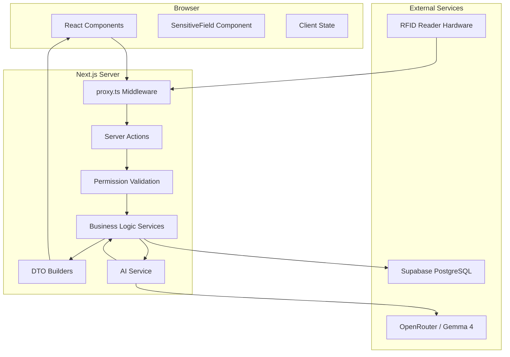

### 2.3 Request Flow

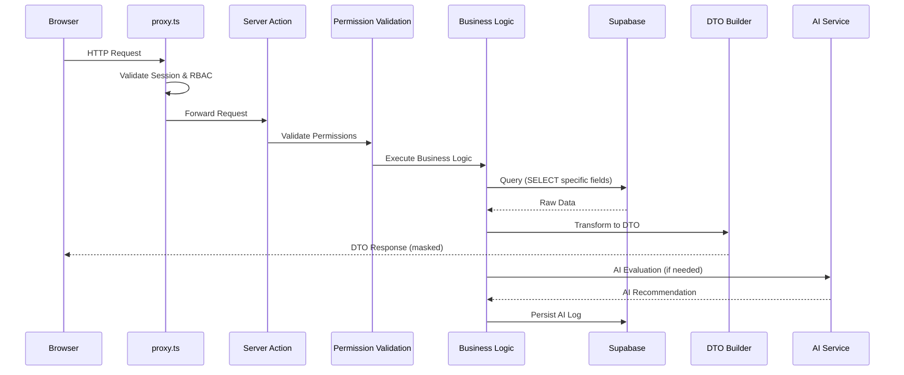

---

## 3. Technology Stack

| Layer | Technology | Version | Purpose |
|-------|-----------|---------|---------|
| Framework | Next.js App Router | 15+ | Full-stack React framework |
| Language | TypeScript | 5.x | Type safety |
| UI | React | 19.x | Component library |
| Styling | Tailwind CSS | 4.x | Utility-first styling |
| Components | shadcn/ui | Latest | Accessible UI primitives |
| Database | Supabase PostgreSQL | 15+ | Primary data store |
| Auth | Supabase Auth | Latest | Authentication & sessions |
| AI | OpenRouter (Gemma 4) | Latest | Decision-support engine |
| Deployment | Vercel | — | Hosting & edge functions |
| Middleware | proxy.ts | — | Edge middleware & RBAC |
| Charts | Recharts | 3.x | Analytics visualization |
| Icons | lucide-react | Latest | Icon set |
| Notifications | sonner | 2.x | Toast notifications |
| Date Handling | date-fns | 4.x | Date utilities |

---

## 4. Role Definitions & Permission Matrices

### 4.1 Role Overview

| Role | Description | Primary Responsibility |
|------|-------------|----------------------|
| **Administrator** | System owner with full configuration and oversight | Manage users, inventory, reports, system settings |
| **Doctor** | Licensed physician | Diagnose, treat, prescribe, review consultations |
| **Nurse** | Clinic staff | Triage, consultations, dispensing, appointments |
| **Student** | Patient (student) | Request appointments, view own records |
| **Faculty** | Patient (faculty/staff) | Request appointments, view own records |

---

### 4.2 Administrator

**Description:**  
The Administrator has the highest level of access. They manage the entire system: user accounts, role assignments, medicine inventory, reports, compliance, and system configuration. They do NOT provide medical care.

**Responsibilities:**
- Manage user accounts and role assignments
- Configure system settings and clinic parameters
- Oversee medicine inventory and restocking
- Generate compliance and operational reports
- Manage RFID registrations and device assignments
- Monitor audit logs and security events
- Manage health program configurations
- Approve health clearances (administrative approval)

**Sidebar:**
```
📊 Dashboard
👥 User Management
   ├── Students
   ├── Faculty
   └── Staff Accounts
🏥 Clinic Management
   ├── Appointments Overview
   ├── Consultations
   └── Incidents
💊 Pharmacy
   ├── Inventory
   ├── Dispensing Log
   └── Restock Requests
📅 Appointments
   ├── All Appointments
   └── Schedule
📋 Health Clearances
   ├── Pending Approvals
   └── Issued Certificates
📈 Reports & Analytics
   ├── Compliance Reports
   ├── Operational Reports
   └── AI Insights
🔐 Security
   ├── Audit Logs
   ├── Session Management
   └── Access Control
🏷️ RFID Management
   ├── RFID Registration
   └── Device Management
⚙️ System Settings
```

**Accessible Modules:**
- All modules (full read/write access)

**Hidden Modules:**
- None (Administrator has full access)

**Allowed Actions:**
- Create, read, update, delete user accounts
- Assign and revoke roles
- Configure system settings
- Manage medicine inventory (add, update, restock, adjust)
- View all medical records (with sensitive data toggle)
- Generate all reports
- Approve health clearances
- View audit logs
- Manage RFID registrations
- Manage appointments (override, reschedule, cancel)
- View AI insights and analytics

**Forbidden Actions:**
- Cannot provide medical diagnoses
- Cannot prescribe medication
- Cannot modify consultation notes (medical records are doctor/nurse-owned)
- Cannot delete audit logs
- Cannot modify AI decision logic directly (via UI)

**Permission Matrix:**

| Module | View | Create | Update | Delete | Approve |
|--------|------|--------|--------|--------|---------|
| User Management | ✅ | ✅ | ✅ | ✅ | ✅ |
| Medical Records | ✅ | ❌ | ❌ | ❌ | ❌ |
| Consultations | ✅ | ❌ | ❌ | ❌ | ❌ |
| Medicine Inventory | ✅ | ✅ | ✅ | ✅ | ✅ |
| Appointments | ✅ | ✅ | ✅ | ✅ | ✅ |
| Incidents | ✅ | ✅ | ✅ | ✅ | ✅ |
| Health Clearances | ✅ | ✅ | ✅ | ✅ | ✅ |
| Reports | ✅ | ✅ | ✅ | ✅ | ✅ |
| Audit Logs | ✅ | ❌ | ❌ | ❌ | ❌ |
| RFID Management | ✅ | ✅ | ✅ | ✅ | ✅ |
| System Settings | ✅ | ✅ | ✅ | ✅ | ✅ |

---

### 4.3 Doctor

**Description:**  
The Doctor is a licensed physician who provides medical consultations, diagnoses, treatment plans, and prescriptions. They review nurse triage notes and make final medical decisions.

**Responsibilities:**
- Conduct medical consultations
- Diagnose conditions
- Prescribe medication
- Review and approve treatment plans
- Review nurse triage notes
- Provide medical recommendations for appointments
- Document consultation notes
- Review incident cases and provide medical guidance

**Sidebar:**
```
📊 Dashboard
👥 Patients
   ├── Student Records
   └── Faculty Records
🩺 Consultations
   ├── Pending Review
   ├── Active Consultations
   └── Completed
💊 Prescriptions
   ├── Write Prescription
   └── Prescription History
📅 Appointments
   ├── My Schedule
   └── Appointment Requests
🚨 Incidents
   ├── Active Cases
   └── Case History
📋 Health Clearances
   ├── Medical Evaluation
   └── Clearance Requests
📈 Analytics
   ├── My Statistics
   └── Clinic Overview
```

**Accessible Modules:**
- Student Medical Records (read, update medical notes)
- Clinic Visit & Consultation Logging (full)
- Medicine Inventory (read, prescribe)
- Appointment Scheduling (view, recommend)
- Incident & Emergency Case Management (full)
- Faculty & Staff Health Services (read, update medical notes)
- Health Clearance & Certification (medical evaluation)
- Reporting & Compliance (view medical reports)

**Hidden Modules:**
- User Management (no access)
- System Settings (no access)
- Audit Logs (no access)
- RFID Management (no access)
- Pharmacy Inventory Management (no add/delete)

**Allowed Actions:**
- View patient medical records (with sensitive data toggle)
- Create consultation notes
- Update consultation notes (own notes)
- Write prescriptions
- Review nurse triage
- Recommend appointment priority
- Manage incident cases (medical aspect)
- Provide medical evaluation for clearances
- View clinic analytics

**Forbidden Actions:**
- Cannot manage user accounts
- Cannot modify system settings
- Cannot view audit logs
- Cannot add/delete medicine inventory
- Cannot approve health clearances (administrative approval is Admin's role)
- Cannot delete medical records

**Permission Matrix:**

| Module | View | Create | Update | Delete | Approve |
|--------|------|--------|--------|--------|---------|
| User Management | ❌ | ❌ | ❌ | ❌ | ❌ |
| Medical Records | ✅ | ❌ | ✅ (own notes) | ❌ | ❌ |
| Consultations | ✅ | ✅ | ✅ (own) | ❌ | ✅ |
| Medicine Inventory | ✅ | ❌ | ❌ | ❌ | ❌ |
| Appointments | ✅ | ❌ | ❌ | ❌ | ✅ (recommend) |
| Incidents | ✅ | ✅ | ✅ | ❌ | ✅ |
| Health Clearances | ✅ | ✅ | ✅ | ❌ | ✅ (medical) |
| Reports | ✅ | ❌ | ❌ | ❌ | ❌ |
| Audit Logs | ❌ | ❌ | ❌ | ❌ | ❌ |
| RFID Management | ❌ | ❌ | ❌ | ❌ | ❌ |
| System Settings | ❌ | ❌ | ❌ | ❌ | ❌ |

---

### 4.4 Nurse

**Description:**  
The Nurse is the primary clinic staff member. They handle triage, initial consultations, medicine dispensing, appointment management, and day-to-day clinic operations.

**Responsibilities:**
- Conduct initial triage and consultations
- Record vital signs and symptoms
- Dispense medication per doctor's prescription
- Manage appointment requests and scheduling
- Handle walk-in clinic visits
- Manage medicine inventory (dispensing)
- Record incident reports
- Assist with health clearances
- Manage RFID check-ins

**Sidebar:**
```
📊 Dashboard
👥 Patients
   ├── Student Records
   └── Faculty Records
🩺 Consultations
   ├── New Walk-in
   ├── Triage
   ├── Active
   └── Completed
💊 Pharmacy
   ├── Dispense Medicine
   ├── Inventory Status
   └── Low Stock Alerts
📅 Appointments
   ├── Requests
   ├── Today's Schedule
   └── Manage Appointments
🚨 Incidents
   ├── Report Incident
   └── Case Management
📋 Health Clearances
   ├── Process Requests
   └── Issued Certificates
🏷️ RFID Check-in
   ├── Kiosk Status
   └── Check-in Log
```

**Accessible Modules:**
- Student Medical Records (read, update triage notes)
- Clinic Visit & Consultation Logging (full)
- Medicine Inventory & Dispensing (dispense, view stock)
- Appointment Scheduling System (full)
- Incident & Emergency Case Management (full)
- Faculty & Staff Health Services (read, update triage notes)
- Health Clearance & Certification (process)
- Reporting & Compliance (view operational reports)

**Hidden Modules:**
- User Management (no access)
- System Settings (no access)
- Audit Logs (no access)
- RFID Management (no device management)
- Medicine Inventory (no add/delete, only dispense)

**Allowed Actions:**
- View patient medical records (with sensitive data toggle)
- Create triage notes
- Record vital signs
- Dispense medicine per prescription
- Manage appointment requests (approve/reject per workflow)
- Handle walk-in visits
- Report incidents
- Process health clearance requests
- Manage RFID check-ins
- View inventory status and low stock alerts

**Forbidden Actions:**
- Cannot manage user accounts
- Cannot modify system settings
- Cannot view audit logs
- Cannot add/delete medicine inventory
- Cannot write prescriptions
- Cannot provide final medical diagnoses
- Cannot delete medical records

**Permission Matrix:**

| Module | View | Create | Update | Delete | Approve |
|--------|------|--------|--------|--------|---------|
| User Management | ❌ | ❌ | ❌ | ❌ | ❌ |
| Medical Records | ✅ | ❌ | ✅ (triage) | ❌ | ❌ |
| Consultations | ✅ | ✅ | ✅ (triage) | ❌ | ✅ |
| Medicine Inventory | ✅ | ❌ | ✅ (dispense) | ❌ | ❌ |
| Appointments | ✅ | ✅ | ✅ | ❌ | ✅ |
| Incidents | ✅ | ✅ | ✅ | ❌ | ✅ |
| Health Clearances | ✅ | ✅ | ✅ | ❌ | ✅ (process) |
| Reports | ✅ | ❌ | ❌ | ❌ | ❌ |
| Audit Logs | ❌ | ❌ | ❌ | ❌ | ❌ |
| RFID Management | ✅ | ❌ | ❌ | ❌ | ❌ |
| System Settings | ❌ | ❌ | ❌ | ❌ | ❌ |

---

### 4.5 Student

**Description:**  
The Student is a patient. They can request appointments, view their own medical records, track their health clearances, and receive notifications. They have the most restricted access.

**Responsibilities:**
- Request appointments
- View own medical records
- Track appointment status
- View health clearance status
- Receive notifications
- Check in via RFID kiosk

**Sidebar:**
```
📊 My Dashboard
📅 Appointments
   ├── Request Appointment
   ├── My Appointments
   └── Appointment History
🩺 My Health Records
   ├── Medical History
   ├── Consultations
   └── Prescriptions
📋 Health Clearances
   ├── My Clearances
   └── Request Clearance
📢 Announcements
⚙️ Settings
   ├── Profile
   └── Privacy
```

**Accessible Modules:**
- Appointment Scheduling System (request, view own)
- Student Medical Records (view own only)
- Health Clearance & Certification (view own, request)
- Notifications (view own)

**Hidden Modules:**
- All other modules (no access)

**Allowed Actions:**
- Request appointments
- View own appointment status
- View own medical records (with sensitive data toggle)
- View own prescriptions
- Request health clearances
- View own clearance status
- View announcements
- Update own profile (non-sensitive fields)
- Check in via RFID kiosk

**Forbidden Actions:**
- Cannot view other students' records
- Cannot view faculty records
- Cannot modify medical records
- Cannot manage appointments (only request)
- Cannot access admin/doctor/nurse modules
- Cannot view inventory
- Cannot view reports
- Cannot view audit logs

**Permission Matrix:**

| Module | View | Create | Update | Delete | Approve |
|--------|------|--------|--------|--------|---------|
| User Management | ❌ | ❌ | ❌ | ❌ | ❌ |
| Medical Records | ✅ (own) | ❌ | ❌ | ❌ | ❌ |
| Consultations | ✅ (own) | ❌ | ❌ | ❌ | ❌ |
| Medicine Inventory | ❌ | ❌ | ❌ | ❌ | ❌ |
| Appointments | ✅ (own) | ✅ (request) | ❌ | ❌ | ❌ |
| Incidents | ❌ | ❌ | ❌ | ❌ | ❌ |
| Health Clearances | ✅ (own) | ✅ (request) | ❌ | ❌ | ❌ |
| Reports | ❌ | ❌ | ❌ | ❌ | ❌ |
| Audit Logs | ❌ | ❌ | ❌ | ❌ | ❌ |
| RFID Management | ❌ | ❌ | ❌ | ❌ | ❌ |
| System Settings | ❌ | ❌ | ❌ | ❌ | ❌ |

---

### 4.6 Faculty

**Description:**  
The Faculty member is a patient (staff). Similar to Student but with faculty-specific data. They can request appointments, view their own medical records, and track health clearances.

**Responsibilities:**
- Request appointments
- View own medical records
- Track appointment status
- View health clearance status
- Receive notifications
- Check in via RFID kiosk

**Sidebar:**
```
📊 My Dashboard
📅 Appointments
   ├── Request Appointment
   ├── My Appointments
   └── Appointment History
🩺 My Health Records
   ├── Medical History
   ├── Consultations
   └── Prescriptions
📋 Health Clearances
   ├── My Clearances
   └── Request Clearance
📢 Announcements
⚙️ Settings
   ├── Profile
   └── Privacy
```

**Accessible Modules:**
- Appointment Scheduling System (request, view own)
- Faculty & Staff Health Services (view own only)
- Health Clearance & Certification (view own, request)
- Notifications (view own)

**Hidden Modules:**
- All other modules (no access)

**Allowed Actions:**
- Request appointments
- View own appointment status
- View own medical records (with sensitive data toggle)
- View own prescriptions
- Request health clearances
- View own clearance status
- View announcements
- Update own profile (non-sensitive fields)
- Check in via RFID kiosk

**Forbidden Actions:**
- Cannot view student records
- Cannot view other faculty records
- Cannot modify medical records
- Cannot manage appointments (only request)
- Cannot access admin/doctor/nurse modules
- Cannot view inventory
- Cannot view reports
- Cannot view audit logs

**Permission Matrix:**

| Module | View | Create | Update | Delete | Approve |
|--------|------|--------|--------|--------|---------|
| User Management | ❌ | ❌ | ❌ | ❌ | ❌ |
| Medical Records | ✅ (own) | ❌ | ❌ | ❌ | ❌ |
| Consultations | ✅ (own) | ❌ | ❌ | ❌ | ❌ |
| Medicine Inventory | ❌ | ❌ | ❌ | ❌ | ❌ |
| Appointments | ✅ (own) | ✅ (request) | ❌ | ❌ | ❌ |
| Incidents | ❌ | ❌ | ❌ | ❌ | ❌ |
| Health Clearances | ✅ (own) | ✅ (request) | ❌ | ❌ | ❌ |
| Reports | ❌ | ❌ | ❌ | ❌ | ❌ |
| Audit Logs | ❌ | ❌ | ❌ | ❌ | ❌ |
| RFID Management | ❌ | ❌ | ❌ | ❌ | ❌ |
| System Settings | ❌ | ❌ | ❌ | ❌ | ❌ |

---

### 4.7 Global Permission Matrix

| Capability | Admin | Doctor | Nurse | Student | Faculty |
|-----------|-------|--------|-------|---------|---------|
| View own profile | ✅ | ✅ | ✅ | ✅ | ✅ |
| View all patients | ✅ | ✅ | ✅ | ❌ | ❌ |
| View own medical records | ❌ | ❌ | ❌ | ✅ | ✅ |
| Create consultations | ❌ | ✅ | ✅ | ❌ | ❌ |
| Write prescriptions | ❌ | ✅ | ❌ | ❌ | ❌ |
| Dispense medicine | ❌ | ❌ | ✅ | ❌ | ❌ |
| Manage inventory | ✅ | ❌ | ❌ | ❌ | ❌ |
| Request appointments | ✅ | ❌ | ❌ | ✅ | ✅ |
| Approve appointments | ✅ | ✅ | ✅ | ❌ | ❌ |
| Manage incidents | ✅ | ✅ | ✅ | ❌ | ❌ |
| Approve clearances | ✅ | ✅ | ✅ | ❌ | ❌ |
| Generate reports | ✅ | ✅ | ✅ | ❌ | ❌ |
| View audit logs | ✅ | ❌ | ❌ | ❌ | ❌ |
| Manage users | ✅ | ❌ | ❌ | ❌ | ❌ |
| System settings | ✅ | ❌ | ❌ | ❌ | ❌ |
| RFID registration | ✅ | ❌ | ❌ | ❌ | ❌ |
| RFID check-in | ✅ | ✅ | ✅ | ✅ | ✅ |
| View AI insights | ✅ | ✅ | ✅ | ❌ | ❌ |

---

## 5. Route Structure

### 5.1 Route Hierarchy

```
app/                                  # Root-level (no src/ prefix — matches project convention)
├── layout.tsx                        # Root layout — providers, fonts, theme
├── globals.css                       # Global Tailwind styles
├── page.tsx                          # Landing page / role-based redirect
├── error.tsx                         # Global error boundary
├── not-found.tsx                     # 404 page
├── loading.tsx                       # Global loading state
├── login/
│   ├── page.tsx                      # Login page
│   ├── actions.ts                    # Login server actions
│   └── layout.tsx                    # Login layout (no sidebar)
├── unauthorized/
│   └── page.tsx                      # 403 unauthorized page
├── rfid-kiosk/
│   ├── page.tsx                      # RFID kiosk interface
│   ├── actions.ts                    # RFID check-in actions
│   └── layout.tsx                    # Kiosk layout (fullscreen, no sidebar)
├── settings/                         # Shared settings (all roles)
│   ├── layout.tsx                    # Settings layout (RBAC guard)
│   ├── page.tsx                      # Profile settings (name, photo)
│   ├── privacy/
│   │   └── page.tsx                  # Privacy / sensitive data prefs
│   └── security/
│       └── page.tsx                  # Change password, sessions
├── admin/
│   ├── layout.tsx                    # Admin layout (RBAC guard + admin sidebar)
│   ├── page.tsx                      # Admin dashboard
│   ├── users/
│   │   ├── page.tsx                  # User management
│   │   ├── students/
│   │   │   └── page.tsx              # Student accounts
│   │   ├── faculty/
│   │   │   └── page.tsx              # Faculty accounts
│   │   └── staff/
│   │       └── page.tsx              # Staff accounts
│   ├── pharmacy/
│   │   ├── page.tsx                  # Inventory overview
│   │   ├── inventory/
│   │   │   └── page.tsx              # Medicine inventory
│   │   ├── dispensing/
│   │   │   └── page.tsx              # Dispensing log
│   │   └── restock/
│   │       └── page.tsx              # Restock requests
│   ├── appointments/
│   │   ├── page.tsx                  # All appointments
│   │   └── schedule/
│   │       └── page.tsx              # Schedule view
│   ├── clearances/
│   │   ├── page.tsx                  # Clearance management
│   │   └── issued/
│   │       └── page.tsx              # Issued certificates
│   ├── reports/
│   │   ├── page.tsx                  # Reports dashboard
│   │   ├── compliance/
│   │   │   └── page.tsx              # Compliance reports
│   │   ├── operational/
│   │   │   └── page.tsx              # Operational reports
│   │   └── ai-insights/
│   │       └── page.tsx              # AI analytics
│   ├── security/
│   │   ├── page.tsx                  # Security overview
│   │   ├── audit-logs/
│   │   │   └── page.tsx              # Audit logs
│   │   ├── sessions/
│   │   │   └── page.tsx              # Session management
│   │   └── access-control/
│   │       └── page.tsx              # Access control config
│   ├── rfid/
│   │   ├── page.tsx                  # RFID registration
│   │   └── devices/
│   │       └── page.tsx              # Device management
│   └── settings/
│       └── page.tsx                  # System settings
├── doctor/
│   ├── layout.tsx                    # Doctor layout (RBAC guard + doctor sidebar)
│   ├── page.tsx                      # Doctor dashboard
│   ├── patients/
│   │   ├── page.tsx                  # Patient list
│   │   └── [id]/
│   │       └── page.tsx              # Patient medical record
│   ├── consultations/
│   │   ├── page.tsx                  # Consultation list
│   │   ├── pending/
│   │   │   └── page.tsx              # Pending review
│   │   └── [id]/
│   │       └── page.tsx              # Consultation detail
│   ├── prescriptions/
│   │   ├── page.tsx                  # Prescription list
│   │   └── new/
│   │       └── page.tsx              # Write prescription
│   ├── appointments/
│   │   ├── page.tsx                  # My schedule
│   │   └── requests/
│   │       └── page.tsx              # Appointment requests
│   ├── incidents/
│   │   ├── page.tsx                  # Incident cases
│   │   └── [id]/
│   │       └── page.tsx              # Incident detail
│   ├── clearances/
│   │   ├── page.tsx                  # Clearance requests
│   │   └── [id]/
│   │       └── page.tsx              # Medical evaluation
│   └── analytics/
│       └── page.tsx                  # Doctor analytics
├── nurse/
│   ├── layout.tsx                    # Nurse layout (RBAC guard + nurse sidebar)
│   ├── page.tsx                      # Nurse dashboard
│   ├── patients/
│   │   ├── page.tsx                  # Patient list
│   │   └── [id]/
│   │       └── page.tsx              # Patient record
│   ├── consultations/
│   │   ├── page.tsx                  # Consultation list
│   │   ├── new/
│   │   │   └── page.tsx              # New walk-in consultation
│   │   ├── triage/
│   │   │   └── page.tsx              # Triage queue
│   │   └── [id]/
│   │       └── page.tsx              # Consultation detail
│   ├── pharmacy/
│   │   ├── page.tsx                  # Pharmacy overview
│   │   ├── dispense/
│   │   │   └── page.tsx              # Dispense medicine
│   │   └── stock/
│   │       └── page.tsx              # Inventory status
│   ├── appointments/
│   │   ├── page.tsx                  # Appointment management
│   │   ├── requests/
│   │   │   └── page.tsx              # Appointment requests
│   │   └── today/
│   │       └── page.tsx              # Today's schedule
│   ├── incidents/
│   │   ├── page.tsx                  # Incident management
│   │   └── new/
│   │       └── page.tsx              # Report incident
│   ├── clearances/
│   │   ├── page.tsx                  # Clearance processing
│   │   └── issued/
│   │       └── page.tsx              # Issued certificates
│   └── rfid/
│       ├── page.tsx                  # RFID check-in
│       └── log/
│           └── page.tsx              # Check-in log
├── student/
│   ├── layout.tsx                    # Student layout (RBAC guard + student sidebar)
│   ├── page.tsx                      # Student dashboard
│   ├── appointments/
│   │   ├── page.tsx                  # My appointments
│   │   ├── new/
│   │   │   └── page.tsx              # Request appointment
│   │   └── history/
│   │       └── page.tsx              # Appointment history
│   ├── records/
│   │   ├── page.tsx                  # My health records
│   │   ├── consultations/
│   │   │   └── page.tsx              # My consultations
│   │   └── prescriptions/
│   │       └── page.tsx              # My prescriptions
│   ├── clearances/
│   │   ├── page.tsx                  # My clearances
│   │   └── request/
│   │       └── page.tsx              # Request clearance
│   └── announcements/
│       └── page.tsx                  # Announcements
└── faculty/
    ├── layout.tsx                    # Faculty layout (RBAC guard + faculty sidebar)
    ├── page.tsx                      # Faculty dashboard
    ├── appointments/
    │   ├── page.tsx                  # My appointments
    │   ├── new/
    │   │   └── page.tsx              # Request appointment
    │   └── history/
    │       └── page.tsx              # Appointment history
    ├── records/
    │   ├── page.tsx                  # My health records
    │   ├── consultations/
    │   │   └── page.tsx              # My consultations
    │   └── prescriptions/
    │       └── page.tsx              # My prescriptions
    ├── clearances/
    │   ├── page.tsx                  # My clearances
    │   └── request/
    │       └── page.tsx              # Request clearance
    └── announcements/
        └── page.tsx                  # Announcements
```

### 5.2 Route Access Rules

| Route Prefix | Admin | Doctor | Nurse | Student | Faculty |
|-------------|-------|--------|-------|---------|---------|
| `/admin/*` | ✅ | ❌ | ❌ | ❌ | ❌ |
| `/doctor/*` | ❌ | ✅ | ❌ | ❌ | ❌ |
| `/nurse/*` | ❌ | ❌ | ✅ | ❌ | ❌ |
| `/student/*` | ❌ | ❌ | ❌ | ✅ | ❌ |
| `/faculty/*` | ❌ | ❌ | ❌ | ❌ | ✅ |
| `/settings/*` | ✅ | ✅ | ✅ | ✅ | ✅ |
| `/rfid-kiosk` | ✅ | ✅ | ✅ | ✅ | ✅ |
| `/login` | ✅ | ✅ | ✅ | ✅ | ✅ |
| `/unauthorized` | ✅ | ✅ | ✅ | ✅ | ✅ |

---

## 6. Business Modules

### 6.1 Student Medical Records Management

**Purpose:**  
Manage complete medical records for students, including personal information, medical history, allergies, medications, and consultation history.

**Features:**
- Student profile with personal and medical information
- Medical history tracking
- Allergy registry
- Current medication list
- Consultation history
- Immunization records
- Growth/health metrics tracking
- Document attachments (with encryption)

**Submodules:**
- Student Profiles
- Medical History
- Allergy Management
- Medication List
- Consultation History
- Immunization Records
- Document Management

**Sidebar Placement:**  
Admin: `👥 User Management → Students`  
Doctor: `👥 Patients → Student Records`  
Nurse: `👥 Patients → Student Records`  
Student: `🩺 My Health Records`

**Workflow:**
1. Admin creates student account
2. Nurse/Doctor adds medical information during consultations
3. Student views own records (masked by default)
4. Updates are logged to audit trail

**Database Tables:**
- `students`
- `student_medical_history`
- `student_allergies`
- `student_medications`
- `student_immunizations`
- `student_documents`

**Server Actions:**
- `getStudentProfile(studentId)`
- `getStudentMedicalHistory(studentId)`
- `updateStudentMedicalHistory(studentId, data)`
- `addStudentAllergy(studentId, allergy)`
- `addStudentMedication(studentId, medication)`
- `getStudentConsultations(studentId)`

**Notifications:**
- New consultation added
- Prescription issued
- Clearance status update

**Audit Logs:**
- Profile creation
- Medical record updates
- Record views (sensitive)

**Permissions:**
- Admin: View all
- Doctor: View all, update medical notes
- Nurse: View all, update triage notes
- Student: View own only

**RFID Integration:**
- RFID UID linked to student profile
- Kiosk check-in retrieves student record

**Security Considerations:**
- All sensitive fields masked by default
- DTOs return only required fields
- RBAC enforced before data access
- Audit logging on all views/updates

---

### 6.2 Clinic Visit & Consultation Logging

**Purpose:**  
Log all clinic visits and consultations, including walk-ins and scheduled appointments. Track triage, diagnosis, treatment, and follow-up.

**Features:**
- Walk-in visit registration
- Triage assessment (vital signs, symptoms)
- Consultation notes
- Diagnosis recording
- Treatment plans
- Follow-up scheduling
- Visit history

**Submodules:**
- Walk-in Registration
- Triage Assessment
- Consultation Notes
- Diagnosis & Treatment
- Follow-up Management
- Visit History

**Sidebar Placement:**  
Doctor: `🩺 Consultations`  
Nurse: `🩺 Consultations`  
Student: `🩺 My Health Records → Consultations`

**Workflow:**
1. Patient checks in (RFID or manual)
2. Nurse performs triage
3. Doctor conducts consultation
4. Diagnosis and treatment recorded
5. Prescription issued (if needed)
6. Follow-up scheduled (if needed)
7. Visit completed and logged

**Database Tables:**
- `clinic_visits`
- `consultations`
- `triage_assessments`
- `diagnoses`
- `treatments`
- `follow_ups`

**Server Actions:**
- `createWalkInVisit(patientId, data)`
- `createTriageAssessment(visitId, data)`
- `createConsultation(visitId, data)`
- `updateConsultation(consultationId, data)`
- `completeVisit(visitId)`
- `scheduleFollowUp(consultationId, data)`

**Notifications:**
- Visit created
- Consultation completed
- Follow-up reminder

**Audit Logs:**
- Visit creation
- Triage updates
- Consultation notes
- Diagnosis recording

**Permissions:**
- Admin: View all
- Doctor: Create, update consultations
- Nurse: Create triage, manage visits
- Student: View own consultations

**RFID Integration:**
- RFID check-in creates visit record
- Patient identification via RFID

**Security Considerations:**
- Consultation notes masked by default
- Only authorized medical staff can view
- Audit trail for all medical entries

---

### 6.3 Medicine Inventory & Dispensing

**Purpose:**  
Manage medicine inventory, track stock levels, dispense medication per prescription, and handle restocking.

**Features:**
- Medicine catalog
- Stock level tracking
- Low stock alerts
- Expiry date tracking
- Dispensing log
- Restock requests
- Batch/lot tracking
- Supplier management

**Submodules:**
- Medicine Catalog
- Stock Management
- Dispensing
- Restock Requests
- Expiry Alerts
- Supplier Management

**Sidebar Placement:**  
Admin: `💊 Pharmacy`  
Nurse: `💊 Pharmacy`  
Doctor: `💊 Prescriptions` (view only)

**Workflow:**
1. Admin adds medicine to catalog
2. Stock levels tracked automatically
3. Doctor writes prescription
4. Nurse dispenses medicine (stock decremented)
5. Low stock triggers alert
6. Admin creates restock request
7. Stock replenished

**Database Tables:**
- `medicines`
- `medicine_stock`
- `medicine_batches`
- `dispensing_logs`
- `restock_requests`
- `suppliers`

**Server Actions:**
- `getMedicineCatalog()`
- `addMedicine(data)`
- `updateMedicine(medicineId, data)`
- `dispenseMedicine(prescriptionId, data)`
- `createRestockRequest(medicineId, quantity)`
- `approveRestockRequest(requestId)`
- `getLowStockAlerts()`

**Notifications:**
- Low stock alert
- Expiry alert
- Restock request status

**Audit Logs:**
- Medicine added/updated
- Dispensing events
- Restock approvals

**Permissions:**
- Admin: Full management
- Nurse: Dispense, view stock
- Doctor: View only

**RFID Integration:**
- RFID identifies patient for dispensing

**Security Considerations:**
- Dispensing requires valid prescription
- Stock adjustments logged
- Controlled substance tracking

---

### 6.4 Appointment Scheduling System

**Purpose:**  
Manage online-only appointment requests with AI-assisted evaluation, staff recommendation, and approval workflow.

**Features:**
- Online appointment requests
- AI evaluation and prioritization
- Staff recommendation
- Approval workflow
- Reminder notifications
- RFID check-in
- Schedule management

**Submodules:**
- Appointment Requests
- AI Evaluation
- Schedule Management
- Reminders
- Check-in Integration

**Sidebar Placement:**  
Admin: `📅 Appointments`  
Doctor: `📅 Appointments`  
Nurse: `📅 Appointments`  
Student: `📅 Appointments`  
Faculty: `📅 Appointments`

**Appointment Workflow (Online Only):**
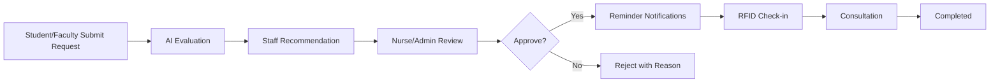

**Database Tables:**
- `appointments`
- `appointment_requests`
- `appointment_ai_evaluations`
- `appointment_reminders`
- `appointment_checkins`

**Server Actions:**
- `submitAppointmentRequest(data)`
- `evaluateAppointmentRequest(requestId)` (AI)
- `recommendAppointment(requestId, recommendation)`
- `reviewAppointment(requestId, decision)`
- `approveAppointment(requestId)`
- `rejectAppointment(requestId, reason)`
- `getAppointmentSchedule(date)`
- `checkInAppointment(appointmentId)`

**Notifications:**
- Request submitted
- AI evaluation complete
- Staff recommendation
- Approval/Rejection
- Reminder (24h, 1h before)

**Audit Logs:**
- Request submission
- AI evaluation
- Staff recommendation
- Approval/Rejection
- Check-in

**Permissions:**
- Admin: Full management
- Doctor: View, recommend
- Nurse: Full management
- Student: Request, view own
- Faculty: Request, view own

**RFID Integration:**
- RFID check-in marks appointment as arrived

**Security Considerations:**
- Walk-ins are NOT allowed in this module (use Clinic Visit module)
- AI evaluation logged separately from human decisions
- Approval always requires a human decision

---

### 6.5 Incident & Emergency Case Management

**Purpose:**  
Manage incident reports and emergency cases, including accidents, injuries, and urgent medical situations.

**Features:**
- Incident reporting
- Emergency case tracking
- Severity classification
- Response coordination
- Follow-up management
- Case closure

**Submodules:**
- Incident Reports
- Emergency Cases
- Severity Classification
- Response Log
- Case Follow-up

**Sidebar Placement:**  
Admin: `🏥 Clinic Management → Incidents`  
Doctor: `🚨 Incidents`  
Nurse: `🚨 Incidents`

**Workflow:**
1. Incident reported (nurse or staff)
2. Severity assessed
3. Emergency response initiated
4. Medical care provided
5. Case documented
6. Follow-up scheduled
7. Case closed

**Database Tables:**
- `incidents`
- `incident_severity`
- `incident_responses`
- `incident_followups`

**Server Actions:**
- `reportIncident(data)`
- `assessIncidentSeverity(incidentId, severity)`
- `logIncidentResponse(incidentId, data)`
- `scheduleIncidentFollowUp(incidentId, data)`
- `closeIncident(incidentId)`

**Notifications:**
- Incident reported
- Severity escalation
- Response logged
- Case closed

**Audit Logs:**
- Incident creation
- Severity assessment
- Response actions
- Case closure

**Permissions:**
- Admin: Full management
- Doctor: Full management
- Nurse: Full management

**RFID Integration:**
- RFID identifies patient in incident

**Security Considerations:**
- Emergency data accessible to authorized staff only
- Time-sensitive logging
- Audit trail for all actions

---

### 6.6 Faculty & Staff Health Services

**Purpose:**  
Provide health services for faculty and staff, similar to student services but with faculty-specific data.

**Features:**
- Faculty profiles
- Medical records
- Consultations
- Prescriptions
- Health clearances

**Submodules:**
- Faculty Profiles
- Medical Records
- Consultations
- Prescriptions
- Clearances

**Sidebar Placement:**  
Admin: `👥 User Management → Faculty`  
Doctor: `👥 Patients → Faculty Records`  
Nurse: `👥 Patients → Faculty Records`  
Faculty: `🩺 My Health Records`

**Workflow:**
1. Admin creates faculty account
2. Medical information added during consultations
3. Faculty views own records (masked)
4. Updates logged to audit trail

**Database Tables:**
- `faculty`
- `faculty_medical_history`
- `faculty_allergies`
- `faculty_medications`

**Server Actions:**
- `getFacultyProfile(facultyId)`
- `getFacultyMedicalHistory(facultyId)`
- `updateFacultyMedicalHistory(facultyId, data)`

**Notifications:**
- New consultation
- Prescription issued
- Clearance status

**Audit Logs:**
- Profile creation
- Medical record updates
- Record views

**Permissions:**
- Admin: View all
- Doctor: View, update medical notes
- Nurse: View, update triage notes
- Faculty: View own only

**RFID Integration:**
- RFID UID linked to faculty profile

**Security Considerations:**
- Same privacy protections as student records
- Sensitive fields masked by default

---

### 6.7 School Health Program Monitoring

**Purpose:**  
Monitor school health programs including immunization drives, health screenings, and wellness campaigns.

**Features:**
- Program creation and management
- Participant tracking
- Screening results recording
- Immunization tracking
- Wellness campaign management
- Program analytics

**Submodules:**
- Health Programs
- Screenings
- Immunizations
- Wellness Campaigns
- Program Analytics

**Sidebar Placement:**  
Admin: `📈 Reports & Analytics → Health Programs`

**Workflow:**
1. Admin creates health program
2. Participants registered/enrolled
3. Screenings and results recorded
4. Immunizations tracked
5. Program effectiveness analyzed
6. AI provides program recommendations

**Database Tables:**
- `health_programs`
- `program_participants`
- `program_screenings`
- `program_immunizations`
- `program_analytics`

**Server Actions:**
- `createHealthProgram(data)`
- `enrollParticipant(programId, participantId)`
- `recordScreeningResult(data)`
- `recordImmunization(data)`
- `getProgramAnalytics(programId)`
- `getAIProgramRecommendations()` (AI)

**Notifications:**
- Program created
- Screening reminder
- Immunization due

**Audit Logs:**
- Program creation
- Participant enrollment
- Screening results
- Immunization records

**Permissions:**
- Admin: Full management
- Doctor: View, update
- Nurse: View, update

**RFID Integration:**
- RFID identifies participant during screening

**Security Considerations:**
- Screening results are sensitive
- Only authorized staff can record results

---

### 6.8 Health Clearance & Certification

**Purpose:**  
Manage health clearance requests, medical evaluations, and certificate issuance for students and faculty.

**Features:**
- Clearance request submission
- Medical evaluation workflow
- Certificate generation
- Clearance tracking
- Expiry management
- Re-issuance

**Submodules:**
- Clearance Requests
- Medical Evaluations
- Certificate Issuance
- Clearance Tracking

**Sidebar Placement:**  
Admin: `📋 Health Clearances`  
Doctor: `📋 Health Clearances`  
Nurse: `📋 Health Clearances`  
Student: `📋 Health Clearances`  
Faculty: `📋 Health Clearances`

**Workflow:**
1. Student/Faculty submits clearance request
2. Nurse processes request and schedules evaluation
3. Doctor performs medical evaluation
4. Result recorded (fit/unfit/conditional)
5. Admin approves and issues certificate
6. Notification sent to requester
7. Clearance tracked until expiry

**Database Tables:**
- `health_clearances`
- `clearance_requests`
- `clearance_evaluations`
- `clearance_certificates`

**Server Actions:**
- `submitClearanceRequest(data)`
- `processClearanceRequest(requestId)`
- `recordClearanceEvaluation(requestId, data)`
- `approveClearance(requestId)`
- `issueCertificate(clearanceId)`
- `getClearanceStatus(requesterId)`

**Notifications:**
- Request submitted
- Evaluation scheduled
- Result recorded
- Certificate issued
- Expiry warning

**Audit Logs:**
- Request submission
- Evaluation results
- Approval decisions
- Certificate issuance

**Permissions:**
- Admin: View, approve, issue certificates
- Doctor: View, medical evaluation
- Nurse: View, process requests
- Student: View own, request
- Faculty: View own, request

**RFID Integration:**
- RFID identifies requester

**Security Considerations:**
- Evaluation results are sensitive
- AI cannot approve clearances
- Human decision required for all approvals

---

### 6.9 Reporting & Compliance

**Purpose:**  
Generate operational, medical, and compliance reports for the clinic and institution.

**Features:**
- Operational reports (visits, consultations, dispensing)
- Medical reports (diagnoses, treatments)
- Compliance reports (health program participation, clearances)
- Exportable reports (PDF, CSV)
- Scheduled report generation
- AI-powered insights

**Submodules:**
- Operational Reports
- Medical Reports
- Compliance Reports
- AI Insights

**Sidebar Placement:**  
Admin: `📈 Reports & Analytics`  
Doctor: `📈 Analytics`  
Nurse: `📈 Reports` (view operational)

**Workflow:**
1. User selects report type and parameters
2. Data aggregated from database
3. Report generated and displayed
4. Exportable to PDF/CSV
5. Optional AI insights generated

**Database Tables:**
- `reports`
- `report_parameters`
- `report_ai_insights`

**Server Actions:**
- `generateReport(reportType, params)`
- `exportReport(reportId, format)`
- `getAIReportInsights(reportId)` (AI)

**Notifications:**
- Report ready
- Scheduled report delivered

**Audit Logs:**
- Report generation
- Report export (sensitive)

**Permissions:**
- Admin: Full
- Doctor: View medical reports
- Nurse: View operational reports
- Student: None
- Faculty: None

**Security Considerations:**
- Reports may contain sensitive data
- Data minimization in report generation
- RBAC enforced on report types

---

### 6.10 User Access & Confidentiality Control

**Purpose:**  
Manage user accounts, roles, access levels, and confidentiality controls across the system.

**Features:**
- User account management
- Role assignment
- Permission configuration
- Session management
- Audit log access
- Confidentiality controls

**Submodules:**
- User Accounts
- Role Management
- Permission Configuration
- Session Management
- Audit Logs

**Sidebar Placement:**  
Admin: `👥 User Management` and `🔐 Security`

**Workflow:**
1. Admin creates user account
2. Role assigned
3. Permissions configured
4. User logs in (one-device session)
5. Access enforced by RBAC
6. Activities audited

**Database Tables:**
- `users`
- `roles`
- `user_roles`
- `permissions`
- `role_permissions`
- `user_sessions`
- `audit_logs`

**Server Actions:**
- `createUser(data)`
- `assignRole(userId, roleId)`
- `updatePermissions(roleId, permissions)`
- `revokeSession(sessionId)`
- `getAuditLogs(filters)`

**Notifications:**
- Account created
- Role changed
- Session revoked

**Audit Logs:**
- Account creation/deletion
- Role assignment changes
- Permission changes
- Session management

**Permissions:**
- Admin: Full control
- Others: No access

**Security Considerations:**
- Admin-only module
- All changes audited
- Session tokens managed server-side

---

## 7. Appointment System

### 7.1 Overview

Appointments are **ONLINE ONLY**. Walk-ins belong exclusively to the Clinic Visit & Consultation Logging module (Section 6.2). This separation ensures predictable clinic flow and accurate data.

### 7.2 Appointment Workflow

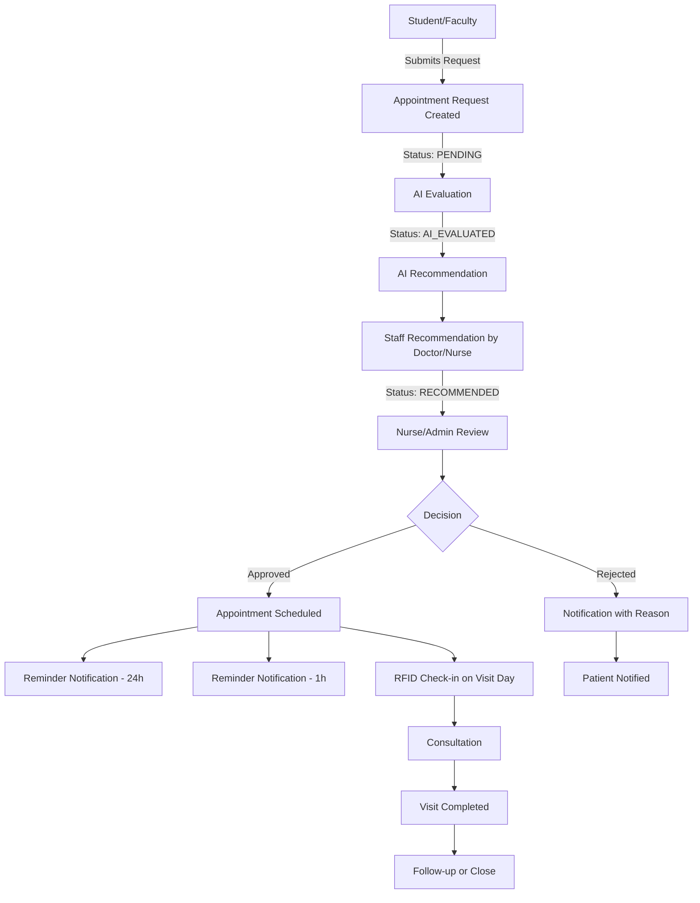

### 7.3 Appointment States

| State | Description | Who Can Transition |
|-------|-------------|-------------------|
| `PENDING` | Request submitted, awaiting AI evaluation | System (on submit) |
| `AI_EVALUATED` | AI has provided priority/schedule recommendation | AI Service |
| `RECOMMENDED` | Staff (nurse/doctor) has reviewed AI output | Doctor/Nurse |
| `APPROVED` | Nurse/Admin has approved the appointment | Nurse/Admin |
| `REJECTED` | Appointment denied with a reason | Nurse/Admin |
| `SCHEDULED` | Appointment time confirmed | System (on approval) |
| `REMINDED` | Reminder notifications sent | Notification Service |
| `CHECKED_IN` | Patient arrived via RFID kiosk | RFID Kiosk / System |
| `IN_CONSULTATION` | Patient is being seen | Nurse |
| `COMPLETED` | Consultation finished | Doctor/Nurse |
| `CANCELLED` | Appointment cancelled (patient or staff) | Patient/Staff |
| `NO_SHOW` | Patient did not arrive | System (after grace period) |

### 7.4 Appointment Data Flow

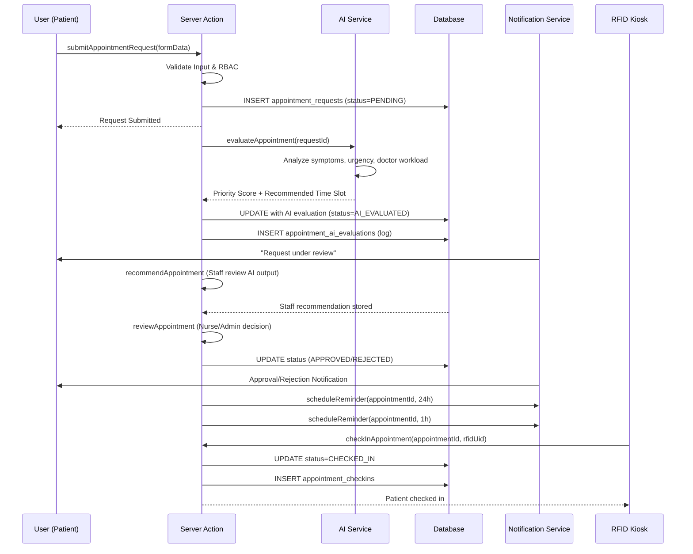

### 7.5 Server Actions for Appointments

| Action | Role(s) | Description |
|--------|---------|-------------|
| `submitAppointmentRequest` | Student, Faculty | Creates appointment request |
| `evaluateAppointment` | System (internal) | Calls AI service for evaluation |
| `recommendAppointment` | Doctor, Nurse | Staff recommendation on AI output |
| `reviewAppointment` | Nurse, Admin | Final approve/reject decision |
| `approveAppointment` | Nurse, Admin | Approves and schedules |
| `rejectAppointment` | Nurse, Admin | Rejects with reason |
| `checkInAppointment` | All (RFID) | RFID check-in |
| `getAppointmentSchedule` | Doctor, Nurse, Admin | View schedule |
| `cancelAppointment` | Student, Faculty, Staff | Cancel appointment |

### 7.6 Rules

- Walk-ins are **never** routed to this module. They go to Clinic Visit.
- AI never makes the final decision — it only recommends.
- All AI calls are logged to `appointment_ai_evaluations`.
- A human must approve or reject every appointment.
- Reminders are scheduled at 24h and 1h before the appointment.

---

## 8. AI Decision Engine

### 8.1 Overview

ZenTraq uses **Gemma 4** through **OpenRouter** as a decision-support engine. The AI is **NOT a chatbot**. It provides structured recommendations that support (but never replace) human decision-making.

### 8.2 AI Responsibilities

| Responsibility | Description | Example |
|----------------|-------------|---------|
| **Appointment Scheduling** | Recommend time slots based on availability | Suggest 2:00 PM Tue |
| **Appointment Prioritization** | Score urgency/priority of requests | Assign priority 1-5 |
| **Workload Balancing** | Distribute patients across doctors/nurses | Balance caseload |
| **Inventory Forecasting** | Predict medicine stock needs | Forecast paracetamol demand |
| **Analytics** | Identify patterns in clinic data | Seasonal flu trend |
| **Health Program Recommendations** | Suggest programs based on trends | Recommend vaccination drive |

### 8.3 AI Contract (What AI Can NEVER Do)

| Action | Status |
|--------|--------|
| Diagnose medical conditions | ❌ FORBIDDEN |
| Prescribe medication | ❌ FORBIDDEN |
| Approve health clearances | ❌ FORBIDDEN |
| Modify records autonomously | ❌ FORBIDDEN |
| Make final appointment decisions | ❌ FORBIDDEN (human review required) |
| Access raw PHI without sanitization | ❌ FORBIDDEN |

### 8.4 AI Call Security Flow

```
Browser → Server Action → AI Service → Input Sanitization → OpenRouter (Gemma 4)
                                                                    ↓
                    Database ← Validation ← Raw AI Response ← Structured Prompt
                                                                    ↓
                    DTO Builder → Browser (recommendation only)
```

### 8.5 AI Service Architecture

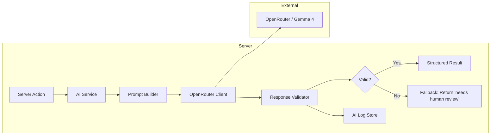

### 8.6 AI Service Modules

**File:** `src/services/ai/ai-service.ts`

```
src/services/ai/
├── ai-service.ts          # Main service (create/openrouter client)
├── prompt-builder.ts      # Builds structured prompts per use-case
├── openrouter-client.ts   # Handles HTTP calls to OpenRouter
├── response-validator.ts  # Validates AI output structure
├── ai-logging.ts          # Logs all AI interactions
└── schemas/
    ├── appointment-priority.schema.ts
    ├── inventory-forecast.schema.ts
    └── analytics-insight.schema.ts
```

### 8.7 Environment Variables (Server-Side Only)

```
OPENROUTER_API_KEY=sk-or-...     # NEVER exposed to browser
OPENROUTER_MODEL=gemma-4         # Model identifier
AI_TIMEOUT_MS=10000              # Request timeout
AI_MAX_TOKENS=512                # Response limit
```

**Security:** The `OPENROUTER_API_KEY` is only referenced in server-only code (services, server actions). It is never imported into client components.

### 8.8 AI Logging

Every AI call is logged to the `ai_logs` table:

| Field | Type | Description |
|-------|------|-------------|
| `id` | uuid | Primary key |
| `user_id` | uuid | Who triggered the call |
| `action_type` | text | e.g. `appointment_evaluation` |
| `entity_type` | text | e.g. `appointment_request` |
| `entity_id` | uuid | Related entity |
| `prompt` | text | Sanitized prompt sent to AI |
| `response` | text | Raw AI response |
| `status` | text | `success`, `failed`, `fallback` |
| `created_at` | timestamptz | Timestamp |

---

## 9. Notifications System

### 9.1 Overview

Notifications are **receiver-based only**. There is no role-based broadcasting. Each notification targets an explicit receiver.

### 9.2 Notifications Table Schema

| Field | Type | Description |
|-------|------|-------------|
| `id` | uuid | Primary key |
| `sender_id` | uuid (nullable) | Who sent it (null for system) |
| `receiver_id` | uuid | Who receives it (required) |
| `title` | text | Short title |
| `message` | text | Notification body |
| `type` | text | `appointment`, `clearance`, `inventory`, `incident`, `system` |
| `entity_type` | text | e.g. `appointment`, `clearance_request` |
| `entity_id` | uuid | Related entity |
| `read_at` | timestamptz (nullable) | When read |
| `created_at` | timestamptz | When created |

### 9.3 Notification Examples

| Scenario | Sender | Receiver | Type | Message |
|----------|--------|----------|------|---------|
| Appointment approved | Nurse | Student | `appointment` | "Your appointment for Aug 5 2:00 PM is confirmed" |
| Low stock alert | System | Admin | `inventory` | "Paracetamol 500mg is below minimum stock" |
| Clearance issued | Admin | Student | `clearance` | "Your health clearance has been issued" |
| Incident reported | Nurse | Doctor | `incident` | "New incident reported for Student #12345" |
| AI evaluation ready | System | Nurse | `appointment` | "AI evaluation complete for request #567" |

### 9.4 Notification Flow

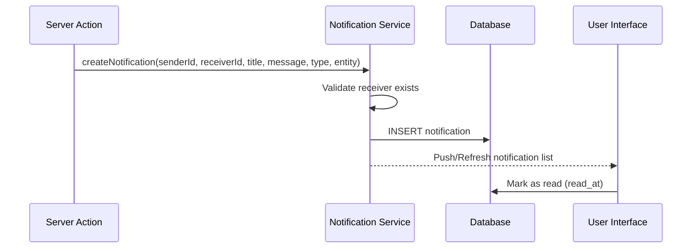

### 9.5 Server Actions for Notifications

| Action | Role(s) | Description |
|--------|---------|-------------|
| `getMyNotifications` | All | Fetch own notifications |
| `markNotificationRead` | All | Mark a notification as read |
| `markAllNotificationsRead` | All | Mark all as read |
| `deleteNotification` | All | Delete own notification |

### 9.6 Rules

- Notifications require an explicit `receiver_id`.
- No `role` broadcast — a notification is always addressed to a specific user.
- `sender_id` can be `NULL` for system-generated notifications.

---

## 10. Security Architecture

### 10.1 Security Layers

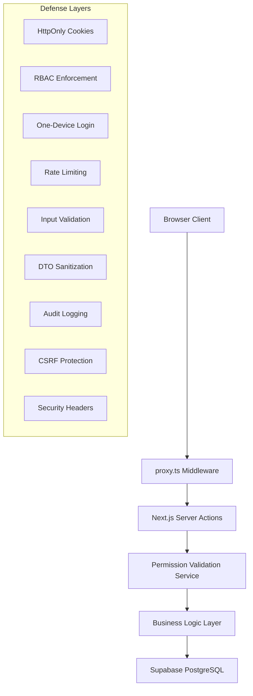

### 10.2 Security Controls

| Control | Description | Implementation |
|---------|-------------|----------------|
| **proxy.ts** | Edge middleware protecting all routes | Validates session, enforces RBAC, applies security headers |
| **RBAC** | Role-based access control | Enforced at proxy, layout, and Server Action levels |
| **HttpOnly Cookies** | Session tokens not accessible via JavaScript | `HttpOnly`, `Secure`, `SameSite=Lax` attributes |
| **One-Device Login** | Only one active session per user | `current_session_token` validated in proxy |
| **Audit Logs** | All sensitive operations logged | `audit_logs` table with immutable records |
| **Rate Limiting** | Protect against brute-force/abuse | `lib/rate-limit.ts` utility |
| **Input Validation** | Validate all inputs server-side | Zod schemas in `lib/validation/` |
| **DTOs** | Return only required fields | DTO builders in `lib/data/` |
| **Data Minimization** | Never `SELECT *` | Queries specify exact columns |
| **CSRF Protection** | Prevent cross-site request forgery | Server Action origin validation |
| **Least Privilege** | Minimal permissions | Role-based permission system |
| **Zero Trust** | No implicit trust | Every request re-authenticated |

### 10.3 Proxy Middleware Security

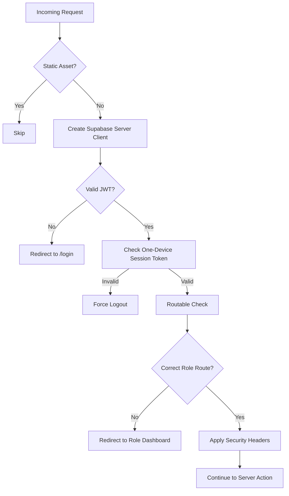

### 10.4 Security Headers

```typescript
// proxy.ts security headers
response.headers.set("Cache-Control", "no-store, no-cache, must-revalidate, proxy-revalidate, max-age=0")
response.headers.set("Pragma", "no-cache")
response.headers.set("Expires", "0")
response.headers.set("X-Content-Type-Options", "nosniff")
response.headers.set("X-Frame-Options", "DENY")
response.headers.set("Referrer-Policy", "strict-origin-when-cross-origin")
```

### 10.5 Protected Data Access Rules

1. **No direct Supabase calls from client components** — All database access goes through Server Actions.
2. **Server Actions validate permissions** — Every action checks the caller's role before executing.
3. **DTOs only** — Responses contain only the minimum fields needed by the UI.
4. **No `SELECT *`** — All queries specify exact column lists.
5. **Sensitive data masked** — SensitiveField component hides PHI by default.

### 10.6 Session Management

- **HttpOnly cookie** stores the session token (`zentraq_session_token`)
- **One-device login** enforced — new login invalidates previous session
- **Session invalidation** — logging out clears the token server-side
- **Session revocation** — admin can revoke any session
- **Automatic expiry** — sessions expire after configured duration

### 10.7 Rate Limiting

Applied to:
- Login attempts (5 per minute per IP)
- Appointment requests (3 per day per user)
- AI evaluation calls (10 per minute per user)
- Notification sends (20 per minute per user)

---

## 11. Database Schema

### 11.1 Entity Relationship Diagram

```mermaid
erDiagram
    USERS ||--o| STUDENTS : "has (optional)"
    USERS ||--o| FACULTY : "has (optional)"
    USERS ||--o| CLINIC_ACCOUNTS : "has (optional)"
    USERS ||--o{ USER_ROLES : "assigned"
    ROLES ||--o{ USER_ROLES : "contains"
    ROLES ||--o{ ROLE_PERMISSIONS : "grants"
    PERMISSIONS ||--o{ ROLE_PERMISSIONS : "used by"

    STUDENTS ||--o{ STUDENT_MEDICAL_HISTORY : "has"
    STUDENTS ||--o{ STUDENT_ALLERGIES : "has"
    STUDENTS ||--o{ STUDENT_MEDICATIONS : "takes"
    STUDENTS ||--o{ STUDENT_IMMUNIZATIONS : "records"
    STUDENTS ||--o{ RFID_DEVICES : "owns"
    FACULTY ||--o{ FACULTY_MEDICAL_HISTORY : "has"
    FACULTY ||--o{ FACULTY_ALLERGIES : "has"

    USERS ||--o{ APPOINTMENTS : "requests"
    APPOINTMENTS ||--o{ APPOINTMENT_AI_EVALUATIONS : "has"
    APPOINTMENTS ||--o{ APPOINTMENT_REMINDERS : "schedules"
    APPOINTMENTS ||--o{ APPOINTMENT_CHECKINS : "records"

    STUDENTS ||--o{ CLINIC_VISITS : "visits"
    FACULTY ||--o{ CLINIC_VISITS : "visits"
    CLINIC_VISITS ||--o{ CONSULTATIONS : "leads to"
    CONSULTATIONS ||--o{ TRIAGE_ASSESSMENTS : "has"
    CONSULTATIONS ||--o{ DIAGNOSES : "records"
    CONSULTATIONS ||--o{ TREATMENTS : "prescribes"
    CONSULTATIONS ||--o{ PRESCRIPTIONS : "issues"
    PRESCRIPTIONS ||--o{ DISPENSING_LOGS : "dispensed"

    MEDICINES ||--o{ MEDICINE_STOCK : "has"
    MEDICINES ||--o{ MEDICINE_BATCHES : "batches"
    MEDICINES ||--o{ RESTOCK_REQUESTS : "requires"
    SUPPLIERS ||--o{ RESTOCK_REQUESTS : "fulfills"

    STUDENTS ||--o{ INCIDENTS : "involved"
    FACULTY ||--o{ INCIDENTS : "involved"
    INCIDENTS ||--o{ INCIDENT_RESPONSES : "has"
    INCIDENTS ||--o{ INCIDENT_FOLLOWUPS : "follows"

    USERS ||--o{ HEALTH_PROGRAMS : "manages"
    HEALTH_PROGRAMS ||--o{ PROGRAM_PARTICIPANTS : "enrolls"
    PROGRAM_PARTICIPANTS ||--o{ PROGRAM_SCREENINGS : "records"
    PROGRAM_PARTICIPANTS ||--o{ PROGRAM_IMMUNIZATIONS : "tracks"

    STUDENTS ||--o{ HEALTH_CLEARANCES : "requests"
    FACULTY ||--o{ HEALTH_CLEARANCES : "requests"
    HEALTH_CLEARANCES ||--o{ CLEARANCE_EVALUATIONS : "has"
    HEALTH_CLEARANCES ||--o{ CLEARANCE_CERTIFICATES : "issues"

    USERS ||--o{ NOTIFICATIONS : "receives"
    USERS ||--o{ AUDIT_LOGS : "generates"
    USERS ||--o{ AI_LOGS : "triggers"
    USERS ||--o{ USER_SESSIONS : "maintains"
```

### 11.2 Core Tables

#### users

| Column | Type | Constraints | Description |
|--------|------|-------------|-------------|
| `id` | uuid | PK, default gen_random_uuid() | User ID |
| `email` | text | UNIQUE, NOT NULL | Login email |
| `email_verified` | boolean | DEFAULT false | Email verification status |
| `is_active` | boolean | DEFAULT true | Account active flag |
| `created_at` | timestamptz | DEFAULT now() | Creation timestamp |
| `updated_at` | timestamptz | DEFAULT now() | Last update |

#### roles

| Column | Type | Constraints | Description |
|--------|------|-------------|-------------|
| `id` | uuid | PK | Role ID |
| `name` | text | UNIQUE, NOT NULL | `admin`, `doctor`, `nurse`, `student`, `faculty` |
| `description` | text | | Role description |
| `created_at` | timestamptz | DEFAULT now() | Creation timestamp |

#### user_roles

| Column | Type | Constraints | Description |
|--------|------|-------------|-------------|
| `user_id` | uuid | FK → users.id, NOT NULL | User |
| `role_id` | uuid | FK → roles.id, NOT NULL | Role |
| `assigned_at` | timestamptz | DEFAULT now() | Assignment time |

#### permissions

| Column | Type | Constraints | Description |
|--------|------|-------------|-------------|
| `id` | uuid | PK | Permission ID |
| `code` | text | UNIQUE, NOT NULL | e.g. `appointment.create`, `record.view` |
| `description` | text | | Description |

#### role_permissions

| Column | Type | Constraints | Description |
|--------|------|-------------|-------------|
| `role_id` | uuid | FK → roles.id | Role |
| `permission_id` | uuid | FK → permissions.id | Permission |

#### students

| Column | Type | Constraints | Description |
|--------|------|-------------|-------------|
| `id` | uuid | PK | Student ID |
| `user_id` | uuid | FK → users.id, UNIQUE | Linked user |
| `student_number` | text | UNIQUE, NOT NULL | School ID number |
| `first_name` | text | NOT NULL | First name |
| `last_name` | text | NOT NULL | Last name |
| `middle_name` | text | | Middle name |
| `department` | text | | Department |
| `course` | text | | Course |
| `year_level` | integer | | Year level |
| `section` | text | | Section |
| `phone` | text | | Phone (masked) |
| `email` | text | | Personal email (masked) |
| `address` | text | | Home address (masked) |
| `birth_date` | date | | Birthdate (masked) |
| `gender` | text | | Gender |
| `blood_type` | text | | Blood type (masked) |
| `emergency_contact_name` | text | | Emergency contact (masked) |
| `emergency_contact_phone` | text | | Emergency phone (masked) |
| `guardian_name` | text | | Guardian (masked) |
| `guardian_phone` | text | | Guardian phone (masked) |
| `rfid_uid` | text | UNIQUE | RFID UID (masked) |
| `status` | text | DEFAULT 'active' | Account status |
| `profile_photo_url` | text | | Profile photo |
| `created_at` | timestamptz | DEFAULT now() | Creation timestamp |
| `updated_at` | timestamptz | DEFAULT now() | Last update |

#### faculty

| Column | Type | Constraints | Description |
|--------|------|-------------|-------------|
| `id` | uuid | PK | Faculty ID |
| `user_id` | uuid | FK → users.id, UNIQUE | Linked user |
| `employee_number` | text | UNIQUE, NOT NULL | Employee ID (masked) |
| `first_name` | text | NOT NULL | First name |
| `last_name` | text | NOT NULL | Last name |
| `middle_name` | text | | Middle name |
| `department` | text | | Department |
| `position` | text | | Job position |
| `phone` | text | | Phone (masked) |
| `email` | text | | Personal email (masked) |
| `address` | text | | Home address (masked) |
| `rfid_uid` | text | UNIQUE | RFID UID (masked) |
| `status` | text | DEFAULT 'active' | Account status |
| `created_at` | timestamptz | DEFAULT now() | Creation timestamp |
| `updated_at` | timestamptz | DEFAULT now() | Last update |

#### clinic_accounts

| Column | Type | Constraints | Description |
|--------|------|-------------|-------------|
| `id` | uuid | PK | Account ID |
| `user_id` | uuid | FK → users.id, UNIQUE | Linked user |
| `role` | text | NOT NULL | `admin`, `doctor`, `nurse` |
| `display_name` | text | NOT NULL | Display name |
| `license_number` | text | | Medical license (masked) |
| `current_session_token` | text | | One-device session token |
| `is_active` | boolean | DEFAULT true | Account status |
| `created_at` | timestamptz | DEFAULT now() | Creation timestamp |

#### user_sessions

| Column | Type | Constraints | Description |
|--------|------|-------------|-------------|
| `id` | uuid | PK | Session ID |
| `user_id` | uuid | FK → users.id, NOT NULL | User |
| `session_token` | text | UNIQUE, NOT NULL | Session token |
| `ip_address` | text | | Login IP |
| `user_agent` | text | | Browser user agent |
| `expires_at` | timestamptz | NOT NULL | Expiry |
| `revoked_at` | timestamptz | | Revocation time |
| `created_at` | timestamptz | DEFAULT now() | Creation |

#### audit_logs

| Column | Type | Constraints | Description |
|--------|------|-------------|-------------|
| `id` | uuid | PK | Log ID |
| `user_id` | uuid | FK → users.id | Actor |
| `action` | text | NOT NULL | e.g. `record.view`, `appointment.approve` |
| `entity_type` | text | | Related entity type |
| `entity_id` | uuid | | Related entity ID |
| `metadata` | jsonb | | Additional context |
| `ip_address` | text | | Actor IP |
| `user_agent` | text | | Actor user agent |
| `created_at` | timestamptz | DEFAULT now() | Timestamp |

#### notifications

| Column | Type | Constraints | Description |
|--------|------|-------------|-------------|
| `id` | uuid | PK | Notification ID |
| `sender_id` | uuid | FK → users.id, nullable | Sender (null = system) |
| `receiver_id` | uuid | FK → users.id, NOT NULL | Receiver |
| `title` | text | NOT NULL | Title |
| `message` | text | NOT NULL | Body |
| `type` | text | NOT NULL | Type |
| `entity_type` | text | | Related entity type |
| `entity_id` | uuid | | Related entity |
| `read_at` | timestamptz | | Read timestamp |
| `created_at` | timestamptz | DEFAULT now() | Creation |

#### ai_logs

| Column | Type | Constraints | Description |
|--------|------|-------------|-------------|
| `id` | uuid | PK | Log ID |
| `user_id` | uuid | FK → users.id | Who triggered |
| `action_type` | text | NOT NULL | AI action type |
| `entity_type` | text | | Entity type |
| `entity_id` | uuid | | Related entity |
| `prompt` | text | | Sanitized prompt |
| `response` | text | | AI response |
| `status` | text | NOT NULL | `success`, `failed`, `fallback` |
| `created_at` | timestamptz | DEFAULT now() | Timestamp |

### 11.3 Medical Tables

#### clinic_visits

| Column | Type | Constraints | Description |
|--------|------|-------------|-------------|
| `id` | uuid | PK | Visit ID |
| `patient_type` | text | NOT NULL | `student` or `faculty` |
| `student_id` | uuid | FK → students.id, nullable | If student |
| `faculty_id` | uuid | FK → faculty.id, nullable | If faculty |
| `visit_type` | text | NOT NULL | `walk-in`, `appointment`, `rfid` |
| `check_in_time` | timestamptz | NOT NULL | Check-in |
| `check_out_time` | timestamptz | | Check-out |
| `status` | text | DEFAULT 'in-progress' | Visit status |
| `created_by` | uuid | FK → users.id | Who registered |
| `created_at` | timestamptz | DEFAULT now() | Creation |

#### consultations

| Column | Type | Constraints | Description |
|--------|------|-------------|-------------|
| `id` | uuid | PK | Consultation ID |
| `visit_id` | uuid | FK → clinic_visits.id | Source visit |
| `appointment_id` | uuid | FK → appointments.id, nullable | If from appointment |
| `doctor_id` | uuid | FK → clinic_accounts.id | Doctor |
| `nurse_id` | uuid | FK → clinic_accounts.id | Nurse (triage) |
| `patient_complaint` | text | | Clinician-facing visit reason |
| `consultation_notes` | text | | Medical notes (masked) |
| `status` | text | DEFAULT 'in-progress' | `in-progress`, `completed` |
| `created_at` | timestamptz | DEFAULT now() | Creation |
| `completed_at` | timestamptz | | Completion |

#### triage_assessments

| Column | Type | Constraints | Description |
|--------|------|-------------|-------------|
| `id` | uuid | PK | Triage ID |
| `consultation_id` | uuid | FK → consultations.id | Parent consultation |
| `nurse_id` | uuid | FK → clinic_accounts.id | Nurse |
| `temperature` | numeric | | Body temp |
| `blood_pressure` | text | | BP reading |
| `heart_rate` | integer | | Heart rate |
| `respiratory_rate` | integer | | Resp rate |
| `oxygen_saturation` | integer | | SpO2 |
| `weight` | numeric | | Weight |
| `height` | numeric | | Height |
| `symptoms` | text | | Reported symptoms (masked) |
| `triage_level` | text | | `red`, `yellow`, `green` |
| `notes` | text | | Triage notes (masked) |
| `created_at` | timestamptz | DEFAULT now() | Creation |

#### diagnoses

| Column | Type | Constraints | Description |
|--------|------|-------------|-------------|
| `id` | uuid | PK | Diagnosis ID |
| `consultation_id` | uuid | FK → consultations.id | Parent |
| `icd10_code` | text | | ICD-10 code (masked) |
| `description` | text | | Diagnosis (masked) |
| `is_primary` | boolean | DEFAULT true | Primary diagnosis |
| `created_by` | uuid | FK → users.id | Doctor |
| `created_at` | timestamptz | DEFAULT now() | Creation |

#### treatments

| Column | Type | Constraints | Description |
|--------|------|-------------|-------------|
| `id` | uuid | PK | Treatment ID |
| `consultation_id` | uuid | FK → consultations.id | Parent |
| `treatment_plan` | text | | Plan (masked) |
| `instructions` | text | | Instructions (masked) |
| `follow_up_days` | integer | | Days to follow-up |
| `created_by` | uuid | FK → users.id | Doctor |
| `created_at` | timestamptz | DEFAULT now() | Creation |

#### prescriptions

| Column | Type | Constraints | Description |
|--------|------|-------------|-------------|
| `id` | uuid | PK | Prescription ID |
| `consultation_id` | uuid | FK → consultations.id | Parent |
| `medicine_id` | uuid | FK → medicines.id | Medicine |
| `dosage` | text | | Dosage (masked) |
| `frequency` | text | | Frequency (masked) |
| `duration_days` | integer | | Duration |
| `quantity` | integer | | Quantity dispensed |
| `instructions` | text | | Instructions (masked) |
| `prescribed_by` | uuid | FK → users.id | Doctor |
| `status` | text | DEFAULT 'pending' | `pending`, `dispensed`, `cancelled` |
| `created_at` | timestamptz | DEFAULT now() | Creation |

#### dispensing_logs

| Column | Type | Constraints | Description |
|--------|------|-------------|-------------|
| `id` | uuid | PK | Log ID |
| `prescription_id` | uuid | FK → prescriptions.id | Source |
| `medicine_stock_id` | uuid | FK → medicine_stock.id | Stock used |
| `dispensed_by` | uuid | FK → users.id | Nurse |
| `quantity` | integer | NOT NULL | Amount dispensed |
| `dispensed_at` | timestamptz | DEFAULT now() | Time |

### 11.4 Pharmacy Tables

#### medicines

| Column | Type | Constraints | Description |
|--------|------|-------------|-------------|
| `id` | uuid | PK | Medicine ID |
| `generic_name` | text | NOT NULL | Generic name |
| `brand_name` | text | | Brand name |
| `category` | text | | Category |
| `unit` | text | NOT NULL | `tablet`, `capsule`, `ml`, `mg` |
| `min_stock_level` | integer | DEFAULT 10 | Reorder threshold |
| `is_controlled` | boolean | DEFAULT false | Controlled substance |
| `is_active` | boolean | DEFAULT true | Active flag |
| `created_at` | timestamptz | DEFAULT now() | Creation |

#### medicine_stock

| Column | Type | Constraints | Description |
|--------|------|-------------|-------------|
| `id` | uuid | PK | Stock ID |
| `medicine_id` | uuid | FK → medicines.id | Medicine |
| `quantity` | integer | NOT NULL, DEFAULT 0 | Current quantity |
| `batch_number` | text | | Batch/lot |
| `expiry_date` | date | | Expiry |
| `location` | text | | Storage location |
| `updated_at` | timestamptz | DEFAULT now() | Last update |

#### restock_requests

| Column | Type | Constraints | Description |
|--------|------|-------------|-------------|
| `id` | uuid | PK | Request ID |
| `medicine_id` | uuid | FK → medicines.id | Medicine |
| `quantity` | integer | NOT NULL | Quantity requested |
| `requested_by` | uuid | FK → users.id | Requester |
| `status` | text | DEFAULT 'pending' | `pending`, `approved`, `rejected`, `fulfilled` |
| `approved_by` | uuid | FK → users.id, nullable | Approver |
| `supplier_id` | uuid | FK → suppliers.id, nullable | Supplier |
| `created_at` | timestamptz | DEFAULT now() | Creation |

#### suppliers

| Column | Type | Constraints | Description |
|--------|------|-------------|-------------|
| `id` | uuid | PK | Supplier ID |
| `name` | text | NOT NULL | Supplier name |
| `contact_person` | text | | Contact |
| `phone` | text | | Phone |
| `email` | text | | Email |
| `is_active` | boolean | DEFAULT true | Active flag |

### 11.5 Appointment Tables

#### appointments

| Column | Type | Constraints | Description |
|--------|------|-------------|-------------|
| `id` | uuid | PK | Appointment ID |
| `patient_type` | text | NOT NULL | `student` or `faculty` |
| `student_id` | uuid | FK → students.id, nullable | If student |
| `faculty_id` | uuid | FK → faculty.id, nullable | If faculty |
| `doctor_id` | uuid | FK → clinic_accounts.id, nullable | Assigned doctor |
| `reason` | text | NOT NULL | Reason (masked) |
| `symptoms` | text | | Symptoms (masked) |
| `priority` | integer | | AI priority score |
| `scheduled_date` | date | | Scheduled date |
| `scheduled_time` | time | | Scheduled time |
| `status` | text | DEFAULT 'pending' | Appointment status |
| `created_at` | timestamptz | DEFAULT now() | Creation |
| `updated_at` | timestamptz | DEFAULT now() | Last update |

#### appointment_ai_evaluations

| Column | Type | Constraints | Description |
|--------|------|-------------|-------------|
| `id` | uuid | PK | Evaluation ID |
| `appointment_id` | uuid | FK → appointments.id | Appointment |
| `priority_score` | integer | | AI priority score |
| `recommended_slot` | text | | AI time slot suggestion |
| `rationale` | text | | AI reasoning |
| `ai_log_id` | uuid | FK → ai_logs.id | Source AI log |
| `created_at` | timestamptz | DEFAULT now() | Creation |

#### appointment_reminders

| Column | Type | Constraints | Description |
|--------|------|-------------|-------------|
| `id` | uuid | PK | Reminder ID |
| `appointment_id` | uuid | FK → appointments.id | Appointment |
| `remind_at` | timestamptz | NOT NULL | When to send |
| `sent_at` | timestamptz | | When sent |
| `status` | text | DEFAULT 'scheduled' | `scheduled`, `sent`, `failed` |

#### appointment_checkins

| Column | Type | Constraints | Description |
|--------|------|-------------|-------------|
| `id` | uuid | PK | Check-in ID |
| `appointment_id` | uuid | FK → appointments.id | Appointment |
| `rfid_uid` | text | | RFID UID used |
| `check_in_time` | timestamptz | DEFAULT now() | Check-in time |

### 11.6 Incident Tables

#### incidents

| Column | Type | Constraints | Description |
|--------|------|-------------|-------------|
| `id` | uuid | PK | Incident ID |
| `patient_type` | text | NOT NULL | `student` or `faculty` |
| `student_id` | uuid | FK → students.id, nullable | If student |
| `faculty_id` | uuid | FK → faculty.id, nullable | If faculty |
| `incident_type` | text | NOT NULL | `injury`, `illness`, `emergency` |
| `description` | text | NOT NULL | Description (masked) |
| `location` | text | | Location |
| `severity` | text | | `minor`, `moderate`, `severe`, `critical` |
| `status` | text | DEFAULT 'open' | `open`, `in-progress`, `closed` |
| `reported_by` | uuid | FK → users.id | Reporter |
| `created_at` | timestamptz | DEFAULT now() | Creation |

#### incident_responses

| Column | Type | Constraints | Description |
|--------|------|-------------|-------------|
| `id` | uuid | PK | Response ID |
| `incident_id` | uuid | FK → incidents.id | Incident |
| `action_taken` | text | NOT NULL | Action (masked) |
| `responder_id` | uuid | FK → users.id | Responder |
| `response_time` | timestamptz | DEFAULT now() | Time |

#### incident_followups

| Column | Type | Constraints | Description |
|--------|------|-------------|-------------|
| `id` | uuid | PK | Follow-up ID |
| `incident_id` | uuid | FK → incidents.id | Incident |
| `follow_up_date` | date | | Date |
| `notes` | text | | Notes (masked) |
| `completed` | boolean | DEFAULT false | Completed flag |

### 11.7 Clearance Tables

#### health_clearances

| Column | Type | Constraints | Description |
|--------|------|-------------|-------------|
| `id` | uuid | PK | Clearance ID |
| `requester_type` | text | NOT NULL | `student` or `faculty` |
| `student_id` | uuid | FK → students.id, nullable | If student |
| `faculty_id` | uuid | FK → faculty.id, nullable | If faculty |
| `purpose` | text | | Purpose (masked) |
| `status` | text | DEFAULT 'pending' | `pending`, `evaluating`, `approved`, `rejected` |
| `expires_at` | date | | Expiry date |
| `created_at` | timestamptz | DEFAULT now() | Creation |

#### clearance_evaluations

| Column | Type | Constraints | Description |
|--------|------|-------------|-------------|
| `id` | uuid | PK | Evaluation ID |
| `clearance_id` | uuid | FK → health_clearances.id | Clearance |
| `doctor_id` | uuid | FK → clinic_accounts.id | Doctor |
| `result` | text | NOT NULL | `fit`, `unfit`, `conditional` |
| `medical_notes` | text | | Notes (masked) |
| `evaluated_at` | timestamptz | DEFAULT now() | Time |

#### clearance_certificates

| Column | Type | Constraints | Description |
|--------|------|-------------|-------------|
| `id` | uuid | PK | Certificate ID |
| `clearance_id` | uuid | FK → health_clearances.id | Clearance |
| `certificate_number` | text | UNIQUE | Certificate number |
| `issued_by` | uuid | FK → users.id | Issuer |
| `issued_at` | timestamptz | DEFAULT now() | Issue time |

### 11.8 Health Program Tables

#### health_programs

| Column | Type | Constraints | Description |
|--------|------|-------------|-------------|
| `id` | uuid | PK | Program ID |
| `name` | text | NOT NULL | Program name |
| `description` | text | | Description |
| `program_type` | text | NOT NULL | `immunization`, `screening`, `wellness` |
| `start_date` | date | | Start |
| `end_date` | date | | End |
| `is_active` | boolean | DEFAULT true | Active flag |
| `managed_by` | uuid | FK → users.id | Manager |
| `created_at` | timestamptz | DEFAULT now() | Creation |

#### program_participants

| Column | Type | Constraints | Description |
|--------|------|-------------|-------------|
| `id` | uuid | PK | Participant ID |
| `program_id` | uuid | FK → health_programs.id | Program |
| `patient_type` | text | | `student` or `faculty` |
| `student_id` | uuid | FK → students.id, nullable | If student |
| `faculty_id` | uuid | FK → faculty.id, nullable | If faculty |
| `enrolled_at` | timestamptz | DEFAULT now() | Enrollment |

#### program_screenings

| Column | Type | Constraints | Description |
|--------|------|-------------|-------------|
| `id` | uuid | PK | Screening ID |
| `participant_id` | uuid | FK → program_participants.id | Participant |
| `screening_type` | text | | Type |
| `result` | text | | Result (masked) |
| `performed_by` | uuid | FK → users.id | Staff |
| `screened_at` | timestamptz | DEFAULT now() | Time |

### 11.9 Indexes

```sql
CREATE INDEX idx_students_user_id ON students(user_id);
CREATE INDEX idx_students_rfid_uid ON students(rfid_uid);
CREATE INDEX idx_faculty_user_id ON faculty(user_id);
CREATE INDEX idx_faculty_rfid_uid ON faculty(rfid_uid);
CREATE INDEX idx_consultations_visit_id ON consultations(visit_id);
CREATE INDEX idx_consultations_status ON consultations(status);
CREATE INDEX idx_appointments_status ON appointments(status);
CREATE INDEX idx_appointments_scheduled_date ON appointments(scheduled_date);
CREATE INDEX idx_notifications_receiver_id ON notifications(receiver_id);
CREATE INDEX idx_notifications_created_at ON notifications(created_at);
CREATE INDEX idx_audit_logs_user_id ON audit_logs(user_id);
CREATE INDEX idx_audit_logs_action ON audit_logs(action);
CREATE INDEX idx_audit_logs_created_at ON audit_logs(created_at);
CREATE INDEX idx_medicine_stock_medicine_id ON medicine_stock(medicine_id);
CREATE INDEX idx_prescriptions_consultation_id ON prescriptions(consultation_id);
CREATE INDEX idx_incidents_status ON incidents(status);
CREATE INDEX idx_clearances_status ON health_clearances(status);
CREATE INDEX idx_ai_logs_user_id ON ai_logs(user_id);
```

### 11.10 Row Level Security (RLS)

```sql
-- Enable RLS on all tables
ALTER TABLE students ENABLE ROW LEVEL SECURITY;
ALTER TABLE faculty ENABLE ROW LEVEL SECURITY;
ALTER TABLE clinic_accounts ENABLE ROW LEVEL SECURITY;
ALTER TABLE consultations ENABLE ROW LEVEL SECURITY;
ALTER TABLE appointments ENABLE ROW LEVEL SECURITY;
ALTER TABLE notifications ENABLE ROW LEVEL SECURITY;
ALTER TABLE audit_logs ENABLE ROW LEVEL SECURITY;
ALTER TABLE ai_logs ENABLE ROW LEVEL SECURITY;

-- Students can only see their own record
CREATE POLICY "students_view_own" ON students
  FOR SELECT USING (auth.uid() = user_id);

-- Staff can view all students
CREATE POLICY "staff_view_all_students" ON students
  FOR SELECT USING (
    EXISTS (
      SELECT 1 FROM clinic_accounts WHERE user_id = auth.uid()
    )
  );

-- Notifications: receiver can only see their own
CREATE POLICY "notifications_view_own" ON notifications
  FOR SELECT USING (receiver_id = auth.uid());

-- Audit logs: only admin can view
CREATE POLICY "audit_logs_admin_only" ON audit_logs
  FOR SELECT USING (
    EXISTS (
      SELECT 1 FROM clinic_accounts 
      WHERE user_id = auth.uid() AND role = 'admin'
    )
  );
```

### 11.11 Triggers

```sql
-- Auto-update updated_at timestamp
CREATE OR REPLACE FUNCTION trigger_set_timestamp()
RETURNS TRIGGER AS $$
BEGIN
  NEW.updated_at = NOW();
  RETURN NEW;
END;
$$ LANGUAGE plpgsql;

-- Apply to tables with updated_at
CREATE TRIGGER set_students_timestamp
  BEFORE UPDATE ON students
  FOR EACH ROW EXECUTE FUNCTION trigger_set_timestamp();

CREATE TRIGGER set_faculty_timestamp
  BEFORE UPDATE ON faculty
  FOR EACH ROW EXECUTE FUNCTION trigger_set_timestamp();

-- Decrement stock when dispensing
CREATE OR REPLACE FUNCTION decrement_stock()
RETURNS TRIGGER AS $$
BEGIN
  UPDATE medicine_stock
  SET quantity = quantity - NEW.quantity
  WHERE id = NEW.medicine_stock_id;
  RETURN NEW;
END;
$$ LANGUAGE plpgsql;

CREATE TRIGGER after_dispense
  AFTER INSERT ON dispensing_logs
  FOR EACH ROW EXECUTE FUNCTION decrement_stock();
```

### 11.12 Views

```sql
-- Patient summary view (masked)
CREATE OR REPLACE VIEW v_patient_summary AS
SELECT 
  s.id AS patient_id,
  s.student_number,
  s.first_name,
  s.last_name,
  s.department,
  s.course,
  s.year_level,
  'student' AS patient_type
FROM students s
UNION ALL
SELECT 
  f.id AS patient_id,
  f.employee_number,
  f.first_name,
  f.last_name,
  f.department,
  f.position,
  NULL,
  'faculty' AS patient_type
FROM faculty f;

-- Appointment overview view
CREATE OR REPLACE VIEW v_appointment_overview AS
SELECT 
  a.id,
  a.patient_type,
  COALESCE(s.first_name, f.first_name) AS patient_first_name,
  COALESCE(s.last_name, f.last_name) AS patient_last_name,
  a.scheduled_date,
  a.scheduled_time,
  a.priority,
  a.status,
  a.created_at
FROM appointments a
LEFT JOIN students s ON a.student_id = s.id
LEFT JOIN faculty f ON a.faculty_id = f.id;
```

---

## 12. Folder Structure

### 12.1 Complete Source Layout

```
app/                              # Root-level Next.js App Router (matches project convention — no src/)
├── layout.tsx                    # Root layout — providers, fonts, theme
├── globals.css                   # Global Tailwind styles
├── page.tsx                      # Landing page / role-based redirect
├── error.tsx                     # Global error boundary
├── not-found.tsx                 # 404 page
├── loading.tsx                   # Global loading state
├── login/                        # Authentication
│   ├── page.tsx                  # Login page
│   ├── actions.ts                # Login server actions
│   └── layout.tsx                # Login layout (no sidebar)
├── unauthorized/                 # 403 page
│   └── page.tsx
├── rfid-kiosk/                   # RFID check-in kiosk
│   ├── page.tsx
│   ├── actions.ts
│   └── layout.tsx                # Kiosk layout (fullscreen, no sidebar)
├── settings/                     # Shared settings (all roles)
│   ├── layout.tsx                # Settings layout (RBAC guard)
│   ├── page.tsx                  # Profile settings (name, photo)
│   ├── privacy/
│   │   └── page.tsx              # Privacy / sensitive data prefs
│   └── security/
│       └── page.tsx              # Change password, sessions
├── admin/                        # Administrator module
│   ├── layout.tsx                # RBAC guard + admin sidebar
│   └── ...
├── doctor/                       # Doctor module
│   ├── layout.tsx                # RBAC guard + doctor sidebar
│   └── ...
├── nurse/                        # Nurse module
│   ├── layout.tsx                # RBAC guard + nurse sidebar
│   └── ...
├── student/                      # Student module
│   ├── layout.tsx                # RBAC guard + student sidebar
│   └── ...
└── faculty/                      # Faculty module
    ├── layout.tsx                # RBAC guard + faculty sidebar
    └── ...

actions/                          # Server Actions (one file per domain)
├── auth.actions.ts               # Login, logout, session
├── student.actions.ts            # Student records
├── faculty.actions.ts            # Faculty records
├── consultation.actions.ts       # Visits, triage, consultations
├── appointment.actions.ts        # Appointments
├── prescription.actions.ts       # Prescriptions, dispensing
├── inventory.actions.ts          # Medicines, stock, restock
├── incident.actions.ts           # Incidents
├── clearance.actions.ts          # Health clearances
├── program.actions.ts            # Health programs
├── notification.actions.ts       # Notifications
├── report.actions.ts             # Reports
├── rfid.actions.ts               # RFID check-in
└── admin.actions.ts              # User management, audit

components/                       # Reusable UI components
├── ui/                           # shadcn/ui primitives
├── layout/                       # Auth layout, sidebar shells, headers
├── sensitive-field.tsx           # Eye-toggle sensitive data component
├── stat-card.tsx                 # Dashboard stat cards
├── status-badge.tsx              # Status badges
├── page-header.tsx               # Page headers
├── consultation-wizard.tsx       # Consultation flow
├── month-calendar.tsx            # Calendar views
└── ...                           # Other shared components

services/                         # Server-only business logic
├── ai/                           # AI Decision Engine
│   ├── ai-service.ts
│   ├── prompt-builder.ts
│   ├── openrouter-client.ts
│   ├── response-validator.ts
│   ├── ai-logging.ts
│   └── schemas/
├── appointment.service.ts        # Appointment business logic
├── consultation.service.ts       # Consultation business logic
├── inventory.service.ts          # Inventory business logic
├── notification.service.ts       # Notification business logic
└── report.service.ts             # Report business logic

lib/                              # Reusable libraries & utilities
├── auth/                         # Auth helpers
│   ├── get-user-role.ts
│   ├── roles.ts
│   └── session.ts
├── data/                         # Data access & DTOs
│   ├── dtos/                     # DTO builders
│   ├── queries/                  # Supabase query helpers
│   └── masks/                    # Field masking utilities
├── validation/                   # Zod input validation schemas
├── security/                     # Security utilities
│   ├── audit-logger.ts
│   ├── rate-limit.ts
│   ├── csrf.ts
│   └── crypto-phi.ts             # PHI encryption
├── notifications/                # Notification helpers
├── constants.ts                  # App constants
└── utils.ts                      # General utilities

hooks/                            # React custom hooks
├── use-session.ts                # Session state
├── use-notifications.ts          # Notifications polling
├── use-sensitive-field.ts        # Sensitive field toggle logic
├── use-media-query.ts            # Responsive design
└── use-debounce.ts               # Debounced inputs

types/                            # TypeScript type definitions
├── dto.types.ts                  # DTO interfaces
├── role.types.ts                 # Role & permission types
├── appointment.types.ts          # Appointment types
├── medical.types.ts              # Medical record types
├── inventory.types.ts            # Inventory types
├── notification.types.ts         # Notification types
└── ai.types.ts                   # AI types

utils/                            # Environment & Supabase clients
├── supabase/
│   ├── server.ts                 # Server-side Supabase client
│   ├── client.ts                 # Client-side (browser) client
│   └── admin.ts                  # Admin/service-role client
└── env.ts                        # Environment variable access

database/                         # Database migrations & schema
├── migrations/                   # SQL migration files
├── seed/                         # Seed data
├── rls/                          # RLS policies
├── triggers/                     # Database triggers
└── views/                        # SQL views

constants/                        # Constants & configuration
├── permissions.ts                # Permission definitions
├── routes.ts                     # Route constants
└── config.ts                     # App configuration
```

### 12.2 Folder Purpose Explanations

| Folder | Purpose |
|--------|---------|
| **`app/`** | Next.js App Router. Contains all pages and layouts organized by role. No `(dashboard)` route group — each role has its own top-level route. |
| **`actions/`** | Server Actions. All data mutations go through these. Each file groups actions by domain. Actions validate permissions and return DTOs. |
| **`components/`** | Reusable React components. `ui/` holds shadcn/ui primitives, `layout/` holds sidebar/shell layouts, `sensitive-field.tsx` is the eye-toggle component. |
| **`services/`** | Server-only business logic. Contains the AI service and domain services. Never imported into client components. |
| **`lib/`** | Reusable utilities: auth helpers, data access/DTOs, validation schemas, security utilities, notification helpers. |
| **`hooks/`** | React custom hooks for client-side state management, including sensitive data toggle and notifications. |
| **`types/`** | TypeScript interfaces and type definitions for all domains. |
| **`utils/`** | Environment configuration and Supabase client creation (server, client, admin). |
| **`database/`** | SQL migrations, seed data, RLS policies, triggers, and views. The source of truth for database schema. |
| **`constants/`** | Static configuration constants: permissions, routes, app settings. |

### 12.3 Server-Only vs Client-Only Code

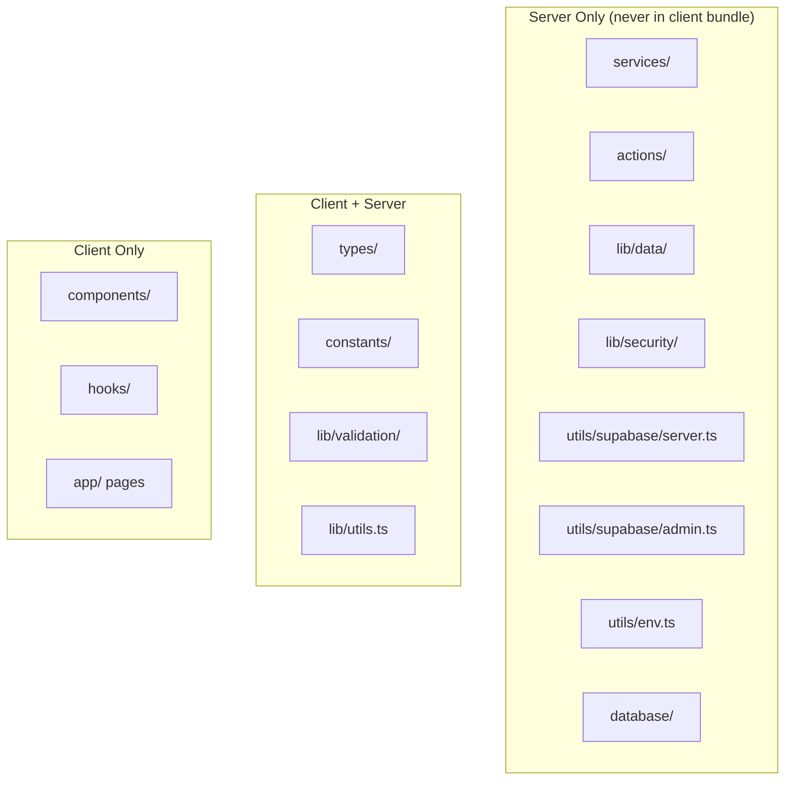

---

## 13. Coding Standards

### 13.1 Naming Conventions

| Item | Convention | Example |
|------|-----------|---------|
| **Components** | PascalCase | `SensitiveField`, `StatCard` |
| **Server Actions** | camelCase, `action` suffix | `createAppointment` |
| **DTO Types** | PascalCase, `DTO` suffix | `AppointmentDTO` |
| **Services** | camelCase, `Service` suffix | `appointmentService` |
| **Helper functions** | camelCase | `formatDate`, `maskField` |
| **Constants** | UPPER_SNAKE_CASE | `MAX_LOGIN_ATTEMPTS` |
| **Files** | kebab-case | `sensitive-field.tsx` |
| **Database tables** | snake_case, plural | `appointments`, `clinic_visits` |
| **Columns** | snake_case | `created_at`, `rfid_uid` |
| **Zod schemas** | PascalCase, `Schema` suffix | `AppointmentRequestSchema` |
| **Types/Interfaces** | PascalCase | `UserRole`, `AppointmentStatus` |
| **Props interface** | PascalCase, `Props` suffix | `SensitiveFieldProps` |

### 13.2 Component Standards

1. **Server Components by default** — Use client components only when interactivity is required.
2. **"use client" directive** — Only add when using hooks, event handlers, or browser APIs.
3. **Props typing** — Always define explicit `Props` interfaces.
4. **Accessibility** — Use semantic HTML, ARIA labels, and keyboard navigation.
5. **Sensitive data** — Wrap all PHI in `SensitiveField` component.
6. **No inline styles** — Use Tailwind utility classes.
7. **Error boundaries** — Client components that fetch data should have error states.
8. **Loading states** — Use `loading.tsx` or skeleton components.

### 13.3 Server Action Standards

```typescript
// Example Server Action pattern
"use server"

export async function createAppointment(input: AppointmentInput): Promise<ActionResult<AppointmentDTO>> {
  // 1. Validate input (Zod)
  const parsed = AppointmentSchema.safeParse(input)
  if (!parsed.success) {
    return { success: false, error: "Invalid input" }
  }

  // 2. Authenticate user
  const session = await getSession()
  if (!session) {
    return { success: false, error: "Unauthorized" }
  }

  // 3. Authorize (RBAC check)
  if (!can(session.userId, "appointment.create")) {
    return { success: false, error: "Forbidden" }
  }

  // 4. Rate limit
  if (!rateLimit(session.userId, "appointment.request")) {
    return { success: false, error: "Rate limited" }
  }

  // 5. Execute business logic (via service)
  const result = await appointmentService.create(parsed.data, session)

  // 6. Audit log
  await auditLog(session.userId, "appointment.create", "appointment", result.id)

  // 7. Notify
  await notificationService.send(...)

  // 8. Return DTO (never raw rows)
  return { success: true, data: toAppointmentDTO(result) }
}
```

**Rules:**
- Always return `ActionResult<T>` — never throw unhandled errors.
- Validate input with Zod before any logic.
- Check authentication and authorization first.
- Return DTOs, never raw database rows.
- Wrap database calls in try/catch.
- Log audit events for sensitive operations.

### 13.4 Database Standards

1. **Never `SELECT *`** — Always specify column lists.
2. **Use parameterized queries** — Prevent SQL injection.
3. **Snake_case** for table and column names.
4. **`created_at` / `updated_at`** — Add to all tables.
5. **UUID primary keys** — Use `gen_random_uuid()`.
6. **Foreign keys with cascade rules** — Explicitly defined.
7. **Indexes on foreign keys** — For join performance.
8. **RLS enabled** — On all tables with sensitive data.
9. **No soft deletes for medical records** — Medical data is never deleted; use status fields.
10. **Audit tables** — For sensitive operations.

### 13.5 Security Standards

1. **Never expose secrets to the browser** — OpenRouter key, service role key, DB credentials.
2. **No raw SQL in client** — Only via Server Actions.
3. **Input validation** — All inputs validated server-side with Zod.
4. **Output sanitization** — DTOs mask sensitive fields.
5. **Least privilege** — RBAC enforced at every layer.
6. **HttpOnly cookies** — For session tokens.
7. **Rate limiting** — On auth, appointment, AI, notification endpoints.
8. **Audit logs** — All sensitive operations.
9. **CSRF protection** — Validate request origins.
10. **No `NEXT_PUBLIC_` for secrets** — Only server env vars for sensitive data.

### 13.6 Error Handling Standards

```typescript
// Standard error pattern
export class AppError extends Error {
  constructor(
    message: string,
    public code: string,
    public status: number = 400
  ) {
    super(message)
  }
}

export function handleError(error: unknown): ActionResult<never> {
  if (error instanceof ZodError) {
    return { success: false, error: "Validation failed", details: error.errors }
  }
  if (error instanceof AppError) {
    return { success: false, error: error.message, code: error.code }
  }
  console.error("Unexpected error:", error)
  return { success: false, error: "Internal server error", code: "INTERNAL" }
}
```

**Rules:**
- Never expose stack traces to the client.
- Always return structured error responses.
- Log server-side errors with context.
- Client shows user-friendly error messages.

### 13.7 Logging Standards

| Level | When | Example |
|-------|------|---------|
| `debug` | Verbose troubleshooting | Query params, timing |
| `info` | Normal operations | User login, appointment created |
| `warn` | Potential issues | Rate limit exceeded, low stock |
| `error` | Failures | DB connection error, AI failure |
| `fatal` | Critical failures | Auth service down |

**Rules:**
- Never log passwords, tokens, or full PHI.
- Log user IDs but not names.
- Include request context (route, action).
- Audit logs are separate from application logs.
- AI logs include sanitized prompts/responses.

### 13.8 Testing Standards

| Test Type | Framework | Coverage |
|-----------|-----------|----------|
| **Unit tests** | Vitest | Services, validation, DTOs |
| **Component tests** | React Testing Library | Components, SensitiveField |
| **Integration tests** | Vitest + Supabase | Server Actions, services |
| **E2E tests** | Playwright | Critical workflows |

**Testing Rules:**
- Test Server Actions with mocked Supabase.
- Test RBAC by role.
- Test sensitive field masking.
- Test permission matrices.
- Test appointment workflow states.
- Test AI fallback behavior.

---

## 14. Sensitive Data Exposure & Privacy Policy

### 14.1 Privacy by Default

ZenTraq follows a **Privacy by Default** principle. Sensitive information should never be fully visible when a page first loads. Authorized users may reveal it only when necessary.

**Core Rule:** Every page that displays confidential information uses an Eye Toggle:
- **Default:** Hidden / Masked
- **User Action:** Click 👁 to reveal, click again to hide

### 14.2 Data Minimization

| Principle | Rule |
|-----------|------|
| **Never `SELECT *`** | All queries specify exact columns |
| **DTOs only** | Responses contain only minimum required fields |
| **No direct Supabase from client** | All data access via Server Actions |
| **RBAC before data access** | Permissions checked before returning data |
| **proxy.ts protection** | All routes protected by middleware |

### 14.3 Sensitive Field Masking

#### Student & Faculty Fields Masked by Default

| Category | Fields |
|----------|--------|
| **Identifiers** | Student Number, Employee Number, RFID UID |
| **Contact** | Email Address (partial mask), Phone Number, Home Address |
| **Emergency** | Emergency Contact, Guardian Information |
| **Medical** | Medical History, Allergies, Current Medication |
| **Consultation** | Consultation Notes, Diagnosis, Treatment |
| **Prescription** | Prescription Details |

#### Internal System Fields Masked by Default

| Category | Fields |
|----------|--------|
| **System** | Internal IDs |
| **Security** | Session Tokens, Security Metadata |
| **Audit** | Audit References |

#### Fields Always Visible

| Category | Fields |
|----------|--------|
| **Identity** | First Name, Last Name |
| **Academic** | Department, Course, Year Level |
| **Employment** | Position, Status |
| **Profile** | Profile Photo |
| **Appointment** | Appointment Status |

### 14.4 Eye Toggle Pattern

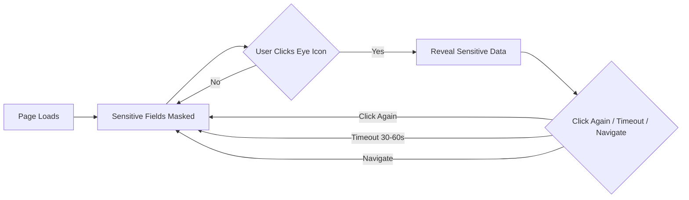

### 14.5 Auto-Hide Timer

- **Default:** Auto-hide after **30-60 seconds** of inactivity.
- **Navigation:** Auto-hide on page navigation.
- **Refresh:** Reset to hidden after page refresh.
- **Configurable:** Timer duration configurable in settings.

### 14.6 DTO-Based Responses

```typescript
// DTO pattern — only required fields returned
export interface StudentPublicDTO {
  id: string
  first_name: string
  last_name: string
  department: string
  course: string
  year_level: number
  status: string
  profile_photo_url: string | null
}

export interface StudentSensitiveDTO extends StudentPublicDTO {
  student_number: string      // masked client-side
  email: string               // partial mask
  phone: string               // masked
  address: string             // masked
  medical_history: MedicalRecordDTO[]  // masked by default
}

// Server-only query — never SELECT *
const { data } = await supabase
  .from("students")
  .select("id, first_name, last_name, department, course, year_level, status, profile_photo_url")
  .eq("id", studentId)
  .single()
```

### 14.7 Server-First Data Access

```
Browser → React Component → Server Action → Permission Validation → Business Logic → Database → DTO → Browser
```

**Rules:**
1. All data access flows through Server Actions.
2. No direct Supabase calls from client components.
3. Only the minimum required fields are returned.
4. Role-based access is validated server-side.

### 14.8 RBAC Validation

- RBAC enforced at multiple layers (proxy, layout, Server Action).
- Permission checks occur **before** any data is returned.
- Each Server Action validates the caller's role.
- Sensitive data requests require explicit permission.

### 14.9 Audit Logging

- All sensitive data **views** are logged.
- All sensitive data **updates** are logged.
- Audit logs include: actor, action, entity type, entity ID, timestamp.
- Admin-only access to audit logs.

### 14.10 Shared Component Standards

#### SensitiveField Component Specification

```
Props:
├── value: string                # Actual value (may be empty)
├── mask: string (optional)      # Custom mask (default: "••••••••")
├── revealable: boolean (default: true)  # Can it be revealed
├── autoHide: boolean (default: true)    # Auto-hide on timer
├── autoHideDelay: number (default: 30000)  # ms before auto-hide
├── className: string (optional) # Styling
├── ariaLabel: string            # Accessibility label
└── onReveal?: () => void        # Called when revealed

Behavior:
├── Default: masked
├── Eye icon toggles reveal/hide
├── Click again to hide
├── Auto-hide after timeout
├── Resets to hidden on navigation/refresh
└── Keyboard accessible (Tab + Enter/Space)
```

```tsx
// Usage example
<SensitiveField
  value={student.phone}
  ariaLabel="Student phone number"
/>
```

**Accessibility Requirements:**
- Eye icon has `aria-label` (e.g., "Show phone number").
- Toggle is keyboard accessible.
- State is visually indicated.
- Masked values use `aria-hidden` and decorative styling.

---

## 15. Phased Implementation Roadmap

### Phase 1: Foundation (Weeks 1-4)

**Goal:** Establish project structure, security baseline, and core architecture.

| Task | Deliverable | Status |
|------|-------------|--------|
| Create `src/` folder structure | All folders per Section 12 | |
| Set up Supabase project | Database, auth, RLS | |
| Configure proxy.ts with RBAC | Role-based routing for all 5 roles | |
| Implement one-device login | Session token management | |
| Create DTO system | DTO builders and types | |
| Implement SensitiveField component | Eye-toggle component | |
| Set up Zod validation | Validation schemas | |
| Create audit logging utility | `lib/security/audit-logger.ts` | |
| Implement rate limiting | `lib/security/rate-limit.ts` | |

**Exit Criteria:**
- All roles can log in and route to correct dashboards.
- proxy.ts enforces role-based access.
- SensitiveField component masks data by default.
- All queries use explicit column selection.

---

### Phase 2: Core Admin + Auth (Weeks 5-8)

**Goal:** Build user management, role assignments, and admin dashboard.

| Task | Deliverable |
|------|-------------|
| Admin dashboard | `app/admin/` routes |
| User management | Create/edit users, assign roles |
| Student & faculty accounts | Profile creation |
| Clinic account management | Admin/Doctor/Nurse accounts |
| Role-based navigation | Sidebar per role |
| Notifications system | `notifications` table + service |
| RFID registration | Admin assign RFID UID to users |

**Exit Criteria:**
- Admin can create users and assign roles.
- Notifications work per receiver.
- RFID UIDs linked to accounts.

---

### Phase 3: Medical Records + Consultations (Weeks 9-12)

**Goal:** Implement the core medical data workflows.

| Task | Deliverable |
|------|-------------|
| Student medical records | CRUD with sensitive masking |
| Faculty medical records | CRUD with sensitive masking |
| Clinic visits | Walk-in registration |
| Triage assessments | Vital signs, symptoms |
| Consultations | Doctor/nurse workflow |
| Prescriptions | Prescription creation |
| Dispensing | Nurse dispensing workflow |
| Audit logging integration | All medical actions logged |

**Exit Criteria:**
- Full consultation workflow works (walk-in → triage → consultation → prescription).
- Medical data masked by default.
- All actions audited.

---

### Phase 4: Appointments + AI (Weeks 13-16)

**Goal:** Implement online appointment system with AI integration.

| Task | Deliverable |
|------|-------------|
| Appointment requests | Student/Faculty submission |
| AI service | OpenRouter + Gemma 4 integration |
| AI evaluation | Priority scoring |
| Staff recommendation | Nurse/Doctor review |
| Approval workflow | Approve/reject with notifications |
| Reminders | 24h + 1h notifications |
| RFID check-in | Kiosk integration |
| AI logging | All AI calls logged |

**Exit Criteria:**
- Full appointment workflow works: request → AI → staff → approve → remind → check-in → consultation.
- AI never makes final decisions.
- AI calls logged.

---

### Phase 5: Pharmacy + Incidents + Clearances (Weeks 17-20)

**Goal:** Implement remaining business modules.

| Task | Deliverable |
|------|-------------|
| Medicine inventory | Full CRUD + stock tracking |
| Restock requests | Admin workflow |
| Incident management | Report, severity, respond, close |
| Health clearances | Request, evaluate, approve, issue |
| Health programs | Create, enroll, track |
| Compliance reports | Report generation |

**Exit Criteria:**
- All business modules functional.
- Stock decremented on dispensing.
- Clearance certificates issued.

---

### Phase 6: Reporting + Security Hardening (Weeks 21-24)

**Goal:** Finalize reports, security, and production readiness.

| Task | Deliverable |
|------|-------------|
| Reporting module | Operational, medical, compliance reports |
| AI analytics | Insights dashboard |
| Security audit | Penetration testing, RLS review |
| Rate limiting tuning | Production limits |
| Performance optimization | Query optimization, caching |
| Backup & recovery | Database backup strategy |
| Monitoring | Error tracking, logging |

**Exit Criteria:**
- All reports generated.
- Security audit passed.
- System production-ready.

---

### Phase 7: Deployment + Testing (Weeks 25-26)

**Goal:** Deploy to Vercel with production configuration.

| Task | Deliverable |
|------|-------------|
| Vercel deployment | Production environment |
| Environment secrets | OpenRouter key, DB credentials |
| E2E testing | Playwright critical paths |
| User acceptance testing | Role-specific testing |
| Documentation | User guides, admin guide |

---

### Testing & Quality Gates Throughout

| Check | Requirement |
|-------|-------------|
| **Code review** | All PRs reviewed |
| **Type safety** | TypeScript strict mode |
| **Lint** | ESLint passes |
| **Unit tests** | Services and validation tested |
| **Component tests** | SensitiveField, forms tested |
| **Integration tests** | Server Actions tested |
| **E2E tests** | Critical workflows tested |
| **Security scan** | Dependencies scanned |
</content>
<task_progress>
- [x] Analyze existing project structure and dependencies
- [x] Review current database schema and configuration
- [x] Examine existing authentication and routing
- [x] Understand current component architecture
- [x] Review existing business modules and components
- [x] Draft SAD sections 1-5 (Overview, Architecture, Stack, Roles, Routes)
- [x] Draft SAD section 6 (Business Modules)
- [x] Draft SAD sections 7-9 (Appointments, AI Engine, Notifications)
- [x] Draft SAD sections 10-11 (Security, Database Schema)
- [x] Draft SAD sections 12-13 (Folder Structure, Coding Standards)
- [x] Draft SAD sections 14-15 (Privacy Policy, Roadmap)
- [ ] Verify final document integrity and completeness
</task_progress>


