# Zentraq Software Architecture Document

**Version:** 4.0

**Status:** Transitional two-repository source baseline

**Last reviewed:** 2026-08-17

**Audience:** Developers, evaluators, clinic administrators, privacy officers,
and security reviewers

This document describes the implementation present in the frontend repository
and the adjacent local `zentraq-backend` repository at the review date. The
backend extraction is implemented in source, while the existing frontend
Server Actions remain the active clinic-data path until deployed replacements
are verified. Source observations do not prove cloud, migration, policy, grant,
secret, network, or operational state.

Status terms used throughout this document:

- **Source-verified:** directly present in application code or configuration.
- **Local reference:** present in the context-only `clinic.sql` schema snapshot.
- **Migration-defined:** created or changed by a versioned local migration.
- **Code-referenced:** queried or called by current application code.
- **Deployment-unverified:** must be checked against the target Supabase project.
- **Operational:** depends on organizational policy or infrastructure outside
  this repository.

## Table of Contents

1. [System Overview](#1-system-overview)
   - [Purpose, scope, and boundaries](#11-purpose-scope-and-boundaries)
   - [Technology stack](#12-technology-stack)
   - [System and data flows](#13-system-and-data-flows)
   - [Original clinic submodules and workflows](#14-original-clinic-submodules-and-workflows)
   - [Route inventory](#15-route-inventory)
   - [Folder structure and integrations](#16-folder-structure-and-integrations)
2. [Infrastructure and Architecture](#2-infrastructure-and-architecture)
   - [Architecture style and topology](#21-architecture-style-and-topology)
   - [Microservices foundation and staged cutover](#22-microservices-foundation-and-staged-cutover)
   - [Layers and trust boundaries](#23-layers-and-trust-boundaries)
   - [Supabase data infrastructure](#24-supabase-data-infrastructure)
   - [Database architecture and schema authority](#25-database-architecture-and-schema-authority)
   - [Database object catalog](#26-database-object-catalog)
   - [Transactions, failure modes, and deployment](#27-transactions-failure-modes-and-deployment)
3. [Roles and Permissions](#3-roles-and-permissions)
   - [Role definitions](#31-role-definitions)
   - [Module and data-scope matrix](#32-module-and-data-scope-matrix)
   - [Authorization enforcement](#33-authorization-enforcement)
4. [Data Privacy](#4-data-privacy)
   - [Data classification and lifecycle](#41-data-classification-and-lifecycle)
   - [HIPAA safeguards mapping](#42-hipaa-safeguards-mapping)
   - [Philippine Data Privacy Act mapping](#43-philippine-data-privacy-act-mapping)
   - [Privacy requirements and limitations](#44-privacy-requirements-and-limitations)
5. [Security](#5-security)
   - [Threat model](#51-threat-model)
   - [Implemented controls](#52-implemented-controls)
   - [OWASP-aligned assessment](#53-owasp-aligned-assessment)
   - [Security gap register](#54-security-gap-register)
   - [Deployment and verification checklists](#55-deployment-and-verification-checklists)

## 1. System Overview

### 1.1 Purpose, scope, and boundaries

Zentraq is a school clinic and health-management application. It supports six
portal roles: admin, doctor, nurse, student, faculty, and staff. Its implemented
scope includes:

- Patient profiles and longitudinal health records
- Clinic check-in, active visits, consultations, and follow-ups
- Appointment request, review, scheduling, reminders, and rescheduling
- RFID registration, patient lookup, queue creation, and consultation claiming
- Medicine inventory, prescriptions, dispensing, expiry, and restocking
- Incident reporting, responses, referrals, and follow-up
- Health programs, participants, screenings, immunizations, and analytics
- Health-clearance requests, evaluation, certificates, and compliance records
- Role-scoped dashboards, reports, announcements, notifications, and audit data
- Patient self-service for the user's own records and requests

The system stores and processes health information. It therefore requires
privacy, security, and clinical governance beyond what source code alone can
provide.

#### Current boundaries

- Zentraq now has exactly two local Git repositories: the Next.js `zentraq`
  frontend and the Node/Express `zentraq-backend` microservices workspace.
- The backend workspace contains an API Gateway and seven domain services with
  independent build/deployment definitions. Cloud deployment is unverified.
- The ten original clinic submodules remain the product taxonomy and share one
  Supabase project. Existing Server Actions remain active during cutover, while
  notification, report, and RFID Edge Functions are retained transition paths.
- The browser uses Supabase Auth and private Realtime broadcast channels. Current
  clinical table reads and writes are performed through server-side actions or
  database RPCs rather than direct browser table queries.
- OpenRouter appointment evaluation is optional and server-only. It is decision
  support, not diagnosis, treatment, prescribing, or autonomous approval.
- RFID support is a software workflow for identifiers, lookup, and queue events;
  hardware provisioning and physical-reader security are outside the repository.
- Email delivery configuration, legal notices, retention policy, backups,
  disaster recovery, workforce training, and facility controls are operational
  responsibilities unless separately implemented by the deployment.

#### Non-goals of this document

This document does not:

- Claim that a deployed database matches local files
- Certify HIPAA or Philippine Data Privacy Act compliance
- Replace clinical policy, legal review, a data protection impact assessment,
  or a security risk assessment
- Treat roadmap entries, placeholder pages, or historical migrations as
  completed production behavior without supporting code

### 1.2 Technology stack

Versions are taken from `package.json`, the installed Next.js package, and the
local Supabase configuration.

| Layer | Current technology | Purpose and notes |
| --- | --- | --- |
| Web framework | Next.js 16.3.0, App Router | Server rendering, layouts, Server Actions, middleware-compatible proxy |
| UI runtime | React and React DOM 19.2.8 | Client and server component rendering |
| Language | TypeScript 5 | Static types for application and DTO contracts |
| Styling | Tailwind CSS 4 | Shared design tokens and responsive layouts |
| UI primitives | Base UI 1.6.0, Radix Tabs 1.1.21, shadcn configuration | Accessible controls and shared components |
| Validation | Zod 4.4.3 | Server-boundary and structured AI-output validation |
| Data platform | Supabase JS/SSR/Functions JS 2.110.2 | Auth, database access, Realtime, Storage, and RPC calls |
| Database | PostgreSQL 17 in local `config.toml` | Relational health and operational data |
| Charts | Recharts 3.8.0 | Dashboard and report visualization |
| Dates | date-fns 4.4.0 | Date formatting and calculations |
| Notifications | Sonner 2.0.7 and Supabase Realtime | Local feedback and private invalidation events |
| Optional AI | OpenRouter chat-completions endpoint | Appointment priority and staff/slot recommendation |
| Package manager | pnpm | `pnpm-lock.yaml` is the authoritative dependency lockfile |
| Backend services | Node.js 22, Express 5, TypeScript 6 | API Gateway and seven independently runnable services in `zentraq-backend` |
| Backend tests | Vitest and Supertest | Shared signing, Gateway, Identity, and AI behavior currently covered |
| Backend deployment source | Render Blueprint | One public gateway and seven private services; deployment unverified |

The installed Next.js package requires Node.js 20.9.0 or newer, while the
installed Supabase JS package requires Node.js 22.0.0 or newer. The effective
project minimum is therefore Node.js 22.0.0. The repository also contains a
`package-lock.json`; contributors should use pnpm and avoid updating the npm
lockfile during normal work.

### 1.3 System and data flows

#### System context

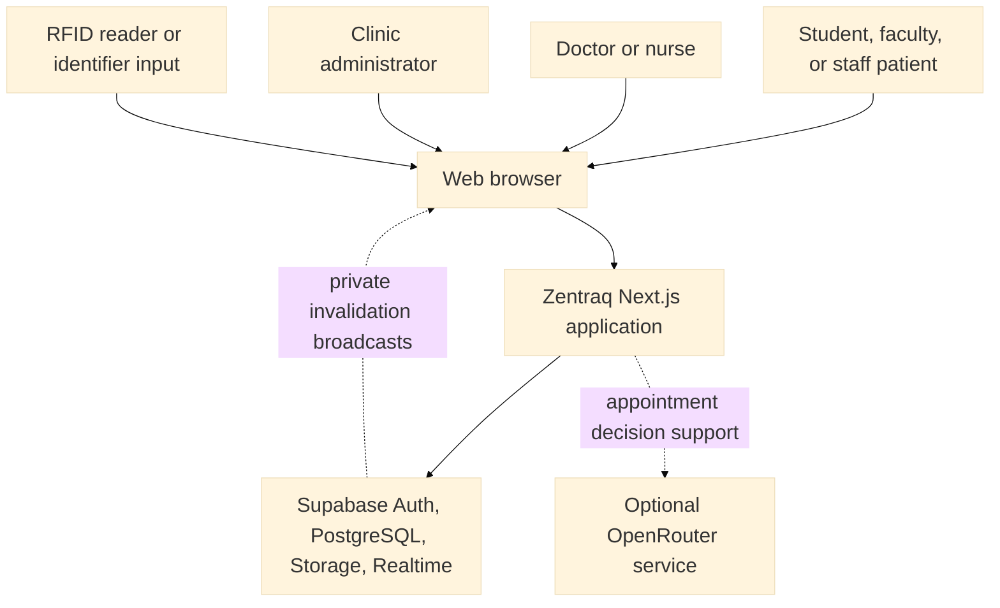

#### Module interaction

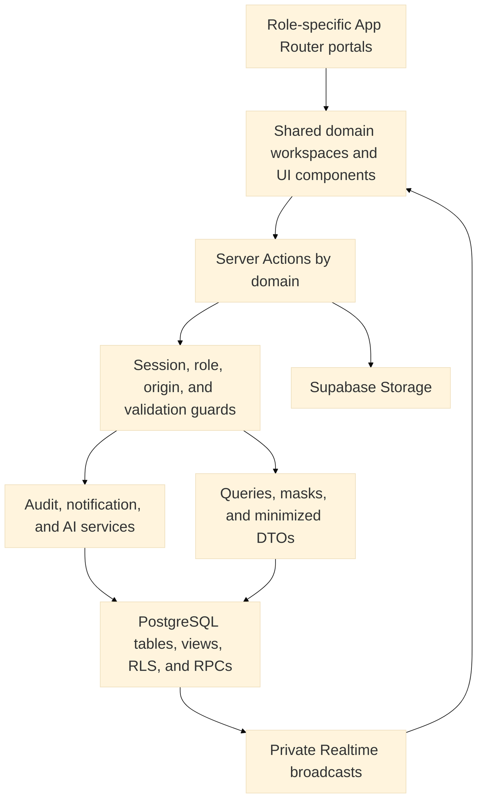

#### Authorized request and data flow

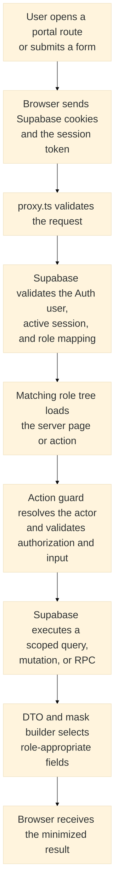

The service-role client is protected by `server-only`, but it bypasses RLS.
Whenever it is used, Server Action authorization and ownership/assignment
filters are part of the effective security boundary.

#### Realtime data flow

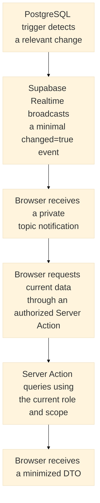

Realtime events are invalidations, not clinical record payloads. Topic policies
cover the clinic RFID queue, a user's notifications, and patient-record topics.

### 1.4 Original clinic submodules and workflows

The following ten names are the canonical product and capstone submodules.
RFID, notifications, audit, analytics, and external integrations are enabling
capabilities within these submodules rather than additional product modules.

| Module | Original submodule | Current behavior | Main roles |
| --- | --- | --- | --- |
| 1 | Student Medical Records Management | Student search, profile, masked fields, health history, documents, own-record access, and RFID association | Admin, Doctor, Nurse; Student sees own data |
| 2 | Clinic Visit & Consultation Logging | Walk-in, appointment, and RFID check-in; queue, claim, triage, handoff, final review, diagnosis, treatment, prescriptions, follow-up, and history | Admin, Doctor, Nurse; patients see own completed history |
| 3 | Medicine Inventory & Dispensing | Catalog, zero-stock visibility, batches, prescriptions, dispensing, restock, alerts, expiry, and medicine movement logs | Admin, Doctor, Nurse with action-specific limits |
| 4 | Appointment Scheduling System | Availability, blocks, booking, review, optional advisory evaluation, reminders, rescheduling, cancellation, check-in, and history | All roles according to scope |
| 5 | Incident & Emergency Case Management | Patient and clinic reporting, classification, response, referral, emergency contacts, follow-up, closure, and history | Clinic roles; Student and Faculty reporting routes |
| 6 | Faculty & Staff Health Services | Employee profiles, records, histories, documents, My Health, examinations, sick leave, and compliance data | Admin, Doctor, Nurse; Faculty and Staff see own data |
| 7 | School Health Program Monitoring | Proposal, approval, participants, enrollment, schedules, screenings, immunizations, progress, and aggregate reports | Admin, Doctor, Nurse |
| 8 | Health Clearance and Certification | Requests, requirements, supporting documents, evaluation, certificates, history, and patient status access | All roles according to scope |
| 9 | Reporting and Compliance | Role-scoped dashboards, activity and operational reports, queued workbooks, audit evidence, and compliance documentation | Admin, Doctor, Nurse with scoped report rights |
| 10 | User Access & Confidentiality Control | Authentication, active sessions, role routing, access administration, action authorization, RLS, grants, Storage, Realtime, privacy, and security controls | All; Admin manages approved access workflows |

#### Compatibility with former technical-domain terms

Earlier architecture drafts used eight technical responsibility groupings. They
map to the canonical product submodules as follows and are not separate modules:

| Former technical grouping | Canonical submodule ownership |
| --- | --- |
| Patient Registry | Modules 1 and 6 |
| Clinical Records | Modules 1, 2, 6, and 8 |
| Scheduling | Module 4 |
| Pharmacy and Inventory | Module 3 |
| Identity and Access | Module 10 |
| Reporting and Audit | Modules 9 and 10 |
| RFID integration | Modules 1, 2, and 6 |
| Notifications | Cross-cutting support for Modules 4, 5, 7, 8, and 9 |

#### Consultation workflow

`consultations.patient_complaint` is the canonical code and database field. The
clinician-facing label is **Visit reason**. Historical complaint column names
remain only in compatibility migrations.

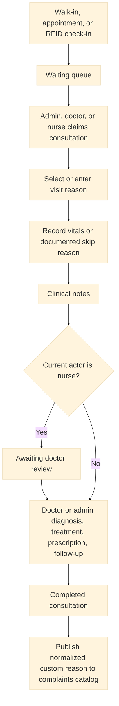

The final workflow uses a database RPC to persist related clinical data. Nurses
cannot submit diagnosis, treatment, prescription, or follow-up payloads through
the Server Action. A nurse handoff retains the reason but does not publish a new
catalog option. A completed doctor/admin review performs a conflict-safe catalog
insert. The target migration and RPC grants remain deployment-unverified.

#### Appointment workflow

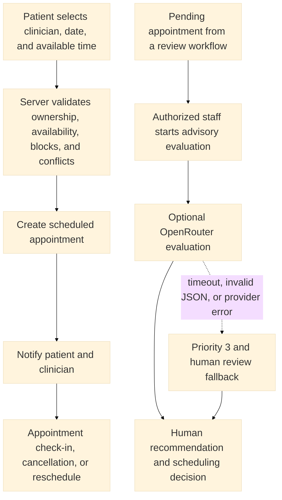

The current patient booking action schedules a validated available slot
directly. A separate staff action can run the advisory evaluator for an
appointment in `pending` state; it is not an automatic step in every booking.
The AI prompt can contain appointment reasons and reported symptoms. Output is
validated with Zod and stored in `ai_logs`; failures return a human-review
fallback. External processing requires a privacy and contract decision before
production use.

#### RFID workflow

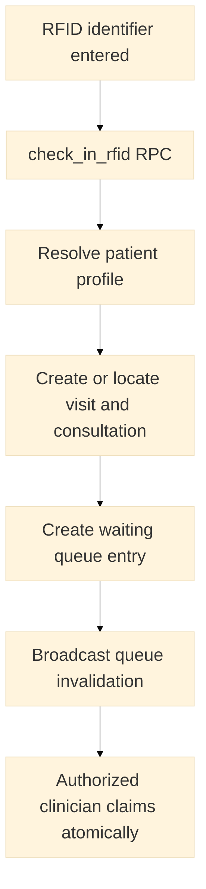

#### Reporting workflow

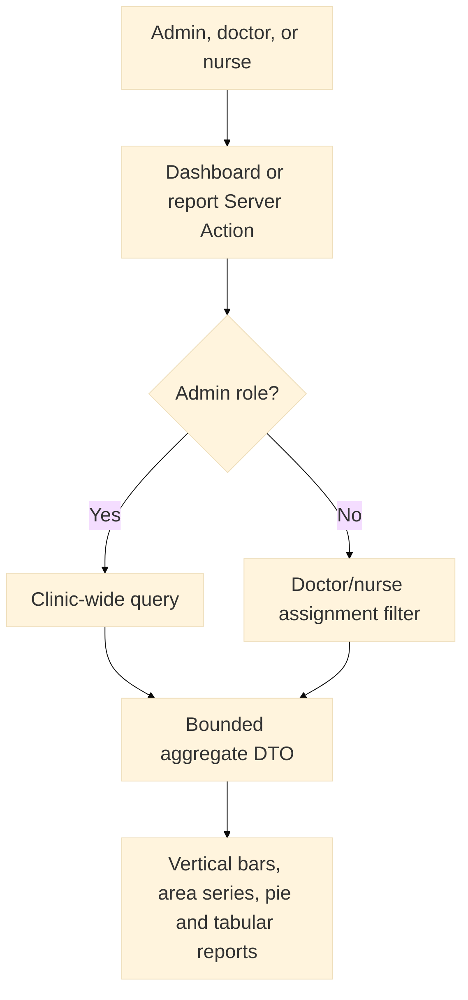

The shared area chart currently supports total consultations, student
consultations, faculty consultations, walk-ins, appointments, and RFID visits.
The dashboard query bounds daily activity to 90 days and limits returned rows.

### 1.5 Route inventory

`proxy.ts` grants an authenticated user only the route tree matching the role in
`user_roles`, plus shared settings, unauthorized, and kiosk routes. Page
existence does not by itself prove that every page is complete or linked in the
sidebar.

| Portal | Pages found | Route groups |
| --- | ---: | --- |
| Admin | 49 | System, records, consultations, reports, medicine, appointments, incidents, programs, clearances, access |
| Doctor | 29 | System, records, consultations, appointments, programs, clearances, reports, incidents, medicine |
| Nurse | 29 | System, records, consultations, clearances, appointments, programs, reports, medicine, incidents |
| Student | 9 | Dashboard, announcements, appointments, own record, consultations, incident report, clearances |
| Faculty | 9 | Dashboard, announcements, appointments, own record, consultations, incident report, clearances |
| Staff | 8 | Dashboard, announcements, appointments, own record, consultations, clearances |

#### Admin routes

- System: `/admin`, `/admin/announcement`, `/admin/rfid-kiosk`,
  `/admin/rfid-registration`
- Records and own health: `/admin/records/view`,
  `/admin/staffhealth/record`, `/admin/my-health`,
  `/admin/my-health/consultations`
- Consultations: `/admin/visits`, `/admin/visits/followup`,
  `/admin/visits/history`, `/admin/visits/history/[id]`
- Appointments: `/admin/appointments/book`, `/calendar`, `/reminders`,
  `/reschedule`, `/waitlist`, and `/admin/my-schedule`
- Medicine: `/admin/medicine/stock`, `/restock`, `/dispense`,
  `/dispense_log`, `/low_stock_alerts`, `/expiry`
- Incidents: `/admin/incidents/log`, `/report`, `/status`, `/referral`,
  `/emergency_contacts`
- Programs: `/admin/healthprograms/list`, `/programs`, `/participants`,
  `/enrollment`, `/schedule`, `/reports`
- Clearances: `/admin/clearance/request`, `/issue`, `/history`,
  `/requirements`, `/templates`
- Reports: `/admin/reports/generate`, `/export`, `/templates`, `/checklist`,
  `/audit_trail`
- Access: `/admin/useraccess/roles`, `/permissions`, `/approval`,
  `/password_reset`

Relative fragments in this inventory inherit the complete prefix shown first;
for example, `/calendar` under Admin Appointments means
`/admin/appointments/calendar`.

#### Doctor routes

- System and records: `/doctor`, `/doctor/announcements`,
  `/doctor/rfid-kiosk`, `/doctor/records/view`,
  `/doctor/staffhealth/record`
- Consultations and own health: `/doctor/visits`, `/visits/followup`,
  `/visits/history`, `/doctor/my-health`, `/my-health/consultations`
- Appointments: `/doctor/appointments/calendar`, `/reminders`, `/reschedule`,
  and `/doctor/my-schedule`
- Programs and clearances: `/doctor/healthprograms/list`, `/participants`,
  `/reports`, `/doctor/clearance/history`, `/issue`
- Reports: `/doctor/reports/generate`, `/export`
- Incidents: `/doctor/incidents`, `/log`, `/status`, `/referral`,
  `/emergency_contacts`
- Medicine: `/doctor/medicine/stock`, `/dispense`, `/dispense_log`

#### Nurse routes

- System and records: `/nurse`, `/nurse/announcements`, `/nurse/rfid-kiosk`,
  `/nurse/records/view`, `/nurse/staffhealth/record`
- Consultations and own health: `/nurse/visits`, `/visits/history`,
  `/nurse/my-health`, `/my-health/consultations`
- Appointments: `/nurse/appointments`, `/appointments/calendar`,
  `/appointments/reminders`, `/nurse/my-schedule`
- Programs, clearances, and reports: `/nurse/healthprograms/list`,
  `/participants`, `/nurse/clearance/history`, `/nurse/reports/view_only`
- Medicine: `/nurse/medicine/stock`, `/restock`, `/dispense`,
  `/dispense_log`, `/low_stock_alerts`, `/expiry`
- Incidents: `/nurse/incidents`, `/log`, `/report`, `/status`, `/referral`,
  `/emergency_contacts`

#### Patient routes

- Student: `/student`, `/announcements`, `/appointments/book`,
  `/appointments/reschedule`, `/records/my_record`, `/visits/my_history`,
  `/incidents/report`, `/clearance/my_history`, `/clearance/request`
- Faculty: `/faculty`, `/announcements`, `/appointments/book`,
  `/appointments/reschedule`, `/staffhealth/my_record`,
  `/visits/my_history`, `/incidents/report`, `/clearance/my_history`,
  `/clearance/request`
- Staff: `/staff`, `/announcements`, `/appointments/book`,
  `/appointments/reschedule`, `/staffhealth/my_record`,
  `/visits/my_history`, `/clearance/my_history`, `/clearance/request`

Patient fragments inherit the role prefix. For example, the student
`/announcements` entry means `/student/announcements`.

#### Shared and public-entry routes

- `/login` is the authentication entry point.
- `/settings`, `/settings/profile`, `/settings/privacy`, and
  `/settings/security` are shared authenticated routes.
- `/unauthorized` is a shared error route.
- `/rfid-kiosk/scanner` is the shared scanner route. Kiosk exposure and physical
  placement require deployment review because `proxy.ts` treats kiosk paths as
  a special case.
- `/` is the root entry route.

### 1.6 Folder structure and integrations

```text
actions/
  access/       Roles, permissions, and audit trail
  accounts/     Account administration and portal recovery
  appointments/ Scheduling, requests, review, availability, and queries
  auth/         Login and authenticated-session commands
  clinical/
    clearances/ Clearance queries and management
    incidents/  Incident queries and management
    prescriptions/ Prescription favorites and management
    records/    Patient records, compliance, search, and documents
    visits/     Visit workflow, queries, and history
  communications/ Announcements and the authenticated notification inbox
  dashboard/    Role-scoped dashboard summaries
  health-programs/ Program workflows and reporting
  inventory/    Medicine catalog, stock, dispensing, and queries
  profiles/     Student, Faculty, Staff, and patient self-service data
  reports/      Aggregate analytics and queued workbook exports
  rfid/         Check-in, queue, patient lookup, and registration
  settings/     Clinic configuration
app/            Role route trees and shared application routes
components/
  analytics/    Shared dashboard and report charts
  clinical/     Visit, history, consultation, and RFID workspaces
  medical/      Records and patient self-service workspaces
  ui/           Shared design-system controls
lib/
  api/          Typed frontend API client and server token bridge
  auth/         Role routing and session helpers
  data/         DTO builders, masks, and query helpers
  security/     Server Action actor and origin guards
  validation/   Zod schemas
services/       AI, audit, and notification services
supabase/
  functions/    Focused notification, report, and RFID Edge Functions
  migrations/   Historical and current imperative migrations plus schema reference
  config.toml   Local Supabase services and PostgreSQL version
  seed.sql      Local seed data
types/          Shared TypeScript contracts
utils/supabase/ Browser, server-session, middleware, and service-role clients
```

The adjacent `zentraq-backend` repository owns `packages/shared`,
`services/api-gateway`, and the Identity, Appointment, Clinical, Inventory,
Notification, Reporting, and AI service packages. It is intentionally not
nested into this frontend Git repository.

| Integration | Data exchanged | Boundary |
| --- | --- | --- |
| Supabase Auth | Credentials, user identity, session cookies | Required platform service |
| Supabase PostgreSQL | Clinical, identity, operational, and audit records | Required platform service |
| Supabase Storage | Medical/supporting files and announcement media | Bucket policy and signed-URL dependent |
| Supabase Realtime | Minimal private invalidation messages | Authenticated topic-policy dependent |
| RFID input | Identifier used for patient resolution and check-in | Hardware and local workstation are external |
| OpenRouter | Appointment reason, symptoms, schedule, and staff context | Optional external processor; disabled without a key |
| Local SMTP/Inbucket | Development email capture | Local only unless a production SMTP provider is configured |

## 2. Infrastructure and Architecture

### 2.1 Architecture style and topology

Zentraq uses a **serverless service-oriented microservices architecture**. The
ten original clinic submodules define product ownership; the runtime source is
split between a Next.js frontend and a Node/Express backend workspace. The
backend provides an API Gateway and seven domain services. Focused Supabase
Edge Functions remain during migration, and one Supabase project provides Auth,
PostgreSQL, Storage, Realtime, and atomic RPCs.

The shared database limits data isolation and remains a platform-wide failure
domain, but it preserves referential integrity and transactional clinical and
inventory workflows during extraction. Service boundaries add network,
credential, timeout, observability, and partial-failure risks; deployment must
therefore be incremental and reversible.

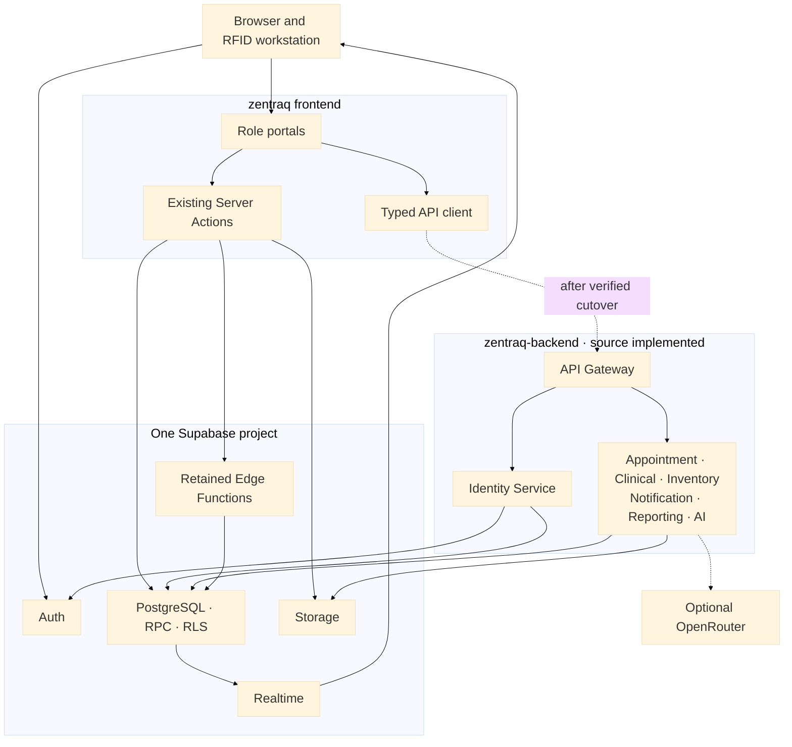

The frontend has a conditional `/api/v1/*` rewrite to `BACKEND_URL`. The
backend has a Render Blueprint defining one public gateway and seven private
services. These are deployment source, not evidence that Vercel or Render has
been configured.

### 2.2 Microservices foundation and staged cutover

Zentraq applies API-gateway, domain-service, event-driven, and data-intensive
patterns. The seven backend services are independently runnable packages and
have separate Render build filters. Notification delivery, report generation,
and RFID check-in retain focused Edge Function boundaries during migration.
Operational independence is not claimed until deployment, monitoring, rollback,
and failure-isolation behavior are verified.

#### Microservice pattern classification

| Pattern | Current implementation | Architectural boundary |
| --- | --- | --- |
| API gateway | Public `/api/v1`, request IDs, CORS, rate limiting, Identity coordination, HMAC-signed internal context, routing, and timeouts | Source implemented and locally tested; deployment and shared/distributed rate limiting remain unverified. |
| Event-driven service | Metadata-only PGMQ queues, source-defined Cron jobs, `notifications-worker`, and `reports-worker` support asynchronous delivery and report processing. | Source is version-controlled; deployment, worker secrets, schedules, retries, and dead-letter behavior remain unverified. |
| Domain services | Identity, Appointment, Clinical, Inventory, Notification, Reporting, and AI expose versioned capability contracts. | Services share one database and privileged key during the first phase; every query therefore needs service-side scope enforcement. |
| Data-intensive service | Reporting owns aggregate/report contracts; Inventory calls a protected atomic dispensing RPC. | Target migration, live artifact authorization, and concurrent behavior require staging evidence. |

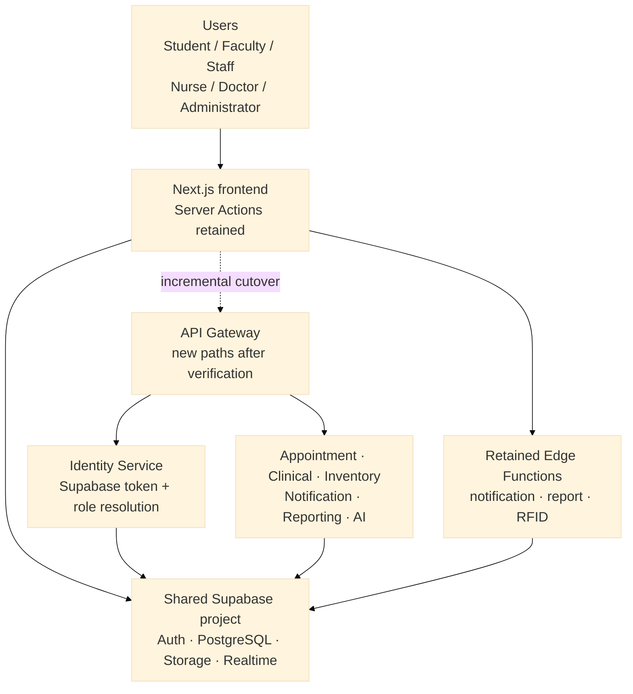

| Module | Original submodule | Current responsibility and ownership boundary |
| --- | --- | --- |
| 1 | Student Medical Records Management | Student identity, demographic and health records, protected documents, own-record access, and student RFID association |
| 2 | Clinic Visit & Consultation Logging | Check-in, queue, consultation state, triage, handoff, clinical outcomes, follow-up, and history |
| 3 | Medicine Inventory & Dispensing | Medicine definitions, zero-stock visibility, batches, stock receipt, dispensing, expiry, and movement logs |
| 4 | Appointment Scheduling System | Availability, blocks, conflicts, booking, review, reminders, rescheduling, cancellation, check-in, and optional advisory evaluation |
| 5 | Incident & Emergency Case Management | Incident intake, classification, response, emergency contacts, referral, follow-up, closure, and history |
| 6 | Faculty & Staff Health Services | Faculty and Staff identity, health records, documents, My Health, consultation history, examinations, sick leave, and compliance |
| 7 | School Health Program Monitoring | Program proposals, approvals, participants, schedules, screenings, immunizations, monitoring, and reports |
| 8 | Health Clearance and Certification | Requests, requirements, evidence, clinical evaluation, certification, history, and patient access |
| 9 | Reporting and Compliance | Role-scoped aggregates, administrative workbooks, audit evidence, operational monitoring, and compliance documentation |
| 10 | User Access & Confidentiality Control | Authentication, sessions, roles, authorization, RLS, grants, Storage, Realtime, secrets, privacy, and security assurance |

#### Submodule-aligned serverless opportunities

| Module | Original submodule | Suitable serverless responsibility | Keep transactional or synchronous |
| --- | --- | --- | --- |
| 1 | Student Medical Records Management | Private-document validation and future approved local-first institutional lookup | Record correction, merge, ownership checks, and conflict-safe local writes |
| 2 | Clinic Visit & Consultation Logging | Source-implemented `rfid-check-in` orchestration and future follow-up notification production | Queue claim, triage, handoff, diagnosis, treatment, prescription, and finalization |
| 3 | Medicine Inventory & Dispensing | Scheduled low-stock, zero-stock, and expiry detection that enqueues generic attention notifications | Dispensing, receipt, adjustment, and restocking |
| 4 | Appointment Scheduling System | Due reminder production and optional governed OpenRouter evaluation isolation | Booking, conflicts, approval, rescheduling, cancellation, and check-in transitions |
| 5 | Incident & Emergency Case Management | Generic overdue follow-up notifications that contain no clinical narrative | Incident classification, response, referral, follow-up, and closure |
| 6 | Faculty & Staff Health Services | Private-document validation and future approved local-first Registrar or HR lookup | Record correction, reconciliation, ownership, and health-record writes |
| 7 | School Health Program Monitoring | Scheduled program reminders and aggregate refresh jobs | Proposal approval, participant changes, screenings, and immunization records |
| 8 | Health Clearance and Certification | Expiry reminders and private-document security processing | Clinical evaluation, approval, certificate issuance, and ownership checks |
| 9 | Reporting and Compliance | Source-implemented `reports-worker`, notification delivery, and future audit monitoring | Report authorization, artifact ownership, signed URLs, and immutable audit writes |
| 10 | User Access & Confidentiality Control | Managed Supabase Auth and sanitized security monitoring | Login boundary, active-role authorization, session revocation, and local account writes |

The recommended next candidates are appointment reminders, inventory attention,
private-document security processing, and audit monitoring, in that order after
the existing three Edge Functions are deployed and verified. AI evaluation
isolation follows only after governance approval; Registrar and OSAS remain
blocked on approved external contracts. Queue and event payloads must contain
opaque identifiers and sanitized codes rather than diagnoses, treatment notes,
medication details tied to a patient, or document contents. The detailed
candidate triggers, authentication models, exclusions, and implementation order
are maintained in
[`SERVERLESS_MICROSERVICES_MIGRATION.md`](./SERVERLESS_MICROSERVICES_MIGRATION.md).

#### Implementation status

| Status | Included capabilities | Interpretation |
| --- | --- | --- |
| Implemented clinic submodules | The ten original submodules, six role portals, domain-first Server Actions, Supabase Auth integration, notifications, audit events, and RFID workflows | These remain the working frontend paths during migration. |
| Source-implemented backend services | API Gateway, seven domain services, shared security/contracts, and Render Blueprint | Frozen install, type checks, eight tests, builds, and local health checks passed; no cloud deployment is claimed. |
| Source-implemented serverless boundaries | `notifications-worker`, `reports-worker`, `rfid-check-in`, protected RPCs, PGMQ queues, worker Cron migration, and private generated-report workflow | Functions, SQL, and configuration are version-controlled but are not confirmed deployed. |
| Deployment-unverified infrastructure | GitHub remotes, Render/Vercel, private networking, service secrets, remote migrations, Edge Functions, Cron, queues, Storage, RLS, signed URLs, and six-role isolation | These remain open until tested against authorized staging and target environments. |
| Future capabilities | Registrar/OSAS, external email/SMS, domain schemas and database roles, distributed limiting, and centralized observability | These require approved contracts, security/privacy review, operational ownership, and implementation evidence. |

#### Architectural justification and next implementation line

The current source adds authenticated network boundaries while retaining shared
transactional consistency. It avoids distributed transactions by keeping
atomic clinical and inventory state changes in PostgreSQL RPCs. The trade-off is
more timeout, credential, partial-failure, logging, and operational complexity.
Independent production scaling and failure isolation remain deployment-
unverified even though independent build definitions now exist.

Work proceeds in this order:

1. Reconcile local and remote migration histories in a disposable or staging
   project.
2. Configure and deploy Gateway and Identity in staging with scoped secrets and
   private networking.
3. Verify token validation, signed internal context, direct-service rejection,
   RLS/grants, and positive/negative tests for all six roles.
4. Cut over one domain capability at a time while retaining the working Server
   Action and an explicit rollback route.
5. Add protected observability, alerts, queue recovery, artifact cleanup, and
   operational runbooks before broader promotion.
6. Retire duplicate paths only after acceptance evidence; implement Registrar
   or OSAS only after their contracts and privacy controls are approved.

The repository contains production-oriented source for queued notification
delivery, queued aggregate workbooks, and synchronous authenticated RFID
check-in. The linked project previously reported only migration `001`, so no
migration push or function deployment was claimed. The capstone-ready
**2.4.1 Microservices Architecture** and **3.2.1 Why Microservices? Justify the
Choice over Monolithic Architecture** sections, security invariants, and detailed
verification gates are maintained in
[`SERVERLESS_MICROSERVICES_MIGRATION.md`](./SERVERLESS_MICROSERVICES_MIGRATION.md).

### 2.3 Layers and trust boundaries

| Layer | Responsibility | Must not do |
| --- | --- | --- |
| Routes and layouts | Select the portal, load initial data, compose workspaces | Treat route visibility as sufficient authorization |
| Client workspaces | Interaction, accessible controls, local state, invalidation subscriptions | Hold service-role keys or query clinical tables directly |
| Server Actions | Resolve actor, authorize, validate, scope, mutate/query, return DTOs | Trust client role, owner IDs, or raw form input |
| API Gateway | Authenticate by coordination, sign internal context, route, limit, time out, and normalize errors | Query domain tables or trust browser role headers |
| Domain services | Reauthorize roles, ownership/assignment, validate, minimize DTOs, and own capability APIs | Accept unsigned context or query another domain casually |
| Frontend services | Reusable audit, notification, and legacy AI behavior retained during migration | Bypass the calling action's authorization contract |
| Validation and DTOs | Reject invalid input and minimize output | Expose raw rows by default |
| Supabase session client | Act as the authenticated user and call authorized RPCs | Assume every exposed object has safe RLS |
| Supabase admin client | Perform server-only privileged queries | Rely on RLS or enter a browser bundle |
| PostgreSQL/RLS/RPC | Enforce row rules and atomic state transitions | Grant broad execution on privileged functions |
| Storage and Realtime | Protect objects/topics and deliver private invalidations | Broadcast PHI in event payloads |

#### Authentication and session flow

1. `proxy.ts` validates signed identity claims through `auth.getClaims()`;
   server workflows call `auth.getUser()` when they require a fresh Auth row.
2. `proxy.ts` reads the HttpOnly `zentraq_session_token` cookie.
3. A server-only service-role query verifies an active, unrevoked
   `user_sessions` row and resolves `user_roles -> roles`.
4. The user is allowed into only the matching top-level portal tree.
5. Server Actions resolve the actor again before protected operations.

One-device invalidation is source-verified. Session expiry, token rotation,
revocation behavior, and target-project Auth settings remain deployment-dependent.

For migrated calls, the frontend sends the Supabase access token to the API
Gateway. Identity Service validates it against Supabase Auth, resolves roles and
profile references from protected records, and returns a minimized actor. The
Gateway signs a short-lived internal context; every domain service verifies the
signature and expiry before applying its own authorization checks.

#### Mutation flow

1. Resolve the current user and role on the server.
2. For protected mutations, compare Origin and Host when the headers are present.
3. Parse unknown input with the action's Zod schema.
4. Derive patient ownership, clinic-account identity, or assignment on the server.
5. Use a scoped query or authenticated RPC.
6. Write an audit event where the workflow has implemented one.
7. Revalidate or return a minimized result.

The origin helper currently permits requests when Origin or Host is absent. It
is a defense-in-depth check, not a complete CSRF strategy by itself.

#### Signed-file flow

Medical documents use server-side bucket operations and signed URLs in the
reviewed actions. Announcement media may use a public presentation path.
Authorization must be checked before generating a sensitive signed URL; the URL
expiry limits exposure but does not replace access control.

### 2.4 Supabase data infrastructure

| Capability | Current implementation | Verification boundary |
| --- | --- | --- |
| Auth | SSR clients use `auth.getClaims()` for page/proxy identity and `auth.getUser()` for fresh Auth records | Provider settings and MFA are deployment-unverified |
| Data API | Local exposed schemas are `public` and `graphql_public`; new-object auto-exposure is unset | Grants and live exposure must be checked |
| PostgreSQL | Local major version 17 | Remote version must match before migration work |
| RLS | Policies and remediation migrations exist for sensitive domains | Applied policies and policy behavior need live tests |
| RPC | Authenticated functions handle check-in, claiming, consultation finalization, and program approval | Signatures, grants, and function owners need live verification |
| Storage | Private document flows exist; a staged 150 KiB profile-photo bucket template stores object paths rather than data URLs | Bucket creation, privacy, MIME limits, and policies need live verification |
| Realtime | Private broadcast policies and trigger functions exist | Publication, topic policy, and target-project settings need live verification |
| Edge Functions | Named-secret notification/report workers and a user-authenticated RFID check-in function are source-defined | Function deployment, keys, JWT enforcement, and role behavior are deployment-unverified |
| Queues | Dedicated metadata-only notification/report PGMQ queues and service-role-only worker RPCs are source-defined | Migration state, queue grants, retries, dead-letter behavior, and Cron need live verification |
| Migrations | Imperative, versioned SQL files; `schema_paths` is empty | The 2026-08-13 linked check found remote history at `001` only; reconcile before any push |
| Seed | `supabase/seed.sql` enabled locally | Never treat development seed identities as production data |
| Network | Local network restrictions are disabled | Production network restrictions are operational/deployment controls |

Supabase's service role bypasses RLS and must remain server-only. Views require
special attention because ordinary PostgreSQL views can execute with owner
permissions; app-facing views should be `security_invoker` where supported or
otherwise protected with explicit grants and safe underlying access.

### 2.5 Database architecture and schema authority

The repository has two different forms of database evidence:

1. `supabase/migrations/clinic.sql` is a 68-table **context-only reference**. Its
   header says it is not intended to be run and that ordering may be invalid.
2. Timestamped/versioned SQL files describe incremental changes and historical
   compatibility work.

Neither source proves live state. Before deployment or migration work, compare
the target schema, migration history, RLS policies, grants, views, function
signatures, owners, and storage policies.

#### Core clinical relationship model

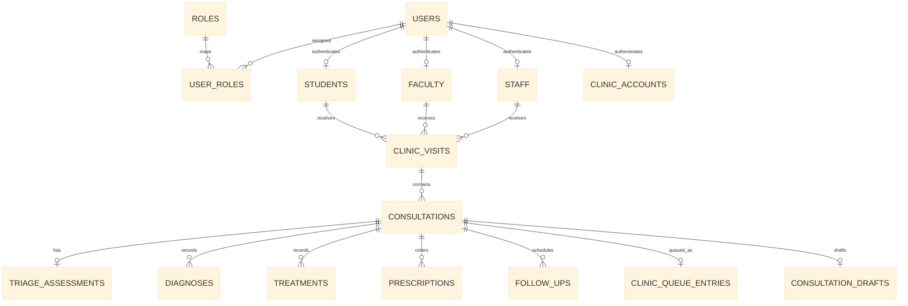

#### Scheduling and operations relationship model

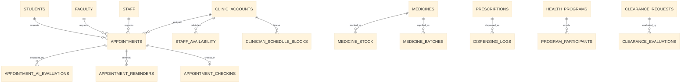

### 2.6 Database object catalog

Catalog status abbreviations:

- **REF**: local `clinic.sql` reference
- **MIG**: versioned migration definition or change
- **APP**: current application reference
- **DEP**: deployed state must be verified

Every object below is **DEP** unless a live database check is recorded separately.

#### Identity and access tables

| Object | Purpose and principal relationships | Status |
| --- | --- | --- |
| `users` | Application identity linked one-to-one to `auth.users`; parent for roles, sessions, and profiles | REF, APP, DEP |
| `roles` | Named portal roles used by `user_roles` and permissions | REF, MIG, APP, DEP |
| `permissions` | Permission catalog entries grouped by resource/action | REF, MIG, APP, DEP |
| `user_roles` | Many-to-many assignment between users and roles; runtime role source | REF, MIG, APP, DEP |
| `role_permissions` | Many-to-many role-to-permission catalog | REF, MIG, APP, DEP |
| `user_sessions` | Custom session token, expiry, and revocation for one-device enforcement | REF, MIG, APP, DEP |
| `clinic_accounts` | Active admin/doctor/nurse identity used for assignments and schedules | REF, MIG rename/backfill, APP, DEP |

Access boundary: Auth establishes identity; the proxy and Server Actions resolve
role assignments. Admin-only actions manage roles and permissions. The service
role reads identity mappings on the server.

#### Patient profile and medical-record tables

| Object | Purpose and principal relationships | Status |
| --- | --- | --- |
| `students` | Student demographics, institutional identifier, user and RFID linkage | REF, APP, DEP |
| `student_medical_history` | Conditions linked to a student | REF, APP, DEP |
| `student_allergies` | Student allergy records | REF, APP, DEP |
| `student_medications` | Student medication history | REF, APP, DEP |
| `student_immunizations` | Student immunization records | REF, APP, DEP |
| `student_documents` | Metadata for protected student documents | REF, APP, DEP |
| `faculty` | Faculty demographics, institutional identifier, user and RFID linkage | REF, APP, DEP |
| `faculty_medical_history` | Conditions linked to faculty | REF, APP, DEP |
| `faculty_allergies` | Faculty allergy records | REF, APP, DEP |
| `faculty_medications` | Faculty medication history | REF, APP, DEP |
| `faculty_immunizations` | Faculty immunization records | REF, APP, DEP |
| `faculty_documents` | Metadata for protected faculty documents | REF, APP, DEP |
| `staff` | Non-faculty employee demographics, user and RFID linkage | REF, MIG, APP, DEP |
| `staff_medical_history` | Conditions linked to staff | REF, APP, DEP |
| `staff_allergies` | Staff allergy records | REF, APP, DEP |
| `staff_medications` | Staff medication history | REF, APP, DEP |
| `staff_immunizations` | Staff immunization records | REF, APP, DEP |
| `staff_documents` | Metadata for protected staff documents | REF, APP, DEP |
| `medical_exam_results` | Role-polymorphic medical examination and compliance results | REF, MIG, APP, DEP |
| `sick_leave_entries` | Role-polymorphic sick-leave and fitness records | REF, MIG, APP, DEP |

Access boundary: clinic roles use server actions; patient roles receive only
records linked to their authenticated profile. Document downloads require
authorized signed-URL creation. Exact RLS behavior is deployment-unverified.

#### Consultations and clinic-operation tables

| Object | Purpose and principal relationships | Status |
| --- | --- | --- |
| `clinic_visits` | Check-in event and patient-type link for walk-in, appointment, or RFID visits | REF, APP, DEP |
| `consultations` | Clinical encounter linked to a visit and assigned clinic accounts; canonical reason is `patient_complaint` | REF, MIG, APP, DEP |
| `triage_assessments` | Vitals and triage disposition, one current record per consultation | REF, MIG constraint, APP, DEP |
| `diagnoses` | Doctor/admin diagnosis entries linked to consultations | REF, APP, DEP |
| `treatments` | Treatment plan entries linked to consultations | REF, APP, DEP |
| `follow_ups` | Follow-up instructions and status linked to consultations | REF, APP, DEP |
| `clinic_queue_entries` | Waiting, claimed, doctor-review, completed, or cancelled queue state | REF, MIG, APP, DEP |
| `consultation_drafts` | Temporary consultation work associated with a consultation/user | REF, MIG, APP, DEP |
| `complaints` | Normalized reusable visit-reason catalog; service-role read/insert only in current migration | REF, MIG, APP, DEP |

Access boundary: admin, doctor, and nurse actions can read role-appropriate data.
Doctor/nurse queue and history actions apply clinic-account assignment filters;
admin receives clinic-wide data where implemented. Finalization uses an
authenticated RPC plus server action checks.

#### Scheduling tables

| Object | Purpose and principal relationships | Status |
| --- | --- | --- |
| `appointments` | Patient request, schedule, clinician assignment, and workflow status | REF, APP, DEP |
| `appointment_ai_evaluations` | Structured AI priority/recommendation linked to an appointment | REF, APP, DEP |
| `appointment_recommendations` | Recommendation history associated with appointment processing | REF, DEP |
| `appointment_reminders` | Reminder scheduling and delivery state | REF, APP, DEP |
| `appointment_checkins` | Appointment arrival/check-in state | REF, APP, DEP |
| `staff_availability` | Recurring clinician availability linked to clinic accounts | REF, APP, DEP |
| `clinician_schedule_blocks` | Date-specific schedule exceptions or blocks | REF, APP, DEP |

Access boundary: patients create and manage their own requests; clinic actions
review and schedule according to explicit role lists. Doctor/nurse dashboard
queries are assignment-scoped where implemented.

#### Pharmacy tables

| Object | Purpose and principal relationships | Status |
| --- | --- | --- |
| `medicines` | Medicine catalog | REF, APP, DEP |
| `medicine_stock` | Current stock records linked to medicines | REF, APP, DEP |
| `suppliers` | Medicine supplier directory | REF, DEP |
| `medicine_batches` | Batch, supplier, quantity, and expiry tracking | REF, APP, DEP |
| `prescriptions` | Medication orders linked to consultations and medicines | REF, APP, DEP |
| `dispensing_logs` | Dispensing event linked to prescription/stock and actor | REF, APP, DEP |
| `restock_requests` | Requested inventory replenishment | REF, APP, DEP |

Access boundary: action-level roles differ by operation. Current clinical action
code restricts medicine creation to admin and direct dispensing to nurse; other
shared inventory queries and operations must retain their own checks.

#### Incident tables

| Object | Purpose and principal relationships | Status |
| --- | --- | --- |
| `incidents` | Health/safety incident report and workflow status | REF, APP, DEP |
| `incident_responses` | Response actions linked to an incident | REF, APP, DEP |
| `incident_followups` | Follow-up actions linked to an incident | REF, APP, DEP |

Access boundary: clinic actions manage incidents. Student and faculty reporting
routes exist; ownership and permitted disclosure must be enforced by the called
server action and RLS.

#### Health-clearance tables

| Object | Purpose and principal relationships | Status |
| --- | --- | --- |
| `health_clearances` | Clearance record and current status | REF, APP, DEP |
| `clearance_requests` | Patient-submitted clearance request | REF, APP, DEP |
| `clearance_evaluations` | Clinical evaluation linked to a request | REF, APP, DEP |
| `clearance_certificates` | Issued certificate linked to an approved clearance | REF, APP, DEP |

Access boundary: patients see/request their own clearances. Clinic roles access
evaluation and history according to action checks; doctor-level compliance
mutations are restricted to doctor/admin in reviewed actions.

#### Health-program tables

| Object | Purpose and principal relationships | Status |
| --- | --- | --- |
| `health_programs` | Program definition, proposal, approval, dates, and status | REF, MIG, APP, DEP |
| `program_participants` | Patient enrollment in a program | REF, APP, DEP |
| `program_screenings` | Screening results linked to program participants | REF, APP, DEP |
| `program_immunizations` | Program-delivered immunization records | REF, APP, DEP |
| `program_analytics` | Stored program aggregate metrics | REF, APP, DEP |

Access boundary: doctor/nurse proposal and clinic-role queries are implemented;
approval is performed by an authenticated role-checking RPC. Confirm live grants.

#### Communications, reporting, AI, audit, and configuration tables

| Object | Purpose and principal relationships | Status |
| --- | --- | --- |
| `notifications` | User-targeted message and read state | REF, MIG, APP, DEP |
| `announcements` | Clinic announcements and optional media | REF, MIG history, APP, DEP |
| `audit_logs` | Actor, action, entity, request metadata, and timestamp | REF, MIG, APP, DEP |
| `ai_logs` | AI prompt, response, status, actor, and appointment context | REF, APP, DEP |
| `program_analytics` | Health-program aggregate values, also cataloged with its domain | REF, APP, DEP |
| `settings` | Application settings | REF, MIG, APP, DEP |
| `services` | Configurable clinic services | REF, MIG, APP, DEP |

Audit writes currently fail open: an audit insertion error is logged to the
server console but does not roll back the business operation. Coverage is
workflow-specific and not proven universal.

#### Application-referenced views

No complete `CREATE VIEW` definitions for the following app-facing views were
found in the reviewed local migrations. They are code-referenced and therefore
represent a schema-source gap until the deployed definitions are captured in a
versioned migration.

| View | Application purpose | Status |
| --- | --- | --- |
| `v_appointment_overview` | Patient/clinician appointment display and dashboard data | APP, local definition missing, DEP |
| `v_patient_medical_record` | Consolidated patient medical-record reads | APP, local definition missing, DEP |
| `v_consultation_summary` | Consultation and patient summary for queues/history/portal | APP, compatibility migration references it, definition missing, DEP |
| `v_medicine_stock_summary` | Stock, alert, and reporting summary | APP, local definition missing, DEP |
| `v_complaint_frequency` | Visit-reason frequency reporting | APP, local definition missing, DEP |
| `v_dispensing_summary` | Dispensing analytics | APP, local definition missing, DEP |
| `v_clearance_completion` | Clearance completion analytics | APP, local definition missing, DEP |
| `v_daily_consultations` | Daily consultation aggregates | APP, local definition missing, DEP |
| `v_rfid_patient_profiles` | Cross-patient-type RFID lookup | APP, local definition missing, DEP |

#### Application-facing RPCs

| RPC | Purpose and authorization model | Status |
| --- | --- | --- |
| `check_in_rfid(p_rfid_uid)` | Resolves RFID, creates/returns visit and queue state atomically | MIG, APP, authenticated call, DEP |
| `claim_consultation(p_consultation_id)` | Atomically claims waiting work for an eligible clinic actor | MIG, APP, authenticated call, DEP |
| `finalize_consultation_workflow(...)` | Validates actor/state and atomically saves vitals, notes, review data, status, and `patient_complaint`; completed reviews publish catalog reasons | MIG overloads, APP, authenticated call, DEP |
| `approve_health_program(...)` | Approves a proposed health program after database-side role checks | MIG, APP, authenticated call, DEP |

`complete_consultation` exists in an earlier migration but current actions direct
completion through `finalize_consultation_workflow`. Treat the older function as
superseded until live dependencies and grants are inspected.

#### Storage buckets

| Bucket | Purpose and access model | Status |
| --- | --- | --- |
| `student-documents` | Student medical/supporting files returned through authorized short-lived signed URLs | APP; bucket migration present; policies DEP |
| `faculty-documents` | Faculty medical/supporting files returned through authorized short-lived signed URLs | APP; bucket definition/policies DEP |
| `staff-documents` | Staff medical/supporting files returned through authorized short-lived signed URLs | APP; bucket definition/policies DEP |
| `compliance-documents` | Medical-exam and sick-leave evidence returned through authorized signed URLs | APP; bucket definition/policies DEP |
| `announcement-images` | Announcement media exposed through a public URL by the current action | APP; public-bucket definition and content controls DEP |

The local Storage service permits files up to 50 MiB, while reviewed compliance
actions impose a 10 MiB application limit. Deployment verification must confirm
bucket privacy, MIME/signature validation, per-object policies, signed-URL
expiry, and whether public announcement media can contain only non-sensitive
content.

#### Internal database functions and triggers

- Role and ownership helpers in `private`: `has_clinic_role`,
  `can_receive_realtime_topic`, `compliance_has_any_role`,
  `compliance_owns_patient`, `is_clinic_staff`, `is_admin`, `is_doctor`,
  `is_nurse`, `current_student_id`, `current_faculty_id`, and
  `is_current_admin`.
- Realtime trigger functions: `broadcast_rfid_queue_change`,
  `broadcast_notification_change`, and `broadcast_patient_record_change`.
- Timestamp helpers for notifications, roles, services, settings, and faculty
  account history.
- `handle_new_user` provisions application identity data after Auth creation.
- `rewrite_policy_helper_calls` is a migration utility, not an application RPC.

Privileged functions must have an empty or controlled `search_path`, internal
authorization where appropriate, revoked default `PUBLIC` execution, and narrow
grants. Local migrations contain remediation for several of these properties;
the deployed function definitions and grants remain unverified.

#### Historical migration-only objects

Older migrations mention `profiles`, `student_accounts`, `faculty_accounts`,
`student_appointments`, `check_ins`, and `visit_logs`. Current application code
uses `clinic_accounts`, role-specific patient profiles, `appointments`,
`appointment_checkins`, `clinic_visits`, and `clinic_queue_entries` instead.
Do not delete or treat the older objects as canonical solely from this document;
first inspect live dependencies and migration history.

### 2.7 Transactions, failure modes, and deployment

#### Transaction and concurrency boundaries

- RFID check-in and consultation claiming use database functions to prevent
  duplicate or competing state transitions.
- Consultation finalization uses a database RPC so vitals, notes, diagnosis,
  treatment, prescriptions, follow-up, queue status, and audit-related fields
  can be validated together.
- The visit-reason catalog has a case-insensitive normalized unique index and
  conflict-safe insertion.
- Application code performs some multi-step service-role mutations without an
  explicit surrounding database transaction. Partial failure must be considered
  for inventory, notification, and other composed workflows.
- `dispense_medicine_v1` is now migration-defined as an atomic, idempotent
  prescription/stock/dispensing boundary. It remains deployment-unverified.
- Notification and audit side effects from domain services are best-effort
  after the primary transaction unless a reviewed outbox/RPC makes them atomic.

#### Failure modes

| Failure | Current behavior | Required response |
| --- | --- | --- |
| Supabase unavailable | Actions return errors or pages cannot load; the application loses its primary data platform | Monitor availability, use clear user errors, define recovery objectives |
| Missing migration/view/RPC | Runtime query or function call fails | Verify migration list and smoke-test each workflow before release |
| Realtime unavailable | Automatic refresh does not arrive | Preserve manual refresh/reload and do not rely on Realtime for authorization |
| AI timeout/provider error | Priority 3 fallback with human review | Monitor fallback rate and keep scheduling usable without AI |
| Invalid AI JSON | Zod parse fails into the same fallback | Do not trust provider output without validation |
| Staff appointment history/cancel | Current actions resolve non-students through `faculty` instead of using `staff`/`staff_id` | Repair the role-to-profile mapping and add staff ownership tests |
| Audit write failure | Business operation continues and logs a server error | Alert on failure; define which events must be transactional |
| Service-role exposure | RLS can be bypassed and broad data compromised | Rotate immediately, investigate, and keep secrets server-only |
| In-memory rate limiter reset | Limits disappear on restart and are not shared across replicas | Use a distributed, atomic production limiter |
| Identity Service unavailable | Gateway cannot safely resolve the actor | Fail closed with a dependency error; never trust cached browser role input |
| Domain service unavailable or timed out | A migrated capability cannot complete | Return a stable error, preserve the existing path during migration, monitor, and roll back the cutover if required |
| Side-effect service unavailable | Notification or audit delivery may lag after a primary write | Use idempotency/outbox where required; alert and retry without repeating the primary mutation |

#### Observability

Source-verified telemetry consists of `audit_logs`, `ai_logs`, application
console errors, workflow statuses, and provider/platform logs available through
the deployment. No centralized alerting, log drain, SIEM, uptime monitor, or
formal audit-retention configuration is established by the repository.

#### Environment boundaries

| Variable | Exposure | Purpose |
| --- | --- | --- |
| `NEXT_PUBLIC_SUPABASE_URL` | Browser-safe | Supabase project URL |
| `NEXT_PUBLIC_SUPABASE_PUBLISHABLE_KEY` | Browser-safe | Publishable client key; still constrained by grants and RLS |
| `SUPABASE_SERVICE_ROLE` | Server secret | Privileged server client |
| `SUPABASE_SERVICE_ROLE_KEY` | Server secret | Supported legacy variable name |
| `BACKEND_URL` | Server configuration | Frontend target for the API Gateway rewrite and server API helper |
| `PHI_ENCRYPTION_KEY` | Server secret | Key source for the currently unused PHI helper |
| `AI_PROVIDER` | Server secret | OpenRouter API key in current code |
| `OPENROUTER_MODEL` | Server configuration | Optional model identifier |
| `AI_TIMEOUT_MS` | Server configuration | Provider timeout |
| `AI_MAX_TOKENS` | Server configuration | Provider output bound |

The backend repository separately requires its gateway origin allowlist,
Supabase URL/service key, HMAC signing secret, internal service key, service
URLs, report signing key, and OpenRouter key/model. Render/Vercel secret
managers must provide them; values must not be committed or logged.

Secrets must be supplied through a deployment secret manager, rotated, scoped,
and excluded from logs and browser bundles.

## 3. Roles and Permissions

### 3.1 Role definitions

| Role | Current responsibility | Default route | Default data scope |
| --- | --- | --- | --- |
| Admin | Clinic operations, access control, reporting, RFID registration, configuration, and permitted clinical review | `/admin` | Clinic-wide where the action implements it |
| Doctor | Assigned consultations, final review, diagnosis, treatment, prescriptions, follow-up, clearances, and reports | `/doctor` | Consultations/appointments assigned to the doctor account |
| Nurse | Assigned visits, triage and handoff, appointments, dispensing, incidents, programs, and reports | `/nurse` | Consultations/appointments assigned to the nurse account |
| Student | Own appointments, record, consultations, incident reports, and clearances | `/student` | Authenticated student's profile only |
| Faculty | Own appointments, record, consultations, incident reports, and clearances | `/faculty` | Authenticated faculty profile only |
| Staff | Own appointment request, record, consultations, and clearances; appointment history/cancellation has a profile-mapping gap | `/staff` | Authenticated staff profile only |

Admin is a privileged operational role, but it should not be described as an
unconditional database superuser. It has only the routes and actions implemented
for it. Current consultation code permits admin final review; organizational
policy must decide whether that authority is clinically appropriate.

### 3.2 Module and data-scope matrix

Legend: **Manage** means implemented create/update workflow access varies by
action; **Assigned** means doctor/nurse clinic-account filtering; **Own** means
authenticated patient ownership; **View** means read-oriented access; **—** means
no normal portal access identified.

| Module | Admin | Doctor | Nurse | Student | Faculty | Staff |
| --- | --- | --- | --- | --- | --- | --- |
| 1. Student Medical Records Management | Manage/view | Clinical view | Clinical view | Own | — | — |
| 2. Clinic Visit & Consultation Logging | Clinic-wide, claim, finalize | Assigned, claim, finalize | Assigned, claim, handoff | Own completed history | Own completed history | Own completed history |
| 3. Medicine Inventory & Dispensing | Manage | Stock, prescribe, selected dispensing | Stock, restock, dispense | View own prescriptions | View own prescriptions | View own prescriptions |
| 4. Appointment Scheduling System | Book, review, manage | Assigned review and schedule | Review and manage | Own request/reschedule | Own request/reschedule | Own request; history/cancel repair is active |
| 5. Incident & Emergency Case Management | Manage | Manage/view | Manage/report | Report route | Report route | — |
| 6. Faculty & Staff Health Services | Manage/view; own when linked | Clinical view; own when linked | Clinical view; own when linked | — | Own | Own |
| 7. School Health Program Monitoring | Manage/approve | Propose/view | Propose/view | — | — | — |
| 8. Health Clearance and Certification | Manage/evaluate | Evaluate | History/support | Own request/history | Own request/history | Own request/history |
| 9. Reporting and Compliance | Clinic-wide reports, workbooks, audit review | Assigned reports | Assigned/view-only reports | Own summary | Own summary | Own summary |
| 10. User Access & Confidentiality Control | Manage approved access workflows | Own session and portal | Own session and portal | Own session and portal | Own session and portal | Own session and portal |

This matrix summarizes present route/action intent. RFID check-in supports
Modules 1, 2, and 6; announcements and notifications support several modules;
neither is an additional product module. The matrix is not a substitute for
function-level authorization tests. Several action files share clinic-role read
access while individual mutations use narrower lists.

#### Consultation authority

| Stage | Admin | Doctor | Nurse |
| --- | --- | --- | --- |
| View clinic queue | Clinic-wide | Authorized queue | Authorized queue |
| Claim waiting consultation | Yes | Yes | Yes |
| Record visit reason, vitals, and notes | Yes | Yes | Yes |
| Submit nurse handoff | Not applicable | Not applicable | Yes |
| Enter diagnosis and treatment | Current code permits | Yes | No |
| Submit prescriptions/follow-up | Current code permits | Yes | No |
| Complete final review | Current code permits | Yes | No; becomes `awaiting_doctor_review` |
| Publish custom visit reason | On completed review | On completed review | No during handoff |

### 3.3 Authorization enforcement

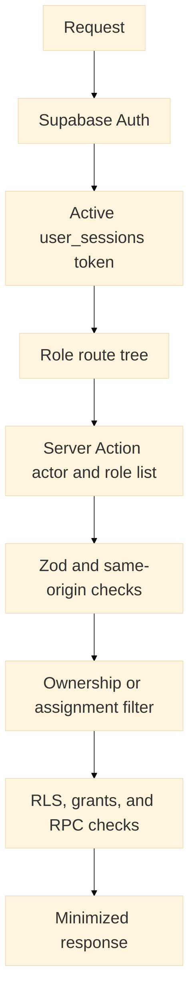

#### Enforcement layers

1. **Route layer:** `proxy.ts` verifies the Auth user, custom active session, and
   top-level portal role. Shared routes are handled separately.
2. **Action layer:** `getActionActor()` resolves the user again and action code
   checks explicit roles. Mutations validate untrusted input and frequently use
   same-origin checks.
3. **Scope layer:** patient ownership or clinician assignment is derived on the
   server. Admin queries omit the assignment filter where clinic-wide access is
   intended.
4. **Database layer:** RLS, object grants, private helper functions, and
   authenticated RPC checks provide defense in depth when correctly deployed.
5. **Output layer:** selected fields, masks, and DTOs reduce unnecessary data.

#### Permission-model nuance

`roles`, `permissions`, and `role_permissions` support an administrative
permission catalog. Current runtime actions also contain explicit role arrays,
and route ownership uses fixed role prefixes. Therefore the system is not a
fully dynamic policy engine: changing a database permission does not necessarily
change every action's authorization behavior.

#### Required authorization tests

- Each role is redirected away from another role's top-level route.
- A patient cannot supply another patient's ID to retrieve or mutate data.
- A doctor or nurse cannot access an unassigned consultation through list,
  detail, history, report, or direct action input.
- A nurse cannot submit diagnosis, treatment, prescriptions, or follow-up in
  finalization.
- Admin-only access and RFID registration actions reject non-admin actors.
- Authenticated users cannot call privileged RPCs outside their database-side
  role and state checks.
- Views do not bypass intended row policies.
- Service-role actions apply equivalent ownership/assignment checks before the
  privileged query.

## 4. Data Privacy

### 4.1 Data classification and lifecycle

| Classification | Examples | Primary risk |
| --- | --- | --- |
| PHI/health data | Complaints, symptoms, vitals, diagnoses, treatments, prescriptions, allergies, medical history, documents, clearances | Harm, stigma, discrimination, clinical privacy breach |
| Sensitive personal information | Birth date, sex/gender, address, identifiers, emergency contacts, RFID UID | Identity theft, profiling, unauthorized tracking |
| Account/security data | Auth identifiers, roles, sessions, IP address, user agent | Account takeover and privilege escalation |
| Operational data | Schedules, stock, incidents, programs, settings, services | Service disruption and internal misuse |
| Audit/AI data | Action metadata, prompts, model responses, rationale | Secondary PHI copy, surveillance, disclosure to processors |
| Attachments | Medical documents, examination evidence, announcement media | Bulk disclosure and persistent copies |
| Aggregates | Daily activity, complaint frequency, program metrics | Re-identification when groups are small |

#### Data lifecycle

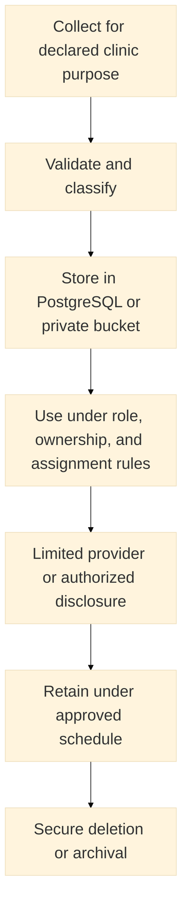

Source code supports parts of collection, validation, access, and signed-file
delivery. A complete retention schedule, legal hold process, archival rules,
backup expiry, deletion workflow, and disposal evidence are not established.

#### Privacy-by-design observations

- Server Actions request selected fields and return DTOs rather than exposing
  unrestricted database clients to clinical workspaces.
- Patient actions derive the profile from the authenticated user.
- Doctor/nurse dashboards and history apply assignment filters where reviewed.
- Sensitive-field masks and protected attachment actions exist.
- Realtime sends invalidation markers rather than clinical content.
- Analytics queries are bounded, but small-group suppression and formal
  de-identification are not established.
- `ai_logs` can duplicate appointment reasons and symptoms and must be governed
  as sensitive data.

### 4.2 HIPAA safeguards mapping

HIPAA applies to covered entities and business associates as defined by United
States law; a school clinic is not automatically subject to HIPAA merely because
it stores health information. Applicability requires legal and organizational
review. The mapping below uses HIPAA as a requested security/privacy benchmark,
not a certification.

Primary references:

- [HHS Security Rule](https://www.hhs.gov/hipaa/for-professionals/security/index.html)
- [HHS Summary of the Security Rule](https://www.hhs.gov/hipaa/for-professionals/security/laws-regulations/index.html)
- [HHS Privacy Practices guidance](https://www.hhs.gov/hipaa/for-professionals/privacy/guidance/privacy-practices-for-protected-health-information/index.html)
- [HHS individual access guidance](https://www.hhs.gov/hipaa/for-professionals/faq/2042/what-personal-health-information-do-individuals/index.html)

| Safeguard area | Repository evidence | Status and gap |
| --- | --- | --- |
| Risk analysis and management | This document identifies technical risks | Partial; formal recurring organizational risk analysis is not evidenced |
| Assigned security responsibility | No accountable security officer is defined in code | Operational requirement |
| Workforce security | Six roles, sessions, route and action checks | Partial; onboarding, termination, sanctions, and access reviews are operational |
| Information access management | RBAC, ownership, assignment, RLS migrations, minimized DTOs | Partial; live RLS/grants and least-privilege tests required |
| Security awareness and training | No training program in repository | Missing operational safeguard |
| Security incident procedures | Audit records and security gaps exist | Partial; response plan, exercises, contacts, and evidence preservation missing |
| Contingency planning | No backup/restore or disaster-recovery plan in repository | Missing operational safeguard |
| Evaluation | Type/lint checks and migration verification are possible | Partial; periodic technical/nontechnical HIPAA evaluation not established |
| Business-associate arrangements | Supabase and optional OpenRouter process data | Contracts, BAA applicability, subprocessor and data-location review required |
| Facility access controls | Not represented in application source | Operational/physical safeguard required |
| Workstation and device security | Kiosk and browser workflows exist | Physical workstation, RFID reader, screen-lock, media, and device controls required |
| Access control | Auth, sessions, portal roles, action roles, RLS/RPC design | Partial; MFA, emergency access, live policy behavior, and admin review unverified |
| Audit controls | `audit_logs`, request metadata, and selected event writes | Partial; coverage, tamper resistance, retention, review, and alerting incomplete |
| Integrity | Validation, relational constraints, authenticated RPC transitions | Partial; backup integrity and change-control evidence not established |
| Person/entity authentication | Supabase Auth plus active session token | Implemented in source; provider configuration and MFA unverified |
| Transmission security | HTTPS/HSTS headers and managed service endpoints expected | Partial; local Supabase is HTTP and production TLS/configuration must be verified |
| Minimum necessary | Scoped actions, selected columns, masks, DTOs | Partial; field-by-field purpose and periodic role review required |
| Notice and individual rights | Privacy/settings routes and self-service records exist | Partial; legally adequate notice, access, amendment, accounting, and complaint process not proven |

### 4.3 Philippine Data Privacy Act mapping

The Philippine Data Privacy Act of 2012 and National Privacy Commission guidance
are the primary local privacy references for a Philippine deployment.

Primary references:

- [Republic Act No. 10173](https://privacy.gov.ph/data-privacy-act/)
- [Implementing Rules and Regulations](https://privacy.gov.ph/implementing-rules-regulations-data-privacy-act-2012/)
- [NPC data-subject rights](https://privacy.gov.ph/data-subject-rights/)
- [NPC Circular 16-03: Personal Data Breach Management](https://privacy.gov.ph/wp-content/uploads/2016/12/sgd-npc-circular-16-03-personal-data-breach-management.pdf)

| Principle or obligation | Current support | Required completion |
| --- | --- | --- |
| Transparency | Privacy/settings route exists | Publish a clear, accurate privacy notice naming purposes, controller, processors, risks, retention, and rights |
| Legitimate purpose | Modules have identifiable clinic purposes | Approve and document lawful basis and purpose for every data category and disclosure |
| Proportionality | DTOs, masks, bounded queries, assignment scope | Review every collected field and remove excessive collection/retention |
| Accountability | Roles, audit records, action boundaries | Designate the PIC/PIP responsibilities, DPO, owners, reviews, and processor contracts |
| Security of personal data | Auth, RBAC, validation, headers, RLS design, signed URLs | Close the security gaps and verify organizational, physical, and technical measures |
| Right to be informed | UI route only | Provide notice at or before collection and maintain version/effective-date evidence |
| Right of access | Patient self-service exposes some own records | Define formal request, identity verification, scope, response, and exception handling |
| Rectification | Some profile/workflow updates exist | Implement governed correction requests and clinical-record amendment history |
| Erasure/blocking | No complete workflow established | Define lawful retention exceptions and approved deletion/blocking process |
| Objection | No complete workflow established | Define intake, lawful exceptions, processing restriction, and outcome notice |
| Data portability | No export workflow proven for complete patient data | Define applicability, secure export format, identity checks, and audit trail |
| Breach management | Audit data can support investigation | Adopt a breach policy, response team, risk assessment, evidence, notices, and exercises |
| Breach notification | No automated legal workflow established | Support the NPC/affected-person notification process, including the applicable 72-hour requirement |
| Processor governance | Supabase and optional OpenRouter are processors/subprocessors | Execute appropriate data-processing terms and review location, retention, access, and deletion |

### 4.4 Privacy requirements and limitations

#### Collection and use

- Show the declared purpose and privacy notice before or at collection.
- Collect only information necessary for clinic care, scheduling, compliance, or
  another documented lawful purpose.
- Do not place patient names, identifiers, or detailed narratives in reusable
  visit-reason catalog entries. Custom categories are limited to 120 characters.
- Separate operational analytics from patient-level clinical access.

#### Retention, deletion, and backups

A deployment must establish a data-retention schedule by record category,
including source rows, attachments, audit logs, AI logs, exports, database
backups, provider logs, and replicas. Deletion must address copies and legal
holds without silently destroying clinical evidence.

#### External AI processing

The optional AI request includes appointment reason, symptoms, requested
schedule, and staff context. Before enabling it with real data:

1. Determine whether the fields are PHI or sensitive personal information.
2. Minimize or de-identify the payload where possible.
3. Review provider retention, training use, subprocessors, region, deletion, and
   incident terms.
4. Execute required data-processing or business-associate agreements.
5. Update the privacy notice and lawful-basis/consent analysis.
6. Restrict logs and monitor provider/fallback behavior.

#### Compliance statement

The presence of encryption libraries, RLS SQL, security headers, audit tables,
or privacy pages does not make the system compliant. Safe deployment requires
verified technical controls plus organizational policies, workforce processes,
contracts, facilities, risk management, and legal review.

## 5. Security

### 5.1 Threat model

| Threat actor or failure | Likely attack | Impacted assets | Primary defenses |
| --- | --- | --- | --- |
| Unauthenticated attacker | Credential attacks, route probing, injection, file discovery | Accounts, PHI, attachments | Auth, validation, rate limiting, headers, RLS |
| Compromised patient account | Change patient IDs or call actions directly | Other patients' records | Server-derived ownership, action checks, RLS |
| Compromised clinician account | Browse unassigned patients or export data | Broad clinical records | Assignment filters, least privilege, audit, access review |
| Malicious insider/admin | Abuse legitimate privileged access | Clinic-wide PHI and security settings | Separation of duties, monitoring, approvals, immutable audit |
| Browser/XSS attacker | Steal sessions or invoke actions | User session and visible PHI | CSP, output encoding, HttpOnly cookies, origin checks |
| CSRF attacker | Trigger state changes from another origin | Appointments and clinical mutations | SameSite/session behavior, Origin checks, action validation |
| Database-policy error | Expose rows through a table, view, or RPC | Entire data domains | RLS tests, grants, security-invoker views, function review |
| Secret leak | Use service role, AI key, or encryption key | Full database or provider access | Server-only modules, secret manager, rotation, scanning |
| External processor compromise | Expose AI prompts or platform data | Symptoms, reasons, logs, attachments | Contracts, minimization, provider security, disablement path |
| RFID misuse | Replay or use copied identifier | Patient lookup and false check-in | Staff supervision, duplicate controls, audit, reader security |
| Availability failure | Supabase, deployment, or network outage | All clinic workflows | Monitoring, backups, downtime procedure, recovery plan |

### 5.2 Implemented controls

#### Authentication and sessions

- Supabase `auth.getUser()` validates the session with the Auth service.
- An HttpOnly `zentraq_session_token` is matched to an active, unrevoked,
  unexpired `user_sessions` row.
- Login redirects to the portal assigned by `user_roles`.
- A session mismatch clears the custom token and redirects to login.

MFA, password policy at the provider, short JWT lifetime, recovery controls, and
administrator reauthentication are not established by the reviewed code.

#### Application authorization

- Fixed portal prefixes prevent ordinary cross-role page access.
- Server Actions resolve the actor independently of client input.
- Explicit role arrays protect action groups and individual mutations.
- Patient ownership and clinician assignment are applied server-side in reviewed
  record, dashboard, consultation, and history actions.
- Nurses are blocked from doctor-level consultation payloads.

#### Input and output security

- Zod schemas validate untrusted workflow input and structured AI output.
- Supabase query builders parameterize normal filters and mutations.
- DTOs and selected columns reduce data returned to clients.
- UI rendering relies on React escaping; no reviewed requirement authorizes raw
  clinical HTML.
- Same-origin comparison is used for many sensitive mutations.

#### Browser and transport headers

`proxy.ts` and `next.config.ts` configure no-store caching on protected requests,
HSTS, frame denial, MIME sniffing protection, referrer policy, permissions
policy, COOP/CORP, and CSP. Production TLS termination must still be verified.

#### Storage and Realtime

- Sensitive bucket operations occur on the server and can return signed URLs.
- Private Realtime topics authorize clinic queue, current-user notifications,
  and owned/clinic-authorized patient records.
- Broadcast payloads contain only change markers.

#### Audit and AI safety

- Selected actions write actor, entity, metadata, IP, and user-agent fields.
- AI output is schema-validated and failure defaults to human review.
- AI is instructed not to diagnose or prescribe.

### 5.3 OWASP-aligned assessment

| Risk area | Current posture | Required verification |
| --- | --- | --- |
| Broken access control | Layered route/action/scope/RLS design; service role increases consequence of action mistakes | Negative tests for every role, object, view, RPC, and signed URL |
| Cryptographic failures | Managed TLS/at-rest capabilities expected; unused AES-GCM helper has unsafe fallback | Remove fallback, manage keys, define encrypted fields, verify provider controls |
| Injection | Zod and Supabase query builders reduce SQL injection; AI prompt input is sanitized/length-bounded | Review dynamic table/filter construction and all RPC SQL |
| Insecure design | Assignment and workflow state are represented; operational safeguards incomplete | Threat-model changes and define abuse/downtime processes |
| Security misconfiguration | Headers and private topics exist; CSP has unsafe allowances and deployed grants are unknown | Production configuration review and automated security checks |
| Vulnerable components | Lockfiles exist; versions are explicit | Use pnpm lockfile, dependency scanning, patch policy, and SBOM process |
| Authentication failures | Auth user and custom session validation exist | MFA, recovery, password, token-expiry, brute-force, and admin controls |
| Software/data integrity failures | Migrations and validation exist | Protected CI, migration review, backup verification, signed releases where needed |
| Logging/monitoring failures | Audit and AI logs exist but coverage and alerting are incomplete | Centralize protected logs, alert, review, retain, and test |
| SSRF | Current AI target is a fixed URL rather than user-controlled | Keep outbound destinations fixed/allowlisted and review future URL-fetch features |
| XSS | React escaping and CSP provide partial protection | Remove unsafe CSP directives, prohibit unsafe HTML, test rich/file content |
| CSRF | Origin/Host comparison is used on many mutations | Cover every mutation and define behavior when headers are absent |

### 5.4 Security gap register

| ID | Severity | Evidence and status | Risk | Required remediation and verification |
| --- | --- | --- | --- | --- |
| SEC-01 | Resolved in source; operations open | `lib/crypto-phi.ts` now requires a server-only key of at least 32 characters and has no hardcoded or Supabase-key fallback; helper remains outside active persistence | Misconfigured invocation now fails closed, but key loss/rotation and field migration are not designed | Provision a managed versioned key; design field migration and rotation; test backup/restore and key loss before integrating the helper |
| SEC-02 | High | Live migrations, RLS, grants, view definitions, function owners, and RPC signatures were not checked | Broken access control or runtime failure can differ from repository intent | Compare target schema, run migration list/advisors, inspect grants/policies, and execute role-negative tests |
| SEC-03 | High | Nine code-referenced views have no complete local `CREATE VIEW` definition | Unreproducible deployments and unknown RLS/view-owner behavior | Capture reviewed `security_invoker` or otherwise protected definitions in versioned migrations; test every role |
| SEC-04 | High | Optional OpenRouter request contains reasons and symptoms; prompt/response are stored | Unauthorized cross-border/provider disclosure and secondary PHI copies | Disable by default for real data until legal/vendor review, minimization, contracts, notice, retention, and deletion controls are approved |
| SEC-05 | High | No repository evidence of complete retention, backup/restore, disaster recovery, downtime, or breach-response programs | Permanent loss, excessive retention, delayed response, and noncompliance | Approve schedules and runbooks; assign owners; test restores, downtime care, and breach exercises |
| SEC-06 | Medium | Rate limiter uses process memory | Limits reset and are inconsistent across replicas, enabling brute force or abuse | Replace with distributed atomic storage; key by safe identifiers; test concurrency, proxy IP handling, and fail behavior |
| SEC-07 | Medium | CSP permits `unsafe-inline` and `unsafe-eval`; styles also permit inline execution context | XSS mitigation is weakened | Remove `unsafe-eval`; introduce nonces/hashes as compatible; test Next.js production build and third-party components |
| SEC-08 | Medium | Audit insertion errors are console-only and do not block business actions; coverage is selective | Sensitive activity can occur without a durable audit trail | Define mandatory events, make critical audit writes transactional/outbox-backed, protect logs, alert on failure, and review regularly |
| SEC-09 | Medium | Same-origin helper permits missing Origin/Host and is not proven on every mutation | Some cross-site mutation paths may lack defense in depth | Inventory all mutations, require a consistent CSRF strategy, preserve SameSite cookies, and test absent/forged headers |
| SEC-10 | Medium | No source evidence of MFA, privileged reauthentication, periodic access review, or rapid deprovisioning | Compromised privileged accounts have broad impact | Require MFA for clinic roles, define reauthentication, automate deprovisioning, and review roles/sessions periodically |
| SEC-11 | Medium | Centralized monitoring, alerting, immutable log retention, and SIEM integration are not established | Attacks and audit failures may go undetected | Configure protected log drains, alerts, dashboards, retention, clock sync, and incident ownership |
| SEC-12 | Medium | Kiosk route has special unauthenticated handling and RFID identifiers can be copied | Unauthorized lookup/check-in or unattended PHI exposure | Review exact kiosk actions, restrict network/device/location, minimize displayed data, add inactivity reset, and audit scans |
| SEC-13 | Medium | Storage policies, MIME validation, malware scanning, and signed-URL expiry were not verified end to end | Malicious upload or attachment disclosure | Enforce private buckets, ownership policies, size/MIME/signature checks, scanning, short signed URLs, and download auditing |
| SEC-14 | Operational | Workforce training, sanctions, workstation use, media disposal, and facility safeguards are absent from code | Insider error and physical compromise | Adopt organizational and physical safeguard policies with recurring training and evidence |
| SEC-15 | High | New services initially share a privileged Supabase key and shared database | A missing service-side ownership or assignment check can become BOLA/IDOR across domains | Use signed internal context, strict DTOs and allowlists now; add scoped database roles/schemas after API ownership stabilizes; run cross-role negative tests |
| SEC-16 | Medium | Gateway rate limiting is process-local and private-network behavior is not deployed | Abuse limits reset across replicas, and exposed internal services would expand the attack surface | Keep only the gateway public, require internal credentials/signatures, verify Render networking, then introduce a distributed limiter when required |

Severity reflects potential impact, not proof of exploitation. Close a gap only
after the relevant source, deployed configuration, and role behavior are tested.

### 5.5 Deployment and verification checklists

#### Application and secrets

- [ ] Use Node.js 22.0.0 or newer and install with `pnpm install`.
- [ ] Keep `pnpm-lock.yaml` authoritative and scan dependencies.
- [ ] Store service-role, AI, and encryption keys only in a secret manager.
- [ ] Confirm no secret uses a `NEXT_PUBLIC_` prefix or appears in logs/builds.
- [ ] Rotate any key previously exposed and investigate its use.
- [x] Remove the PHI encryption fallback before enabling the helper.
- [ ] Provision, rotate, back up, and recovery-test a managed encryption key
      before integrating encrypted fields.
- [ ] Build in production mode and verify headers without `unsafe-eval` where possible.
- [ ] Configure the Gateway as the only public backend service and verify every
      private service rejects unsigned or direct requests.

#### Supabase and migrations

- [ ] Confirm remote PostgreSQL version and migration history.
- [ ] Apply migrations in order in a non-production environment.
- [ ] Capture missing view definitions in version control.
- [ ] Inspect every exposed table/view grant and enable appropriate RLS.
- [ ] Verify view execution security and underlying row access.
- [ ] Inspect every `SECURITY DEFINER` owner, `search_path`, internal auth check,
      default `PUBLIC` execution, and explicit grant.
- [ ] Run Supabase security/performance advisors and resolve findings.
- [ ] Verify private Realtime topic policies with positive and negative users.
- [ ] Verify Storage buckets, object policies, signed URLs, file limits, and scanning.

#### Role and workflow tests

- [ ] Smoke-test admin, doctor, nurse, student, faculty, and staff portals.
- [ ] Test direct cross-role URLs and direct Server Action/RPC calls.
- [ ] Test patient ownership and clinician assignment isolation.
- [ ] Test consultation claim races and duplicate RFID scans.
- [ ] Test nurse handoff versus doctor/admin completion and reason publication.
- [ ] Test 0, 1, 10, and 11-row visit/history pagination states.
- [ ] Test appointment AI success, timeout, invalid JSON, and disabled-provider paths.
- [ ] Test notification and patient-record Realtime invalidations without PHI payloads.
- [ ] Test attachment authorization before and after signed-URL expiry.

#### Privacy and operations

- [ ] Approve the privacy notice, lawful bases, consent rules, and data inventory.
- [ ] Complete a data protection impact/risk assessment.
- [ ] Execute required processor, data-processing, or business-associate terms.
- [ ] Approve retention, legal hold, deletion, backup, and disposal schedules.
- [ ] Test data-subject access, correction, objection, erasure/blocking, and export processes.
- [ ] Assign security, privacy/DPO, incident, clinical, and system owners.
- [ ] Establish workforce training, access review, sanctions, and termination procedures.
- [ ] Test backups, restores, disaster recovery, downtime operation, and breach notification.

#### Documentation acceptance checks

- [ ] All README and table-of-contents links resolve.
- [ ] Mermaid blocks render without syntax errors.
- [ ] Routes match `app` and `lib/navigation.ts`.
- [ ] Action boundaries match `actions/README.md` and current role checks.
- [ ] Tables match the context schema and are not mislabeled as confirmed live.
- [ ] Views and RPCs match current code references and migration evidence.
- [ ] `patient_complaint` is canonical outside historical compatibility discussion.
- [ ] No documentation claims every clinic submodule is independently deployed, universal audit coverage,
      browser-free Supabase use, deployed migration state, or legal compliance.
- [ ] Markdown contains no broken encoding and `git diff --check` passes.

The principal evidence sources for this baseline are `package.json`,
`supabase/config.toml`, `supabase/migrations`, `proxy.ts`, `next.config.ts`,
`lib/navigation.ts`, `lib/security/action-guard.ts`, `actions`, `services`, and
the role-specific `app` route trees. Re-run the inventory whenever those sources
change materially.
