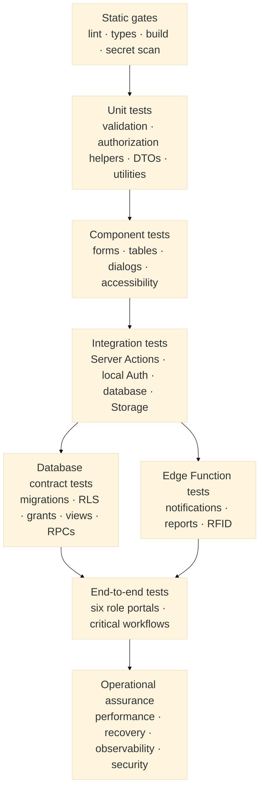
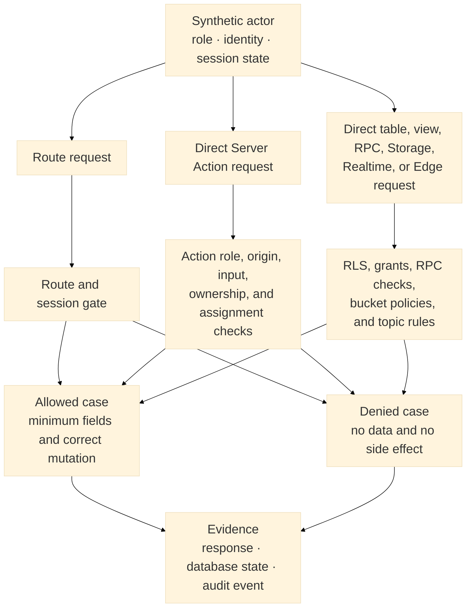
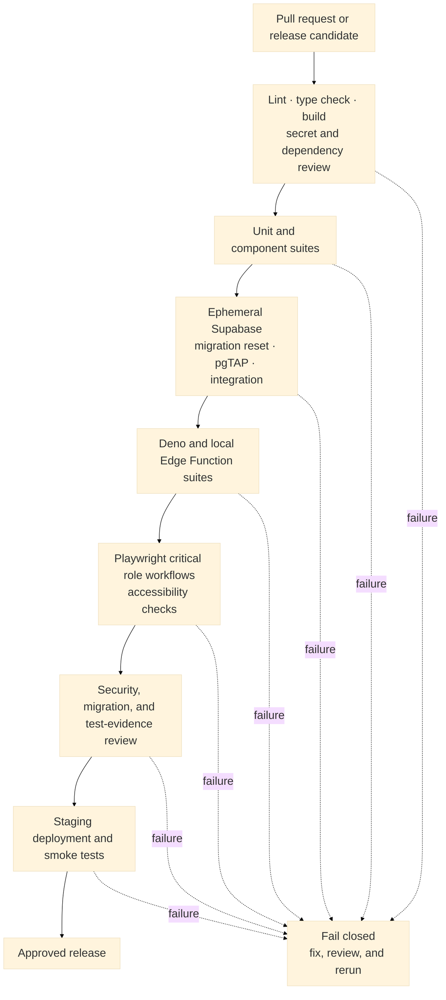

# Zentraq Testing Strategy

| Document field | Value |
| --- | --- |
| Status | Active transitional baseline; partial backend automation implemented |
| Source review date | 2026-08-17 |
| Applies to | `zentraq` frontend and local `zentraq-backend` source trees |
| Audience | Capstone evaluators, developers, testers, security reviewers, and clinic stakeholders |

## 1. Purpose and status boundary

This document defines how Zentraq should be tested from an individual function
through a complete clinic workflow. The strategy prioritizes patient safety,
confidentiality, authorization, data integrity, accessibility, and reliable
recovery over raw test-count or coverage percentages.

This document separates implemented evidence from proposed coverage. At the
review date:

- `package.json` provides `dev`, `build`, `start`, and `lint` scripts, but no
  automated unit, integration, or end-to-end test scripts.
- The frontend has no Vitest, Playwright, Jest, Cypress, or pgTAP suite. The root
  `test.md` file is empty and is not an executable suite.
- The backend workspace uses Vitest and Supertest. Four test files with eight
  tests cover shared signed context, Gateway behavior, Identity authorization,
  and AI authorization/fallback. Domain integration coverage remains open.
- Supabase is configured for imperative migrations, local Auth, PostgreSQL,
  Storage, Realtime, and Edge Functions.
- Notification, report, and RFID check-in Edge Functions are source-defined.
  Their deployment, schedules, secrets, and live behavior remain unverified.
- Source-defined migrations and security controls do not prove that the same
  objects, grants, RLS policies, or function versions are active remotely.

Backend source, a frontend API bridge, and an atomic inventory migration now
exist, but this strategy is not evidence that any cloud or Supabase deployment
is active.

## 2. Testing objectives

Zentraq testing must provide defensible evidence that:

1. each user reaches only the correct role portal and authorized records;
2. patient ownership and clinician assignment cannot be bypassed by changing
   route parameters, form fields, Server Action inputs, RPC arguments, or API
   requests;
3. clinical, appointment, medicine, clearance, RFID, notification, and report
   workflows preserve their allowed state transitions and transaction rules;
4. invalid, hostile, duplicate, stale, or concurrent requests fail safely;
5. protected health information (PHI), credentials, and privileged keys do not
   leak through browser payloads, logs, errors, reports, Storage, or Realtime;
6. keyboard, screen-reader, contrast, focus, and error-handling behavior meets
   WCAG 2.2 Level AA expectations;
7. migrations can create a clean local database and can be verified before any
   promotion to a shared environment; and
8. test results are repeatable, reviewable, and traceable to requirements and
   risks.

## 3. Risk-based testing model

Zentraq should use several complementary test layers. Fast deterministic tests
run first, while slower browser and operational tests validate the complete
system only after lower layers pass.



The model is not a strict numerical pyramid. Database authorization and browser
workflow tests receive more weight than usual because a clinic-management
system can pass isolated component tests while still exposing another patient's
record or committing an invalid clinical state.

## 4. Test environments and protected data

| Environment | Purpose | Permitted data | Required safeguards |
| --- | --- | --- | --- |
| Developer local | Unit, component, database, integration, and exploratory tests | Deterministic synthetic records only | Local Supabase stack; secrets in ignored environment files; local reset commands must never target a linked shared project |
| Continuous integration | Repeatable pull-request and branch verification | Synthetic per-run fixtures | Ephemeral services; masked logs; short-lived credentials; artifacts with defined retention |
| Staging or pre-production | Deployment, role, browser, migration, and operational verification | Synthetic or formally de-identified data only | Separate Supabase project; production-like grants and configuration; no production secrets |
| Production | Minimal post-deployment health and read-only checks | Approved synthetic monitor account where policy permits | No destructive test, no broad service-role test, no real-patient mutation, immediate alerting and rollback path |

### 4.1 Test-data rules

- Never copy real patient, student, faculty, staff, consultation, prescription,
  attachment, incident, or clearance data into automated tests.
- Create at least two synthetic identities for each role so ownership and
  cross-user denial can be tested, not merely authentication.
- Create assigned and unassigned doctor/nurse cases for every scoped clinical
  workflow.
- Prefix fixtures with a unique test-run identifier to support parallel runs and
  precise cleanup.
- Use the service role only in server-side fixture setup and cleanup. It must not
  appear in browser storage, client bundles, test screenshots, traces, or logs.
- Prefer transaction rollback for pgTAP tests. Application and browser tests
  should use unique fixtures and explicit cleanup because they cross process and
  transaction boundaries.
- Screenshots, videos, traces, reports, and failure payloads must be treated as
  sensitive test artifacts even when the records are synthetic.

### 4.2 Minimum role fixture set

| Fixture | Required distinction |
| --- | --- |
| Admin A and Admin B | Privileged workflow and audit attribution |
| Doctor A and Doctor B | Assigned, unassigned, available, and unavailable review cases |
| Nurse A and Nurse B | Assigned triage, handoff, and denied final-review cases |
| Student A and Student B | Own-record and cross-patient denial cases |
| Faculty A and Faculty B | Own staff-health record and cross-profile denial cases |
| Staff A and Staff B | Own staff-health record, booking, and cross-profile denial cases |

## 5. Test layers and recommended tools

Frontend tool choices below remain recommendations. Vitest and Supertest are
already installed in the backend workspace with pinned lockfile versions.

### 5.1 Static verification

Every change should first pass the repository's current static checks:

```powershell
pnpm run lint
pnpm exec tsc --noEmit
pnpm run build
```

The backend repository must also pass:

```powershell
pnpm install --frozen-lockfile
pnpm typecheck
pnpm test
pnpm build
```

Static checks should also reject committed secrets, accidental
`SUPABASE_SERVICE_ROLE` browser exposure, unsafe `NEXT_PUBLIC_` variables,
unreviewed generated files, and malformed migrations. A successful build proves
compilation and bundling only; it does not prove authorization, deployed schema,
runtime behavior, or accessibility.

### 5.2 Unit tests

Use Vitest for deterministic TypeScript logic and React Testing Library for
synchronous components. Favor behavior-oriented assertions over internal
implementation details.

Initial unit-test candidates include:

- Zod schemas and hostile boundary values;
- password requirements and validation messages;
- role-to-route mapping and navigation filtering;
- authorization, ownership, and assignment predicates that can be isolated;
- DTO builders, masking, and field minimization;
- rate-limit decisions and retry boundaries;
- date, status, medicine, file-type, and file-size utilities; and
- report request and worker payload validation.

Async Server Components should primarily be covered through integration or
end-to-end tests because the installed Next.js guidance recommends browser tests
for that boundary.

### 5.3 Component tests

Component tests should verify user-visible behavior without bypassing Server
Actions or inventing a second client-side data-access architecture. Priority
subjects are forms, dialogs, tables, filters, loading states, empty states,
error recovery, and sensitive attachment previews.

Each interactive component suite should cover:

- accessible names, labels, descriptions, and validation errors;
- complete keyboard operation and predictable focus restoration;
- light and dark themes with readable contrast;
- disabled, pending, success, stale, and failure states;
- no PHI in an error toast or debug output; and
- narrow and zoomed layouts without clipped controls or horizontal task flow.

### 5.4 Server Action and application integration tests

Run Server Actions against a local Supabase stack using real Auth identities and
synthetic records. Mock only genuinely external providers. For each action,
test the complete contract:

1. unauthenticated request;
2. authenticated but disallowed role;
3. allowed role with an out-of-scope record;
4. malformed, oversized, or forged input;
5. valid request and expected minimized response;
6. duplicate, stale, and concurrent request where applicable; and
7. dependency failure with safe error and no partial state.

Tests must assert both the returned result and the database side effect. A toast
or success response is not evidence that the intended transaction committed.

### 5.5 PostgreSQL, RLS, grant, view, and RPC tests

Use pgTAP through the Supabase CLI for schema and policy contracts. Database
tests should begin a transaction, create only synthetic fixtures, declare the
planned assertion count, and roll back.

The database suite must verify:

- migrations apply from an empty local database in filename order;
- required tables, columns, constraints, indexes, triggers, views, buckets, and
  functions exist with reviewed signatures;
- every exposed table has the intended grants and RLS status;
- `SELECT`, `INSERT`, `UPDATE`, and `DELETE` are independently allowed or denied
  for `anon`, `authenticated`, and each application role;
- update policies enforce both row visibility and the permitted resulting row;
- patient rows are limited to server-derived ownership;
- doctor and nurse rows are limited by assignment where required;
- app-facing views preserve caller authorization, including reviewed
  `security_invoker` behavior or equivalent protection;
- every `SECURITY DEFINER` function has a justified owner, fixed safe
  `search_path`, narrow execution grants, internal authorization, and negative
  tests;
- state-changing RPCs are atomic, reject invalid transitions, and remain correct
  under competing requests;
- Storage object policies protect read, upload, replacement, and deletion; and
- private Realtime topics reject unauthorized subscribers and disclose only the
  minimum event payload.

Recommended local commands after the test files exist are:

```powershell
supabase start
supabase db reset
supabase test db
```

`supabase db reset` is destructive to its selected database. Before running it,
the operator must confirm the CLI is targeting the disposable local stack and
is not linked to a shared or production project.

### 5.6 Edge Function tests

Use Deno's test runner for pure logic and mocked HTTP integration tests, then use
the local Supabase Edge Runtime for a smaller contract suite.

| Function | Required tests |
| --- | --- |
| `notifications-worker` | Named worker secret; unauthorized rejection; claim limit; retry/backoff; idempotent completion; provider timeout; safe log fields; no notification to the wrong user |
| `reports-worker` | Named worker secret; request ownership; allow-listed report type; safe artifact path; bounded size; checksum/status update; retry and expiry; signed download authorization |
| `rfid-check-in` | Valid user JWT; malformed/unknown RFID; role and patient mapping; duplicate scan; queue concurrency; RPC failure; no service-role bypass; minimized response |

For every function, test missing environment variables, malformed JSON, wrong
HTTP method, payload limits, dependency timeouts, database errors, and duplicate
delivery. Worker tests must prove at-least-once execution does not produce
duplicate externally visible effects.

### 5.7 Backend API and service tests

Run Gateway and domain-service tests at three levels: isolated middleware,
HTTP contracts with mocked downstream services, and staging integration against
synthetic Supabase fixtures. Every public endpoint requires missing-token,
invalid-token, wrong-role, cross-account/assignment, malformed-input, timeout,
and safe-error cases.

| Service | Priority evidence |
| --- | --- |
| API Gateway | CORS allowlist, request IDs, rate limits, invalid/expired token, Identity timeout, route timeout, no upstream detail leakage |
| Identity | Token validation, active role from protected records, disabled account, minimized profile, RFID input and authorization |
| Appointment | Patient ownership, clinician assignment, availability/conflicts, transitions, idempotency, notification failure isolation |
| Clinical | Own-record denial, assignment filtering, role-specific DTOs, consultation state, audit failure behavior |
| Inventory | Admin/Nurse role, positive quantity, idempotency, concurrent stock, prescription match, rollback on invariant failure |
| Notification | Own inbox only, admin create, idempotent internal create, read-state ownership, pagination bounds |
| Reporting | Role scope, aggregate minimization, report authorization, signed-download expiry, audit metadata sanitization |
| AI | Allowed roles, strict schema, invalid provider JSON, timeout, deterministic fallback, unknown identifier rejection, no mutation |

Internal services must reject unsigned, expired, or incorrectly signed context
and wrong service credentials even if reached directly. Tests must assert that
tokens, keys, RFID values, and medical narrative are absent from logs and public
errors.

### 5.8 End-to-end browser tests

Use Playwright against a production build and an isolated local or staging
Supabase environment. Cover Chromium first in pull requests; run Chromium,
Firefox, and WebKit for scheduled or release-candidate verification.

Prefer accessible role and label locators. Do not select elements by fragile CSS
classes or expose database IDs solely to make a test easier.

## 6. Authorization and privacy test design

Every protected resource should be tested through all enforcement layers. A
route redirect alone is insufficient because an attacker can call the Server
Action, Data API object, Storage path, Realtime topic, or RPC directly.



### 6.1 Mandatory negative-test matrix

| Actor | Attempt | Expected result |
| --- | --- | --- |
| Unauthenticated user | Open protected route or call protected action/RPC/function | Redirect or stable unauthorized response; no record disclosure or mutation |
| Any patient | Replace own patient ID with another patient's ID | Denied or empty result; no existence leak; no side effect |
| Doctor | Access another clinician's assigned case where assignment is required | Denied through list, detail, history, report, action, and RPC paths |
| Nurse | Submit diagnosis, treatment, prescription, follow-up, or final review | Denied; consultation remains unchanged and auditable |
| Faculty or staff | Enter another patient portal or cross-profile identifier | Denied; remains in the correct `/faculty` or `/staff` destination |
| Non-admin | Manage roles, permissions, accounts, RFID registration, or clinic settings | Denied at route, action, and database layers |
| Authenticated user | Subscribe to another user's notification or patient-record topic | Subscription rejected or no event delivered |
| Browser client | Use or discover a service-role/secret key | Key absent from bundle, storage, requests, logs, and rendered source |

### 6.2 Security abuse cases

The automated and manual security suite should include OWASP-aligned attempts
for broken access control, injection, cross-site scripting, forged origins,
session fixation/reuse, mass assignment, insecure file upload, path traversal,
signed-URL reuse, rate-limit bypass, malicious report parameters, and sensitive
data in error responses. Dependency and secret scans should run in CI.

No automated scanner is permission to test an unapproved production target.
Penetration testing requires written scope, a non-production target where
possible, rate limits, safe test data, and an incident contact.

## 7. Critical workflow suites

### 7.1 Authentication and session lifecycle

- Valid and invalid login for all six roles.
- Correct default destination for admin, doctor, nurse, student, faculty, and
  staff.
- Password reset, password change, sign-out, expired token, revoked custom
  session, concurrent session, and back-button behavior.
- Direct navigation to another role's portal and replay of an old action after
  sign-out.
- Server-side role resolution; authorization must not trust user-editable
  metadata or a client-provided role.

### 7.2 Consultation and clinical review

- Walk-in, appointment, and RFID-originated consultation creation.
- Claim concurrency so only one authorized clinician succeeds.
- Nurse triage, doctor selection, handoff, doctor final review, and completed
  patient history.
- Doctor/admin finalization authority and explicit nurse denial.
- Required reason, vitals, diagnosis, treatment, prescription, and follow-up
  validation for the relevant stage.
- Transaction rollback when any write in finalization fails.
- Notification and audit attribution without PHI-rich payloads.

### 7.3 Appointments

- Student, faculty, and staff booking with correct patient mapping.
- Availability, duplicate request, overlap, capacity, reschedule, cancellation,
  waitlist, reminder, and clinician-assignment behavior.
- Manila-time boundary cases, including day changes and daylight-independent
  timestamp storage/formatting.
- Patient sees only own appointment; clinician sees only the intended workload;
  admin sees the approved clinic-wide scope.

### 7.4 Medicine inventory and dispensing

- Catalog item appears with zero stock and enters the shared Restock workflow.
- Concurrent receipt/dispense operations preserve non-negative stock and an
  auditable movement history.
- Expired, inactive, insufficient, duplicate, and unapproved medicine cases are
  rejected.
- Admin and nurse stock results agree; doctor stock view uses the same source and
  does not receive unnecessary supplier or audit fields.
- Prescription and dispense quantities remain consistent after failure or retry.

### 7.5 RFID check-in

- Registered and unknown tags, duplicate scans, rapid repeated scans, malformed
  IDs, revoked sessions, and wrong-role access.
- The user-authenticated Edge Function calls `check_in_rfid_v1` without a
  service-role fallback.
- One scan produces at most one intended queue/consultation transition and one
  bounded Realtime update.
- Preview links route to the correct record type without exposing a patient to an
  unauthorized role.

### 7.6 Reports, notifications, and attachments

- Report type and filters are allow-listed; request status belongs to the caller;
  generated artifacts have safe names, bounded size, checksum, expiry, and
  short-lived authorized download.
- Notification claims, retries, duplicate delivery, read-state ownership, and
  recipient isolation.
- Attachment upload validates extension, MIME type, content signature, size,
  bucket path, and ownership; previews use authorized signed URLs and do not
  cache PHI publicly.
- Audit and worker logs store correlation metadata without report contents,
  diagnoses, prescriptions, or attachment URLs.

### 7.7 Clearances, incidents, and health programs

- Patient request ownership and requirement validation.
- Authorized evaluation, certificate issuance, history, and revocation states.
- Incident reporting, referral, status, and emergency-contact boundaries.
- Proposal, approval, enrollment, participant, compliance, and report access by
  the allowed clinic role.

## 8. Non-functional assurance

### 8.1 Accessibility

Automated accessibility checks should run on representative routes for every
role, but automated results must be supplemented by keyboard and screen-reader
review. Release candidates must have no unresolved critical or serious automated
violations and no blocker in a critical workflow.

Manual review includes focus order, visible focus, dialog trapping and return,
form instructions, error association, headings, landmarks, table semantics,
status announcements, zoom/reflow, contrast in both themes, reduced motion, and
touch target usability.

### 8.2 Performance and scalability

Establish measured baselines before assigning numerical budgets. Record p50,
p95, and worst-case behavior for login, dashboard load, record search,
consultation queue, claim/finalize, booking, stock mutation, RFID check-in,
report request, and signed download.

Load tests must use synthetic data in an approved environment. They should test
concurrency, not merely request volume: competing consultation claims,
simultaneous appointment booking, medicine dispensing, worker claims, and rapid
RFID scans are priority cases.

### 8.3 Reliability, recovery, and observability

- Inject database, provider, network, timeout, queue, Storage, and worker
  failures; verify safe retry or rollback.
- Confirm idempotency keys, claim leases, attempt limits, and dead-letter or
  operator-recovery paths where defined.
- Test backup restoration into an isolated environment and verify representative
  records, constraints, grants, and workflows after restore.
- Verify alerts for authentication spikes, repeated authorization denial,
  migration failure, worker backlog, repeated retries, report failure, and
  unexpected service-role use.
- Correlation IDs must connect application, Edge Function, and database events
  without placing PHI in logs.

## 9. Continuous integration and release gates

The intended pipeline fails closed. A later stage starts only when the earlier
evidence is successful.



### 9.1 Pull-request gates

- Lint, type check, and production build pass.
- Unit and component suites pass once introduced.
- Changed migrations rebuild the disposable local database and pass pgTAP.
- Changed Server Actions include allowed-role and denied-role tests.
- Changed clinical, authorization, Storage, Realtime, RPC, or worker behavior
  includes relevant integration and negative tests.
- Changed Gateway or service behavior includes authentication, authorization,
  validation, timeout, direct-service, and safe-error regression tests.
- No committed secret or browser-exposed privileged key.
- Documentation and requirement traceability are updated for changed behavior.

### 9.2 Release-candidate gates

- All critical workflow suites pass in the target-like staging environment.
- The applied migration list and database object signatures match the reviewed
  release source.
- RLS, grants, views, RPC execution, Storage policies, Realtime topics, Edge
  Function JWT/secret enforcement, schedules, and queues are live-tested.
- Render exposes only the Gateway publicly; every domain service validates
  signed internal context and rejects direct/expired/forged requests.
- Vercel Network evidence shows only explicitly migrated clinic capabilities
  using `/api/v1/*`; retained Server Actions still work until accepted cutover.
- All six roles pass route, action, ownership, assignment, and direct-object
  negative tests.
- No open critical or high-severity defect; lower-severity acceptance requires a
  named owner, documented impact, and approved remediation date.
- Accessibility has no critical or serious automated violation and no manual
  blocker in a critical workflow.
- Backup/restore evidence and the release rollback procedure are current.

Passing source checks alone must never be reported as deployment verification or
regulatory compliance.

## 10. Test-case and evidence standard

Every durable test case should record:

| Field | Required content |
| --- | --- |
| Identifier | Stable ID such as `AUTH-RBAC-001` or `CLIN-FINAL-004` |
| Requirement or risk | Linked backlog item, acceptance criterion, threat, or architecture rule |
| Preconditions | Role, assignment, session state, feature state, and synthetic fixtures |
| Action | User interaction or direct contract call |
| Expected result | Response, visible behavior, database state, audit event, and forbidden side effects |
| Cleanup | Rollback or explicit fixture cleanup |
| Evidence | Automated result, trace, screenshot where safe, query assertion, and environment/build identifier |

Tests should follow clear Arrange-Act-Assert structure and use names that state
the rule being protected. Screenshots alone are insufficient for database or
authorization claims.

### 10.1 Defect severity

| Severity | Definition | Release decision |
| --- | --- | --- |
| Critical | PHI disclosure, privilege escalation, secret exposure, destructive corruption, or patient-safety-critical incorrect behavior | Stop testing on the affected environment, contain, investigate, and block release |
| High | Unauthorized action, broken critical workflow, non-atomic clinical/inventory write, or unrecoverable failure | Block release until fixed and regression-tested |
| Medium | Material usability, accessibility, compatibility, or recoverable functional defect | Fix before release or obtain explicit risk acceptance |
| Low | Minor presentation or documentation issue without security, safety, or workflow impact | Track with owner and priority |

## 11. Phased adoption plan

### Phase 1: Fast foundation

1. Expand the backend Vitest/Supertest foundation to every domain service; add
   approved React Testing Library and Playwright tooling to the frontend with
   pinned versions and each repository's authoritative `pnpm-lock.yaml`.
2. Add deterministic scripts for lint, type check, unit, component, E2E, and
   aggregate CI execution.
3. Unit-test validation, role routes, signed context, authorization helpers,
   DTO masking, API error normalization, timeouts, and critical utilities.
4. Create synthetic users and fixture builders without production data.

### Phase 2: Database and authorization assurance

1. Add pgTAP suites for migration contracts, RLS, grants, views, Storage, and
   privileged RPCs.
2. Cover all role/ownership/assignment allow-and-deny permutations.
3. Add concurrent tests for consultation claim/finalize, appointment booking,
   stock mutation, and worker claims.
4. Run database advisors and review every finding; an advisor pass complements
   but does not replace policy behavior tests.

### Phase 3: Workflow and Edge Function coverage

1. Add staging HTTP/integration suites for the Gateway and seven services.
2. Add Deno unit and HTTP contract suites for the three Edge Functions.
3. Add Playwright smoke tests for all six portals.
4. Automate the consultation, appointment, inventory, RFID, report, and patient
   self-service critical paths.
5. Add accessibility checks and cross-browser release suites.

### Phase 4: Operational hardening

1. Establish performance budgets from measured baselines.
2. Add controlled fault injection, retry/idempotency, backup/restore, and worker
   backlog tests.
3. Add staging deployment verification, evidence retention, and release
   approval records.
4. Schedule periodic authorization regression and scoped security assessment.

## 12. Ownership and review cadence

| Activity | Primary owner | Required reviewer |
| --- | --- | --- |
| Unit and component tests | Implementing developer | Another developer |
| Server Action and workflow integration | Domain developer | Clinical/process owner for acceptance rules |
| RLS, grants, views, RPCs, Storage, Realtime | Database/security owner | Independent security-aware reviewer |
| Edge Functions, queues, retries, Cron | Service owner | Database/security owner |
| Accessibility | UI owner | Keyboard/screen-reader reviewer or trained tester |
| Release evidence and residual risk | Release owner | Project lead and relevant clinic stakeholder |

Review this strategy when a new role, sensitive data class, service boundary,
external integration, privileged RPC, Storage bucket, Realtime topic, or major
workflow is introduced. Also review it after a security incident or a defect
that escaped into a shared environment.

## 13. References

### Repository sources

- [Zentraq README](../README.md)
- [Software Architecture Document](SOFTWARE_ARCHITECTURE_DOCUMENT.md)
- [Focused Serverless Service Boundaries](SERVERLESS_MICROSERVICES_MIGRATION.md)
- [Server Action Boundaries](../actions/README.md)
- [`package.json`](../package.json)
- [Supabase local configuration](../supabase/config.toml)

### Primary technical guidance

- [Next.js testing guides](https://nextjs.org/docs/app/guides/testing)
- [Next.js with Vitest](https://nextjs.org/docs/app/guides/testing/vitest)
- [Next.js with Playwright](https://nextjs.org/docs/app/guides/testing/playwright)
- [Supabase testing overview](https://supabase.com/docs/guides/local-development/testing/overview)
- [Supabase CLI testing and linting](https://supabase.com/docs/guides/local-development/cli/testing-and-linting)
- [Supabase Edge Function testing](https://supabase.com/docs/guides/functions/unit-test)
- [OWASP Application Security Verification Standard](https://owasp.org/www-project-application-security-verification-standard/)
- [Web Content Accessibility Guidelines 2.2](https://www.w3.org/TR/WCAG22/)
